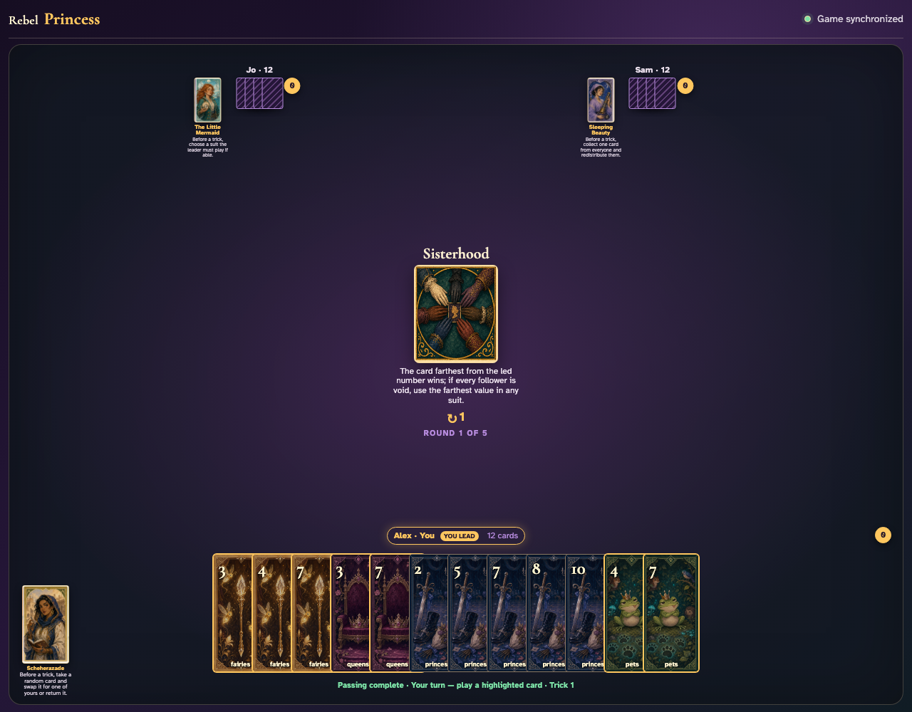
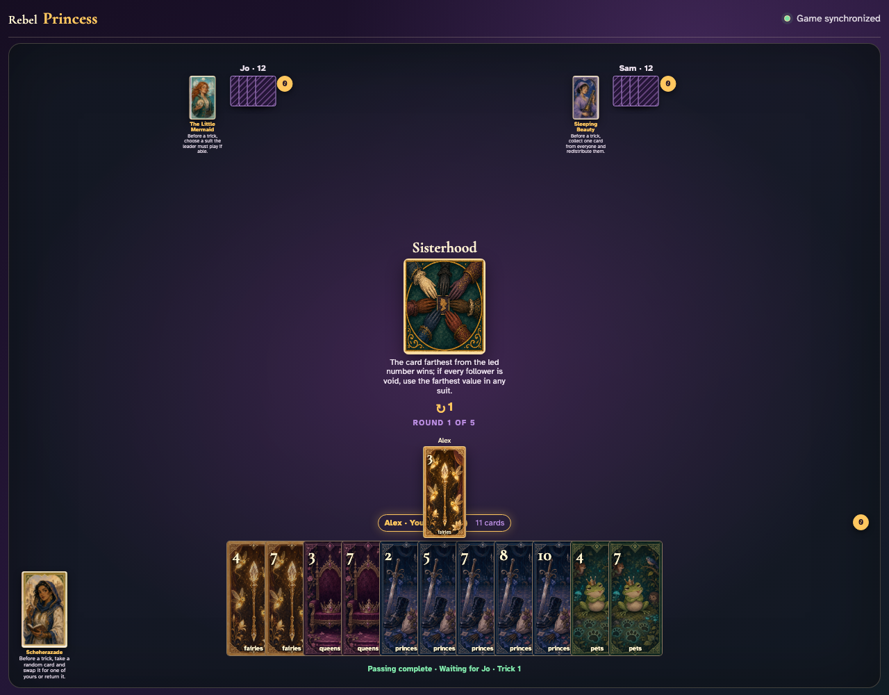
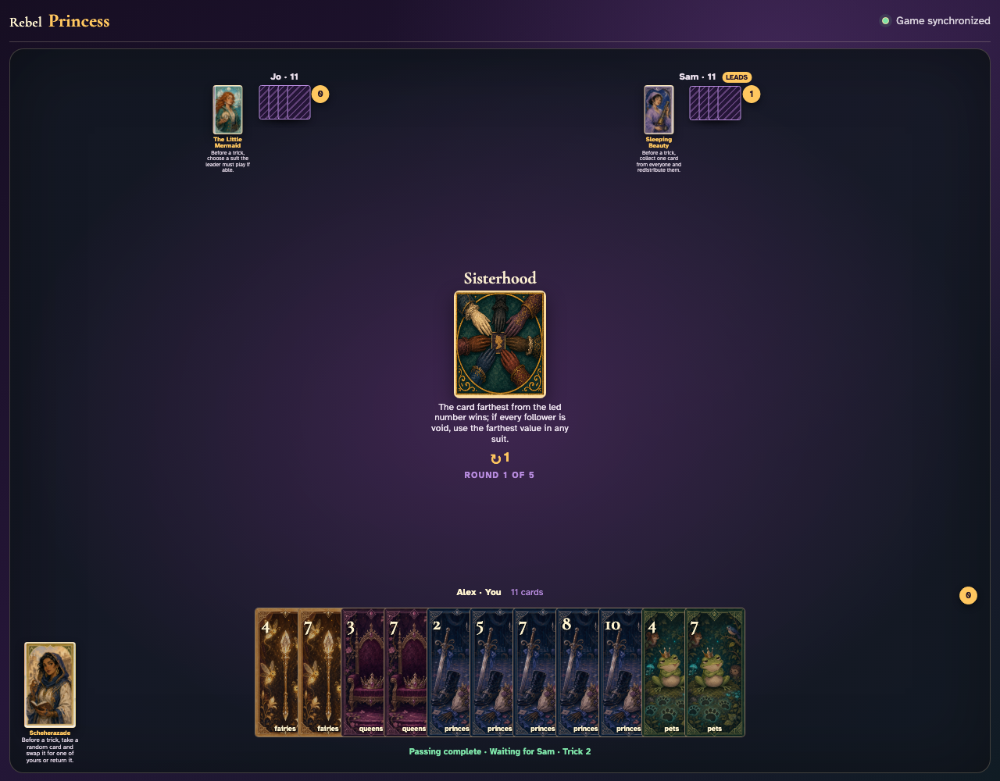
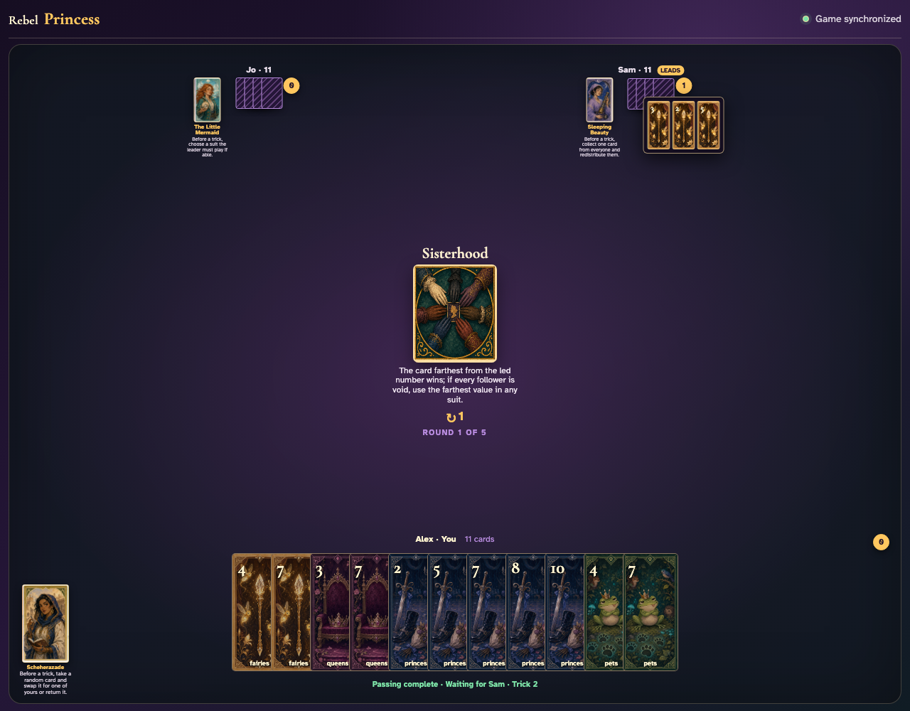

# Sisterhood

Play a complete trick through clicks, compare each visible value with the lead, and open the mathematically correct winner’s captured trick.

## The center announces that numerical distance from the lead—not ordinary high rank—wins

**Verifications:**
- [x] The exact distance rule is readable
- [x] The leader has an enabled card

---

## Alex leads Fairies 3; its printed value becomes the distance origin

**Verifications:**
- [x] The exact lead graphic is visible
- [x] The next clockwise player has legal choices

---

## The three cards reveal together; Fairies 5 is farthest from 3 and Sam receives the trick

**Verifications:**
- [x] All three exact cards are visible during collection
- [x] Only Sam has one trick

---

## Sam opens the awarded cards so every value can be checked against the lead

**Verifications:**
- [x] The review contains every played card
- [x] The winner counter remains one

---
