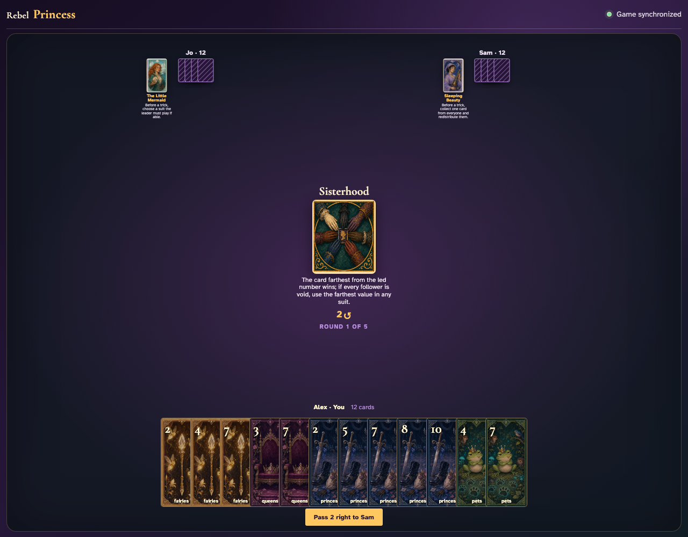
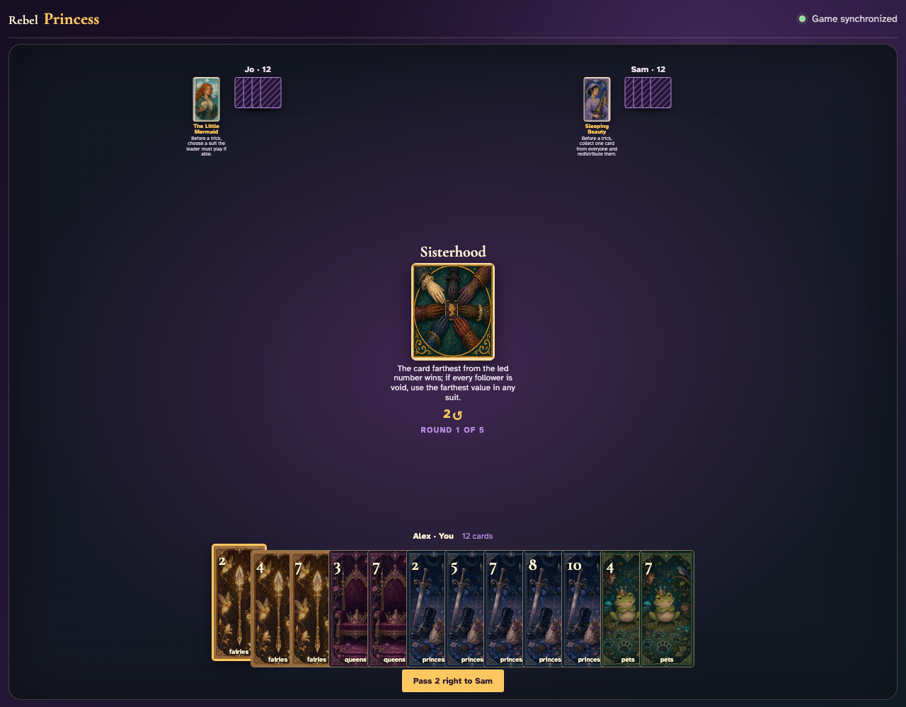
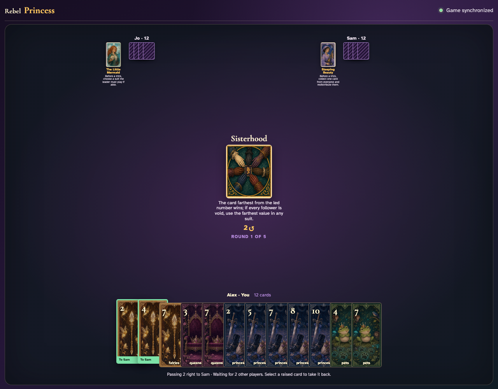
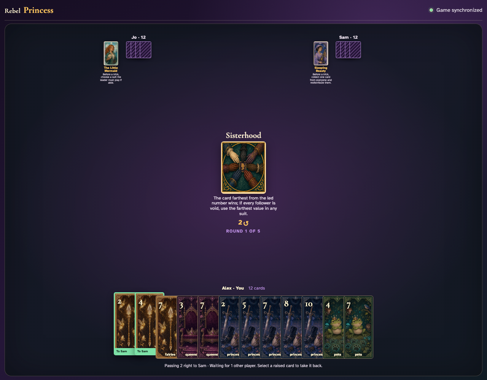
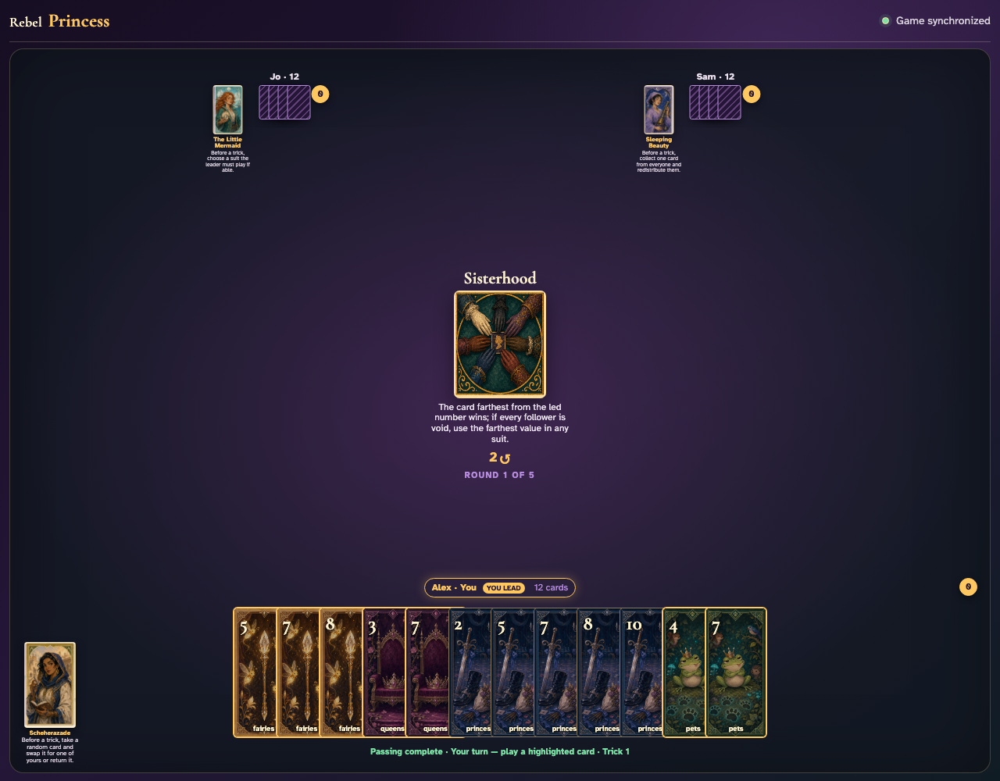
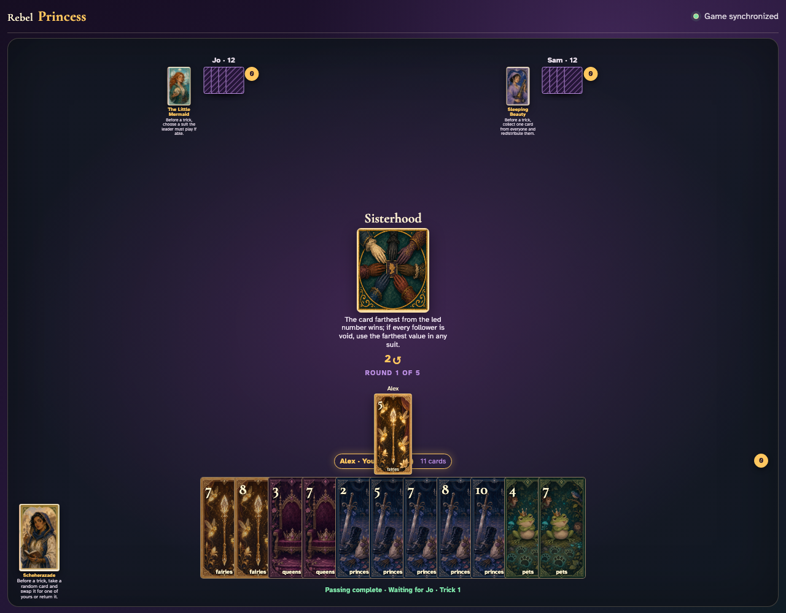
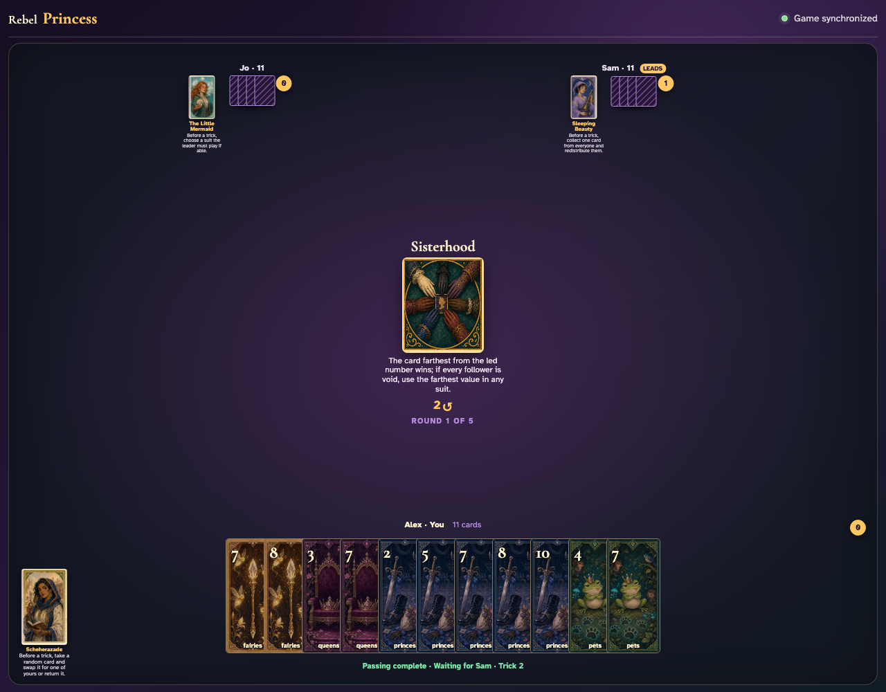
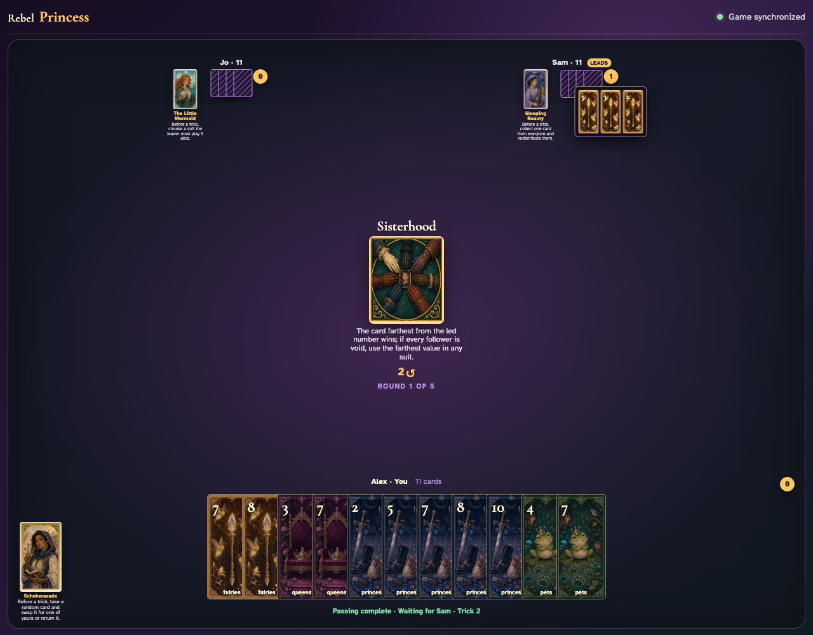

# Sisterhood

Play a complete trick through clicks, compare each visible value with the lead, and open the mathematically correct winner’s captured trick.

## Sisterhood prints a 2-card right pass before play begins

**Verifications:**
- [x] The center icon announces Pass 2 right
- [x] The action names Sam as the recipient
- [x] The pass cannot be committed before any card is chosen

---

## Alex clicks Fairies 2; it is assignment 1 of 2 to Sam

**Verifications:**
- [x] Exactly 1 chosen card is raised
- [x] Fairies 2 stays visibly selected
- [x] 1 more selection is still required

---

## Alex clicks Fairies 4; it is assignment 2 of 2 to Sam

**Verifications:**
- [x] Exactly 2 chosen cards are raised
- [x] Fairies 4 stays visibly selected
- [x] The complete printed pass is ready to commit

---

## Alex commits the 2 cards toward Sam while both other players are still choosing

**Verifications:**
- [x] All 2 outgoing cards remain visible and raised
- [x] The waiting message preserves the printed right direction
- [x] No incoming cards arrive before every player commits

---

## Jo commits next; Alex still sees the cards held until Sam makes the final decision

**Verifications:**
- [x] Exactly one other player remains
- [x] Alex can still identify every outgoing card

---

## Sam commits last; all three right transfers resolve simultaneously and play can begin

**Verifications:**
- [x] Every player again holds twelve cards
- [x] Alex receives the exact right incoming cards
- [x] The table leaves the simultaneous pass phase for play or the Round card’s next action

---

## The center announces that numerical distance from the lead—not ordinary high rank—wins

**Verifications:**
- [x] The exact distance rule is readable
- [x] The leader has an enabled card

---

## Alex leads Fairies 5; its printed value becomes the distance origin

**Verifications:**
- [x] The exact lead graphic is visible
- [x] The next clockwise player has legal choices

---

## The three cards reveal together; Fairies 2 is farthest from 5 and Sam receives the trick

**Verifications:**
- [x] All three exact cards are visible during collection
- [x] Only Sam has one trick

---

## Sam opens the awarded cards so every value can be checked against the lead

**Verifications:**
- [x] The review contains every played card
- [x] The winner counter remains one

---
