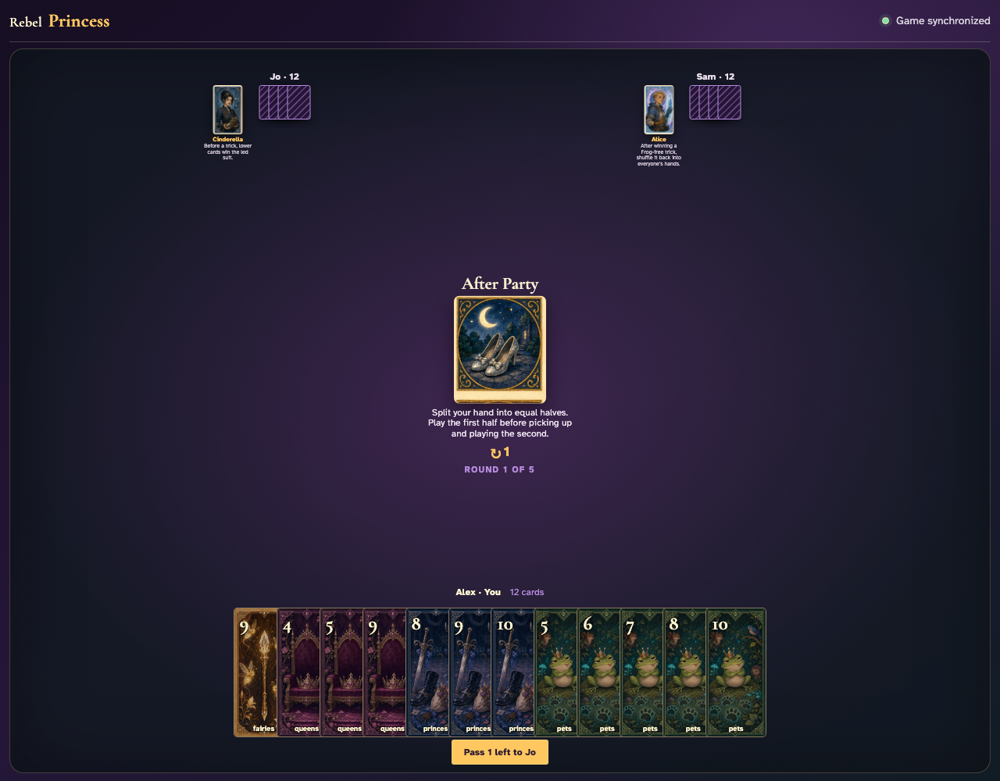
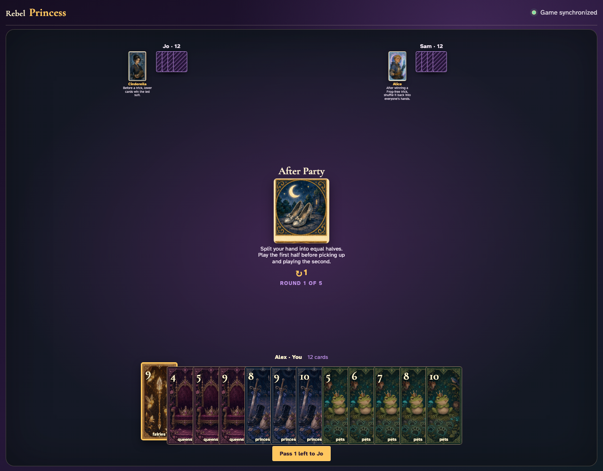
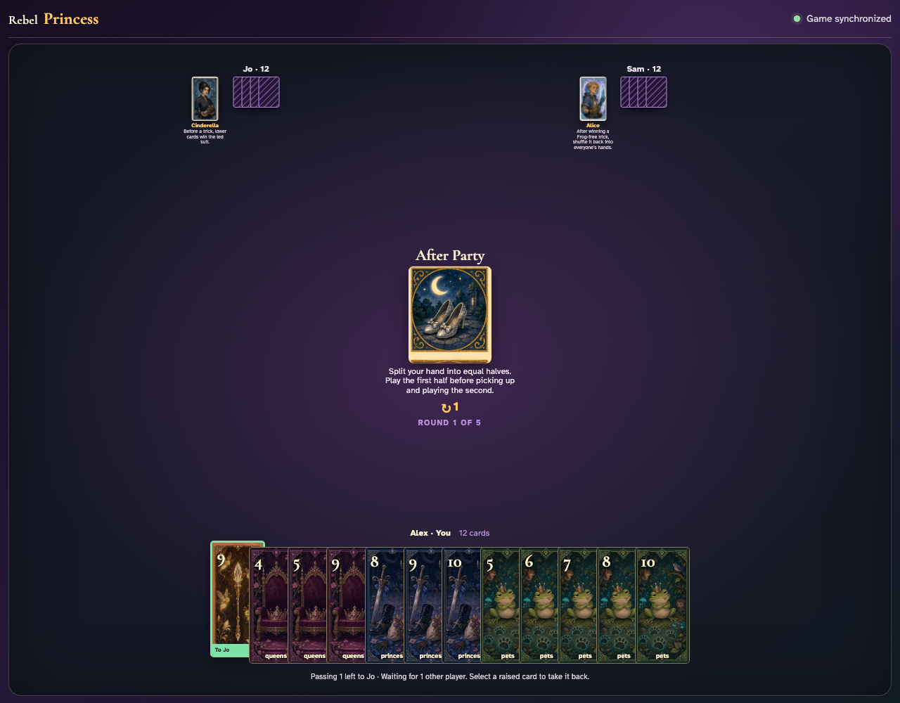
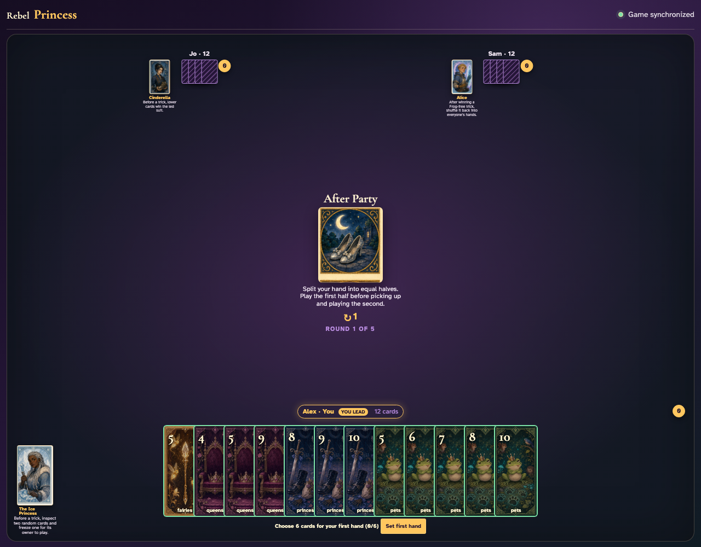
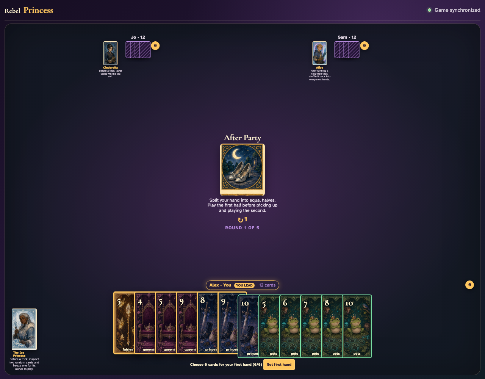
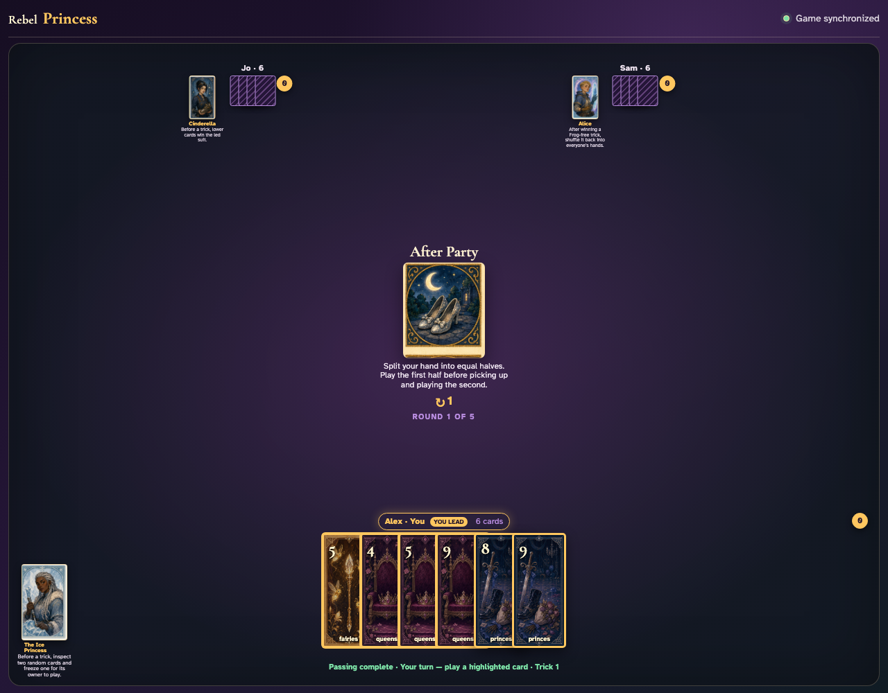
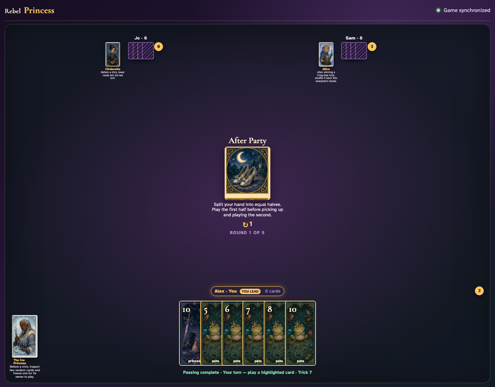
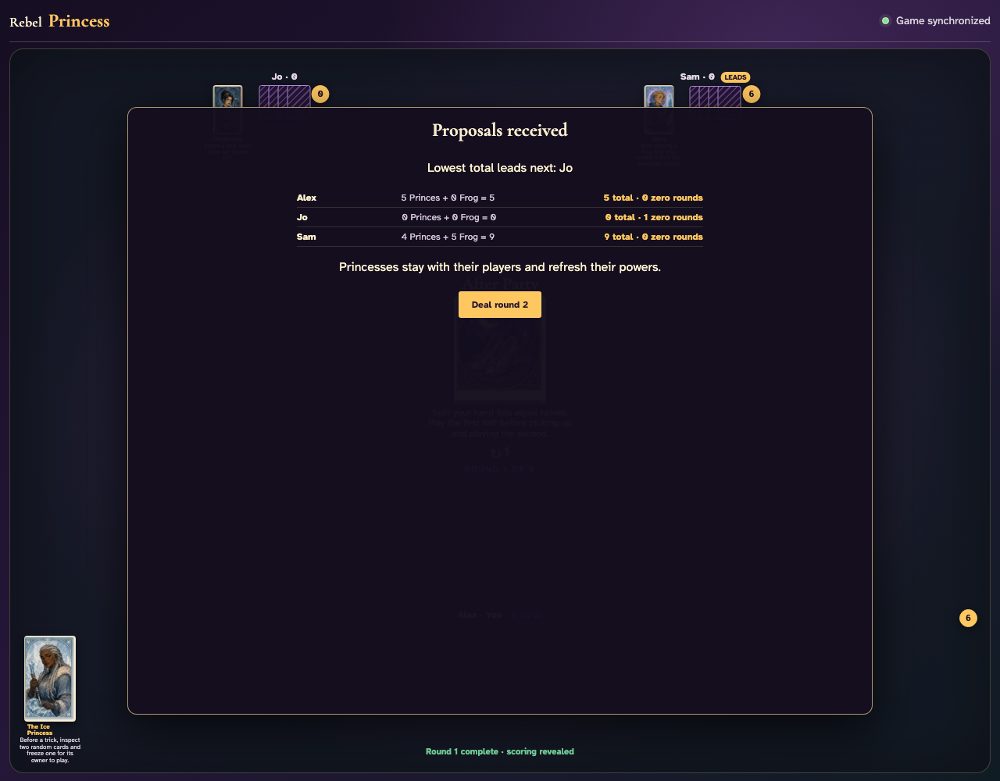

# After Party

Choose the first half through ordinary card clicks, synchronize all three splits, exhaust six tricks, pick up the held halves, and finish the round.

## After Party prints a 1-card left pass before play begins

**Verifications:**
- [x] The center icon announces Pass 1 left
- [x] The action names Jo as the recipient
- [x] The pass cannot be committed before any card is chosen

---

## Alex clicks Fairies 9; it is assignment 1 of 1 to Jo

**Verifications:**
- [x] Exactly 1 chosen card is raised
- [x] Fairies 9 stays visibly selected
- [x] The complete printed pass is ready to commit

---

## Alex commits the 1 cards toward Jo while both other players are still choosing

**Verifications:**
- [x] All 1 outgoing cards remain visible and raised
- [x] The waiting message preserves the printed left direction
- [x] No incoming cards arrive before every player commits

---

## Jo commits next; Alex still sees the cards held until Sam makes the final decision

**Verifications:**
- [x] Exactly one other player remains
- [x] Alex can still identify every outgoing card

---

## Sam commits last; all three left transfers resolve simultaneously and play can begin

**Verifications:**
- [x] Every player again holds twelve cards
- [x] Alex receives the exact left incoming card
- [x] The table leaves the simultaneous pass phase for play or the Round card’s next action

---

## After passing, each client must choose exactly six cards for the first hand

**Verifications:**
- [x] The center states that halves are played sequentially
- [x] Every client sees a 0/6 first-hand prompt

---

## Alex clicks six specific cards for the first hand: Fairies 5, Queens 4, Queens 5, Queens 9, Princes 8, Princes 9

**Verifications:**
- [x] Exactly six cards are visibly selected
- [x] The Set first hand button becomes enabled

---

## All three submissions resolve together; each table edge now contains only its chosen first six cards

**Verifications:**
- [x] Each hand contains exactly six playable first-half cards
- [x] Alex’s six exact choices remain and the held half is absent
- [x] The ordinary first trick can begin

---

## After six complete tricks exhaust the first hands, all three held six-card halves appear automatically

**Verifications:**
- [x] Every player picks up exactly six second-half cards
- [x] None of Alex’s first-hand cards returns
- [x] Trick seven is announced

---

## Six more ordinary tricks consume the second halves and reveal normal round scoring

**Verifications:**
- [x] All three hands are empty
- [x] Round one scoring is visible

---
