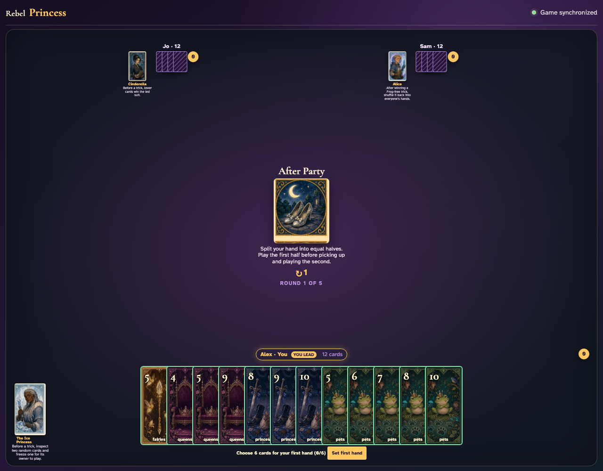
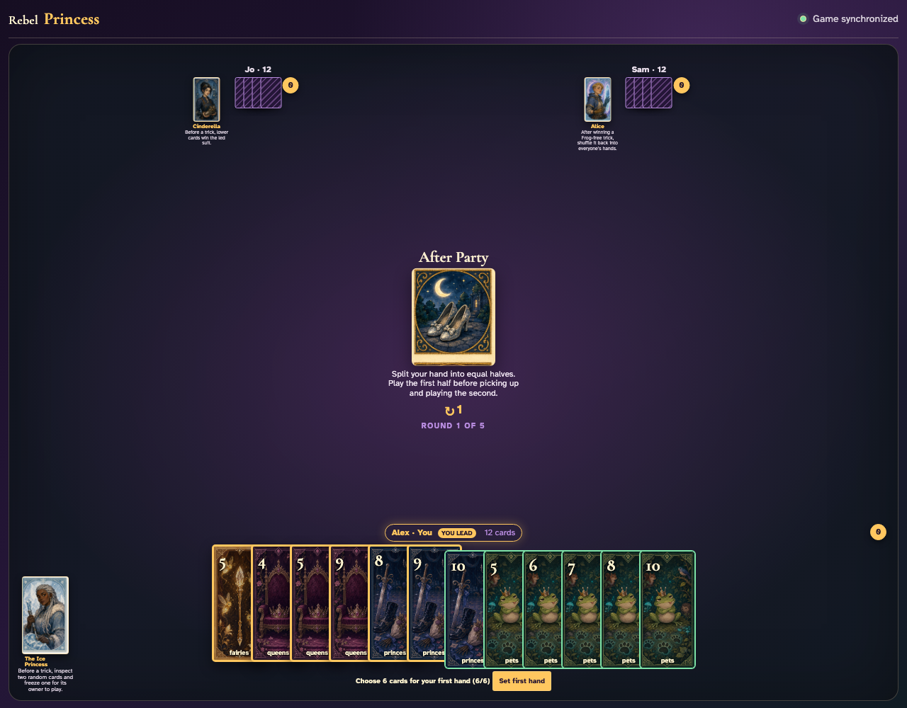
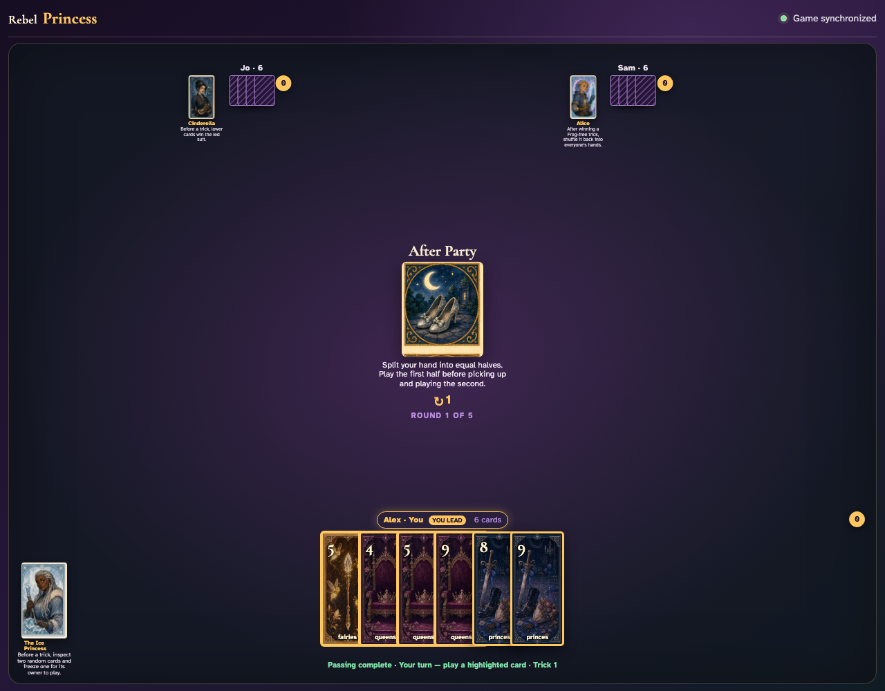
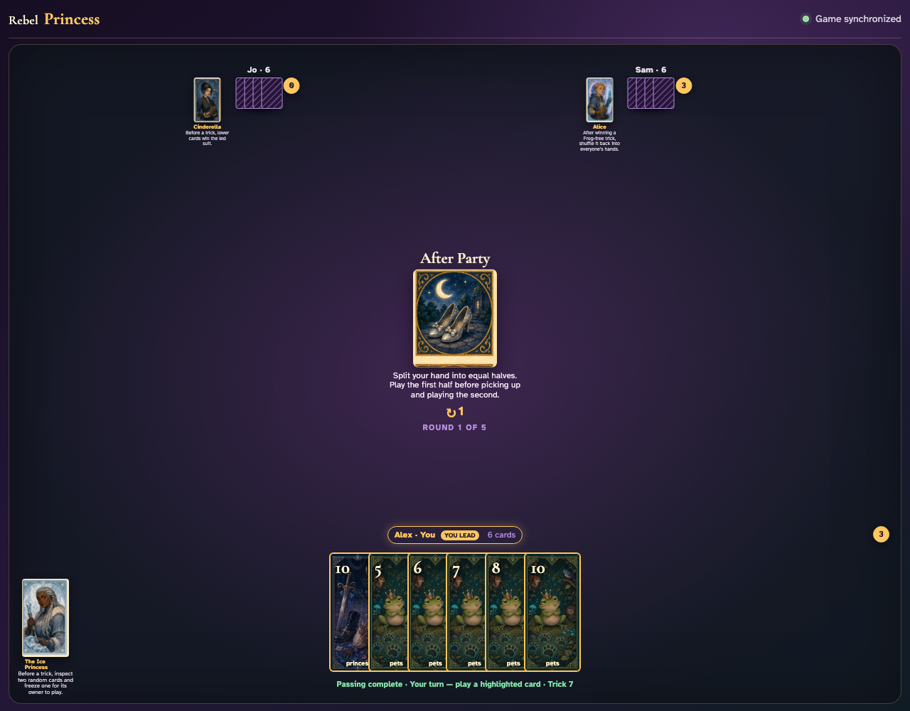
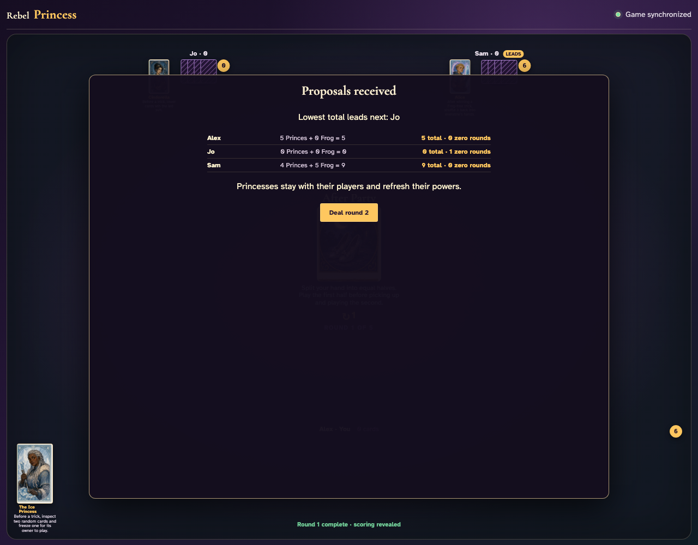

# After Party

Choose the first half through ordinary card clicks, synchronize all three splits, exhaust six tricks, pick up the held halves, and finish the round.

## After passing, each client must choose exactly six cards for the first hand

**Verifications:**
- [x] The center states that halves are played sequentially
- [x] Every client sees a 0/6 first-hand prompt

---

## Alex clicks six specific cards for the first hand: Fairies 5, Queens 4, Queens 5, Queens 9, Princes 8, Princes 9

**Verifications:**
- [x] Exactly six cards are visibly selected
- [x] The Set first hand button becomes enabled

---

## All three submissions resolve together; each table edge now contains only its chosen first six cards

**Verifications:**
- [x] Each hand contains exactly six playable first-half cards
- [x] Alex’s six exact choices remain and the held half is absent
- [x] The ordinary first trick can begin

---

## After six complete tricks exhaust the first hands, all three held six-card halves appear automatically

**Verifications:**
- [x] Every player picks up exactly six second-half cards
- [x] None of Alex’s first-hand cards returns
- [x] Trick seven is announced

---

## Six more ordinary tricks consume the second halves and reveal normal round scoring

**Verifications:**
- [x] All three hands are empty
- [x] Round one scoring is visible

---
