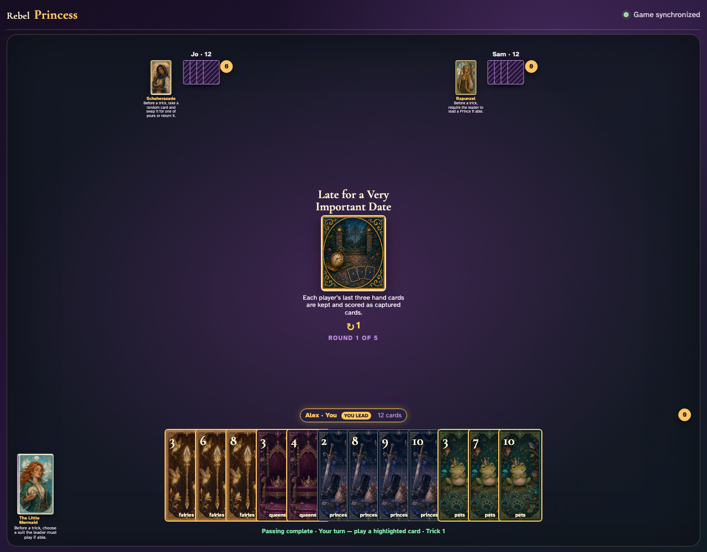
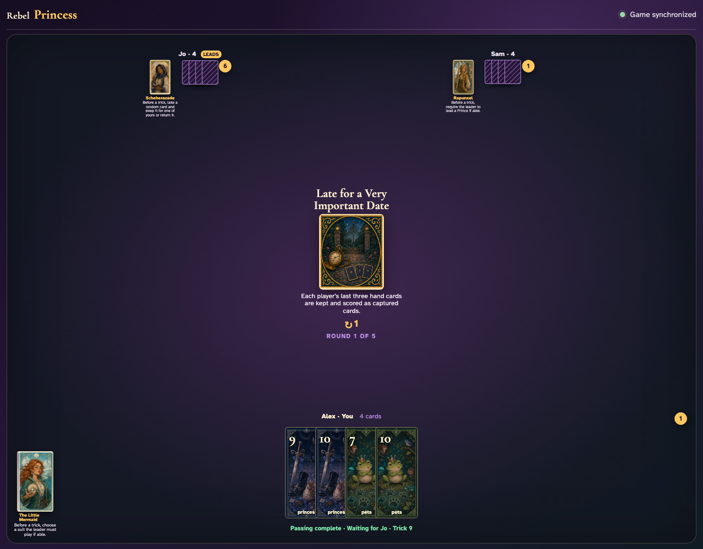
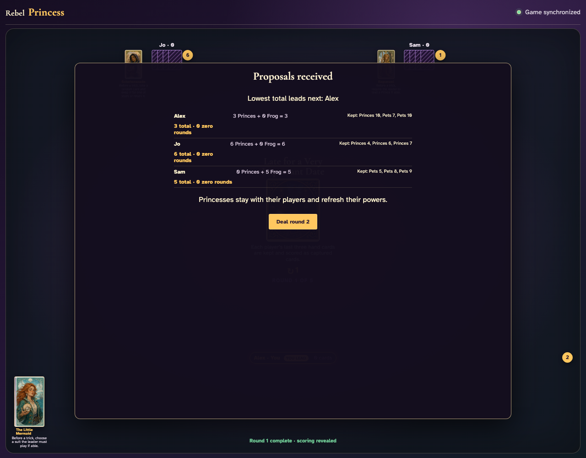

# Late for a Very Important Date

Play nine full tricks through clicks, identify the three unplayed cards at every seat, and prove those exact cards are kept and scored.

## The center states that each player stops with three cards and scores them as captured

**Verifications:**
- [x] The exact keep-and-score rule is readable
- [x] All three players begin with twelve playable cards

---

## After eight tricks, each edge visibly has four cards: one more will be played and the other three will leave early

**Verifications:**
- [x] Every hand contains exactly four cards
- [x] Trick nine is announced

---

## The ninth trick completes and the remaining three cards at every seat move directly into the scoring panel

**Verifications:**
- [x] Every hand is now empty without playing a tenth trick
- [x] Each player’s three exact retained cards are listed
- [x] Only nine tricks were played

---

## Round scoring visibly includes Princes and the Frog from both won tricks and the listed kept cards

**Verifications:**
- [x] Round one scoring is visible
- [x] All nine retained cards are accounted for

---
