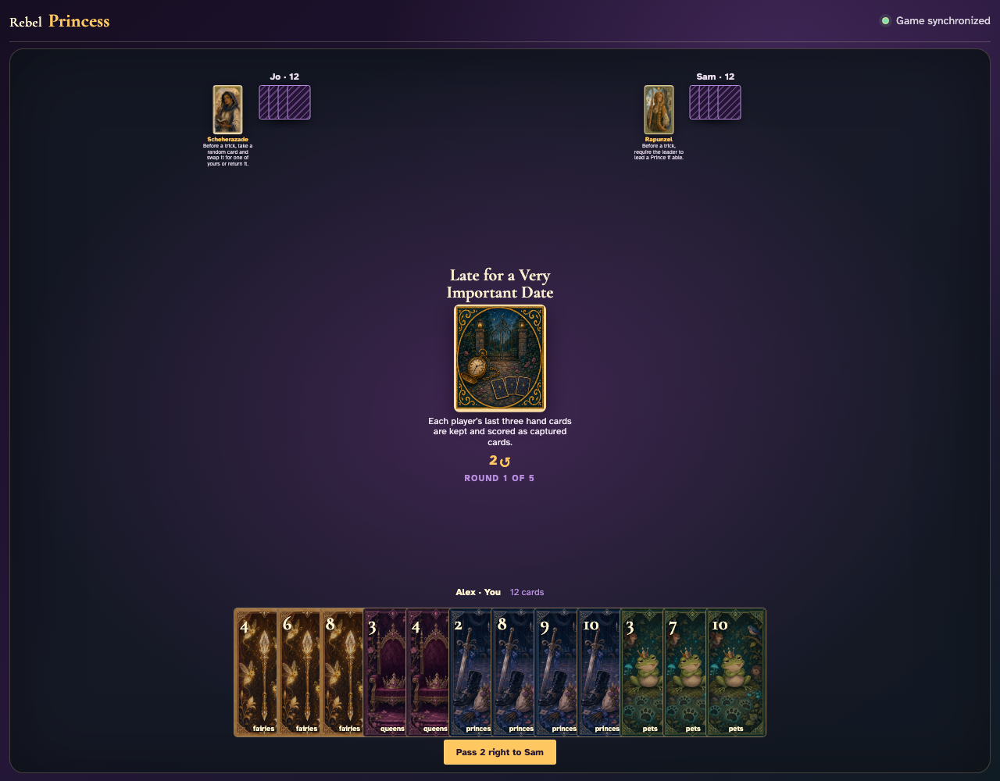
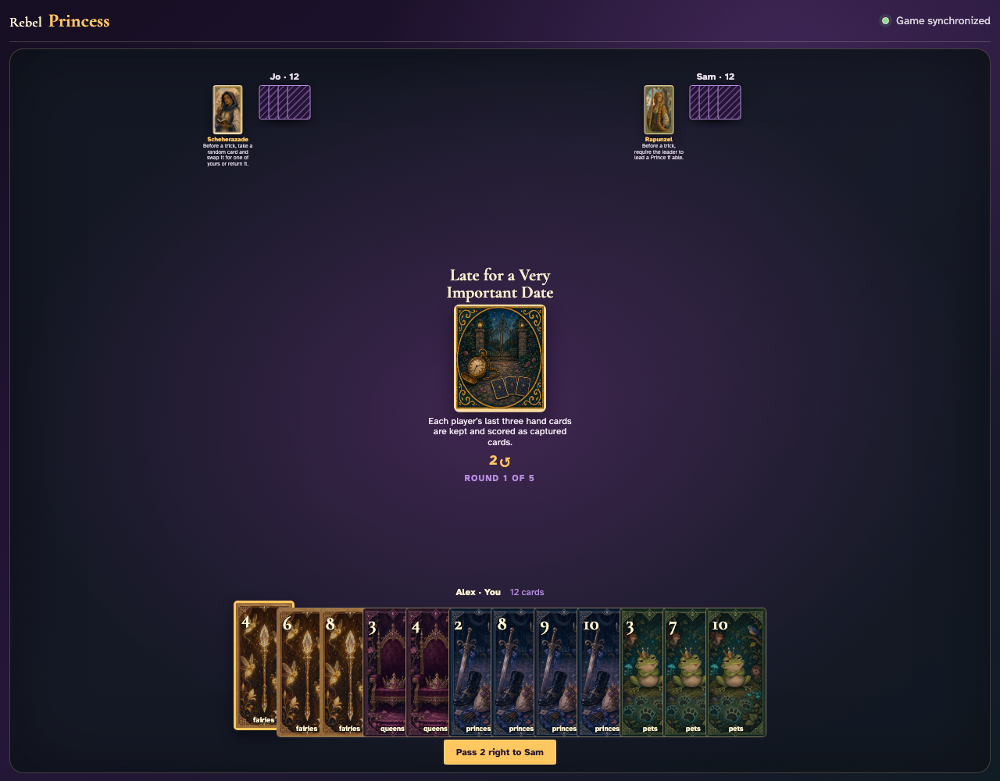
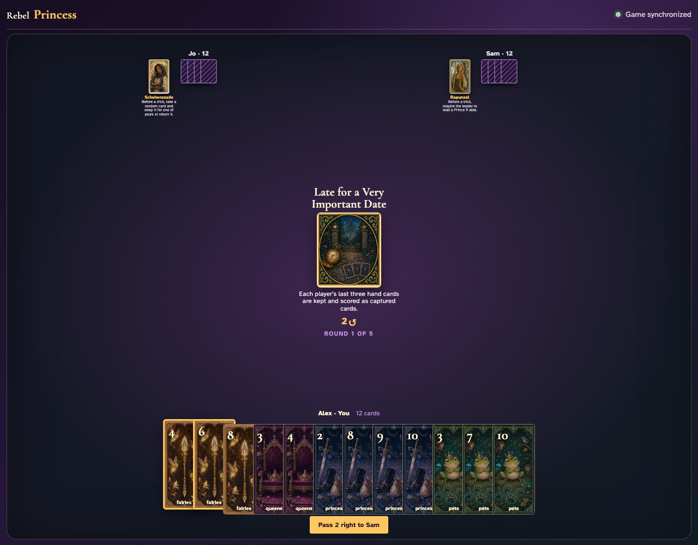
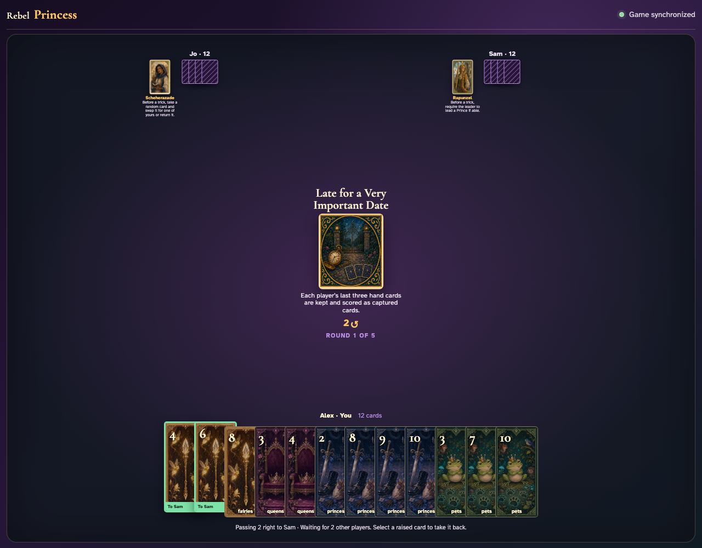
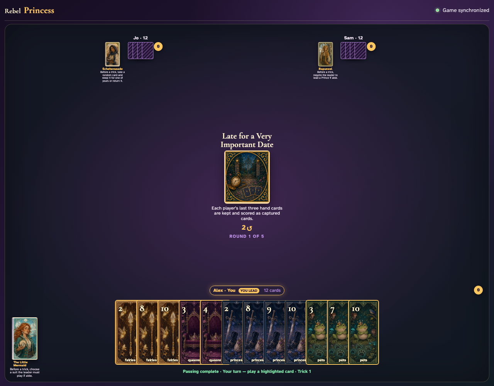
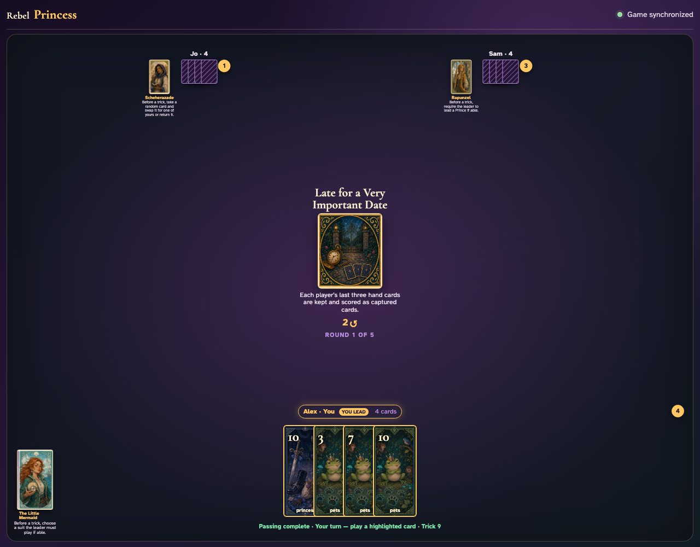
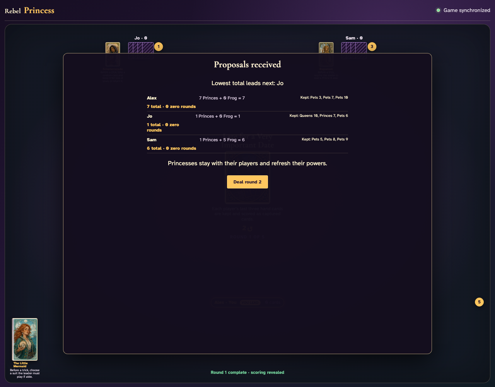

# Late for a Very Important Date

Play nine full tricks through clicks, identify the three unplayed cards at every seat, and prove those exact cards are kept and scored.

## Late for a Very Important Date prints a 2-card right pass before play begins

**Verifications:**
- [x] The center icon announces Pass 2 right
- [x] The action names Sam as the recipient
- [x] The pass cannot be committed before any card is chosen

---

## Alex clicks Fairies 4; it is assignment 1 of 2 to Sam

**Verifications:**
- [x] Exactly 1 chosen card is raised
- [x] Fairies 4 stays visibly selected
- [x] 1 more selection is still required

---

## Alex clicks Fairies 6; it is assignment 2 of 2 to Sam

**Verifications:**
- [x] Exactly 2 chosen cards are raised
- [x] Fairies 6 stays visibly selected
- [x] The complete printed pass is ready to commit

---

## Alex commits the 2 cards toward Sam while both other players are still choosing

**Verifications:**
- [x] All 2 outgoing cards remain visible and raised
- [x] The waiting message preserves the printed right direction
- [x] No incoming cards arrive before every player commits

---

## Jo commits next; Alex still sees the cards held until Sam makes the final decision

**Verifications:**
- [x] Exactly one other player remains
- [x] Alex can still identify every outgoing card

---

## Sam commits last; all three right transfers resolve simultaneously and play can begin

**Verifications:**
- [x] Every player again holds twelve cards
- [x] Alex receives the exact right incoming cards
- [x] The table leaves the simultaneous pass phase for play or the Round card’s next action

---

## The center states that each player stops with three cards and scores them as captured

**Verifications:**
- [x] The exact keep-and-score rule is readable
- [x] All three players begin with twelve playable cards

---

## After eight tricks, each edge visibly has four cards: one more will be played and the other three will leave early

**Verifications:**
- [x] Every hand contains exactly four cards
- [x] Trick nine is announced

---

## The ninth trick completes and the remaining three cards at every seat move directly into the scoring panel

**Verifications:**
- [x] Every hand is now empty without playing a tenth trick
- [x] Each player’s three exact retained cards are listed
- [x] Only nine tricks were played

---

## Round scoring visibly includes Princes and the Frog from both won tricks and the listed kept cards

**Verifications:**
- [x] Round one scoring is visible
- [x] All nine retained cards are accounted for

---
