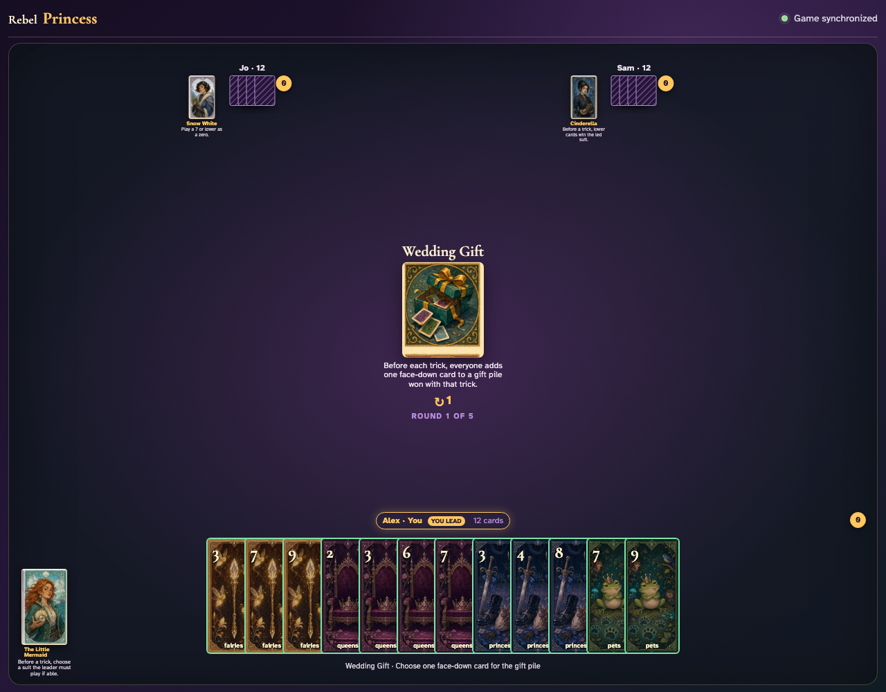
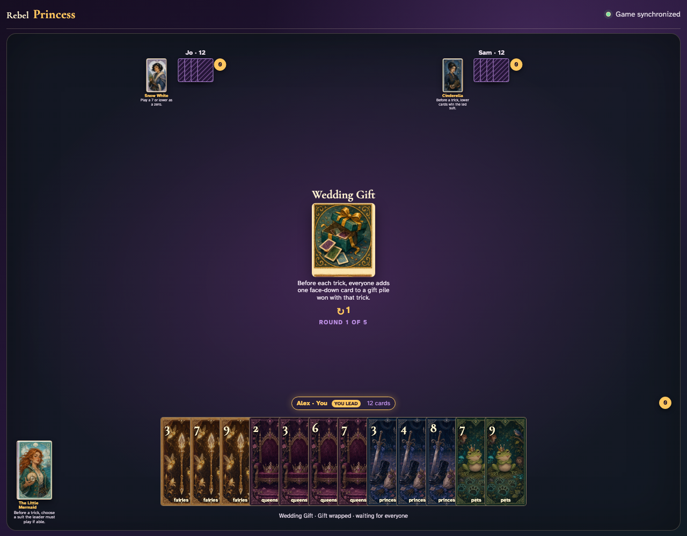
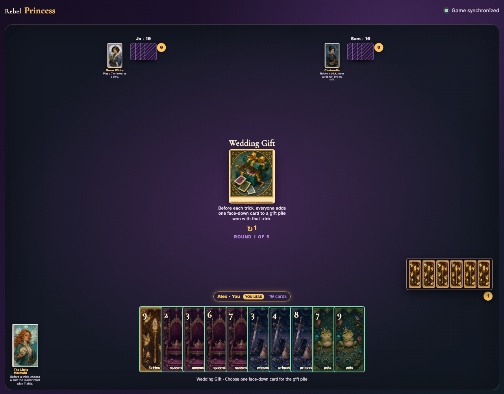
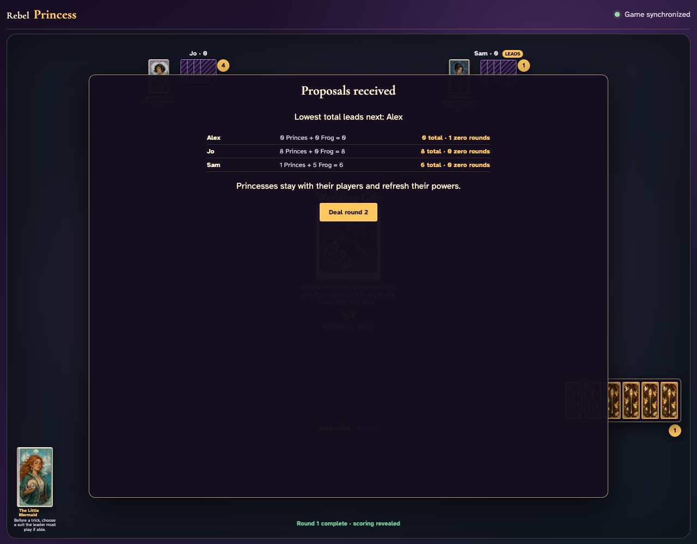

# Wedding Gift

Contribute gifts one client at a time, prove the first winner captures all six cards, then complete all six gift-and-trick cycles through clicks.

## Before trick one, every client is prompted to put one hand card face down into the gift pile

**Verifications:**
- [x] The exact gift rule is readable
- [x] Every client has selectable gift cards

---

## Alex clicks Fairies 3 as a face-down gift and waits without exposing it to the table center

**Verifications:**
- [x] Alex sees the wrapped waiting state
- [x] No ordinary card can be played while gifts are missing

---

## Alex wins the first trick and opens a six-card capture: three played cards plus all three gifts

**Verifications:**
- [x] The review contains every face-down gift
- [x] The review also contains every played card
- [x] The next Wedding Gift prompt appears before trick two

---

## Five more visible gift-and-trick cycles consume all 36 cards and score every Prince plus the Frog normally

**Verifications:**
- [x] All hands are empty after exactly six tricks
- [x] The three-player deck’s nine Princes and five-point Frog total fourteen proposals

---
