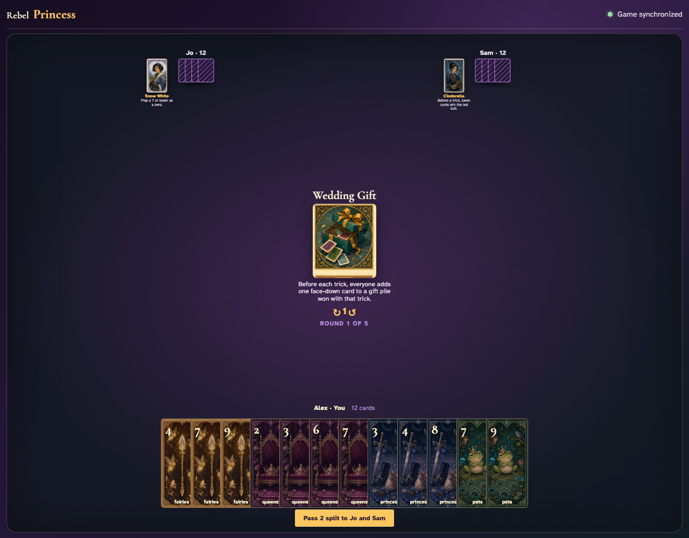
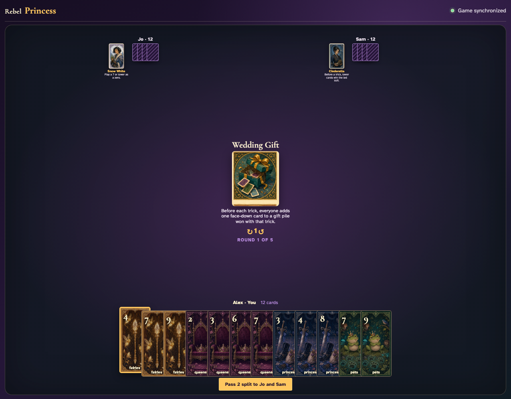
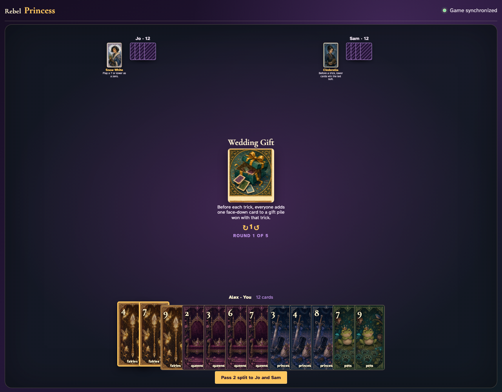
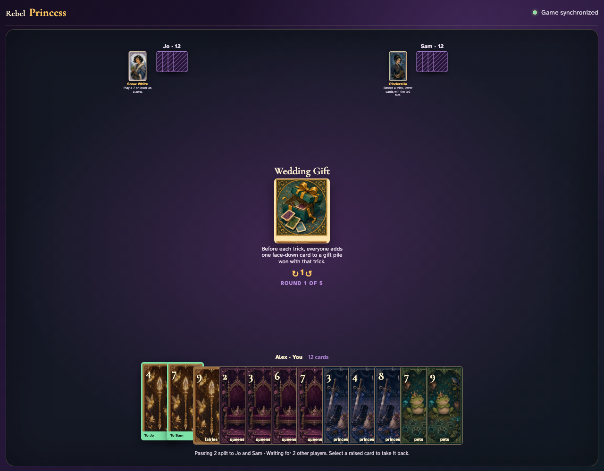
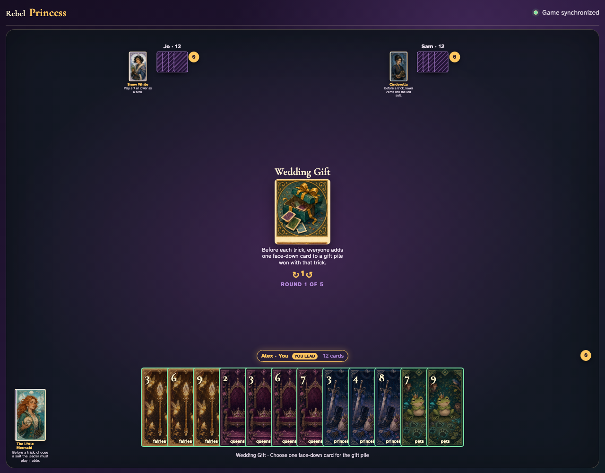
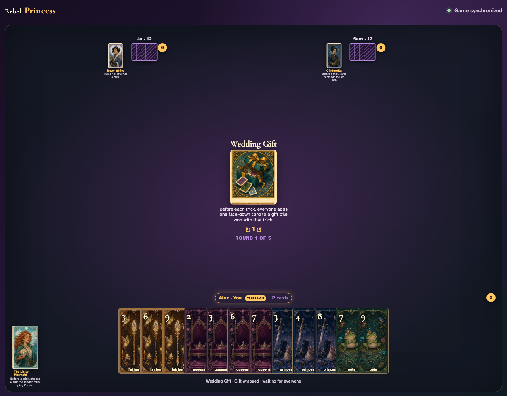
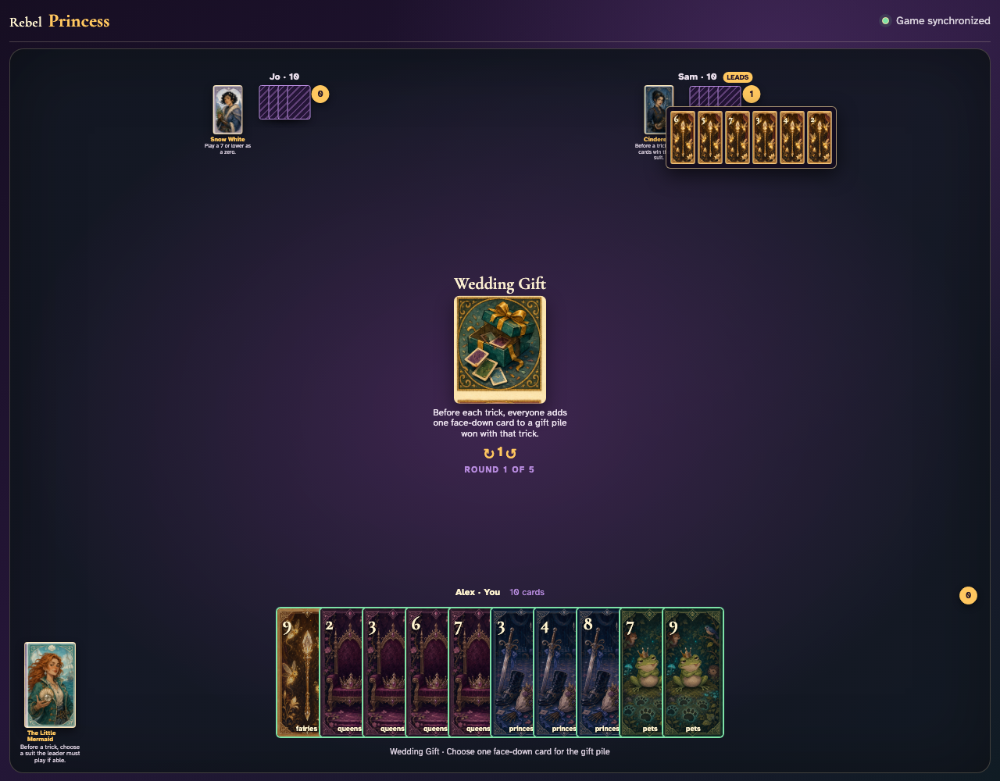
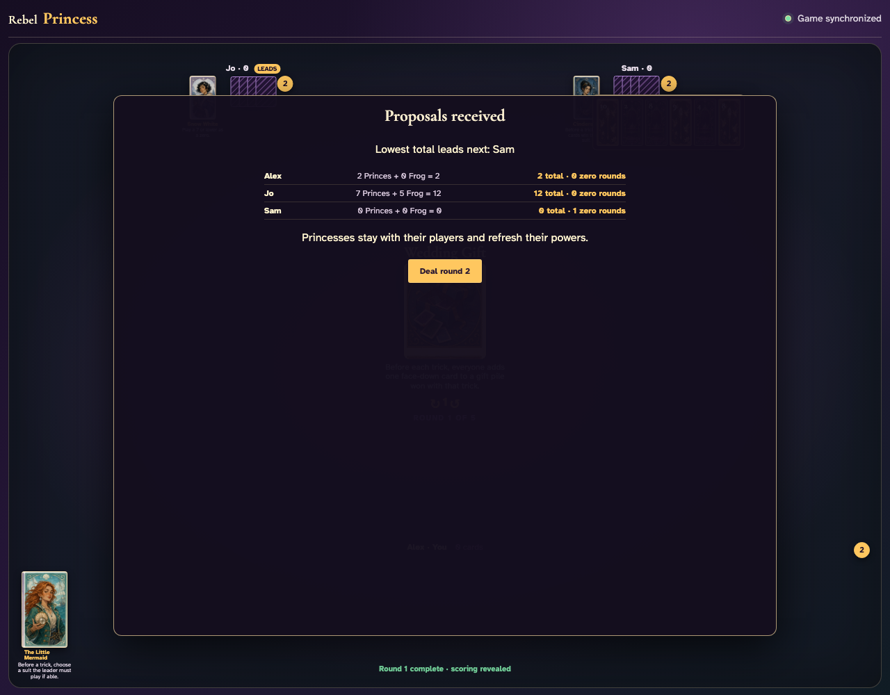

# Wedding Gift

Contribute gifts one client at a time, prove the first winner captures all six cards, then complete all six gift-and-trick cycles through clicks.

## Wedding Gift prints a 2-card split pass before play begins

**Verifications:**
- [x] The center icon announces Pass 2 split
- [x] The action names Jo and Sam as the recipients
- [x] The pass cannot be committed before any card is chosen

---

## Alex clicks Fairies 4; it is assignment 1 of 2 to Jo

**Verifications:**
- [x] Exactly 1 chosen card is raised
- [x] Fairies 4 stays visibly selected
- [x] 1 more selection is still required

---

## Alex clicks Fairies 7; it is assignment 2 of 2 to Sam

**Verifications:**
- [x] Exactly 2 chosen cards are raised
- [x] Fairies 7 stays visibly selected
- [x] The complete printed pass is ready to commit

---

## Alex commits the 2 cards toward Jo and Sam while both other players are still choosing

**Verifications:**
- [x] All 2 outgoing cards remain visible and raised
- [x] The waiting message preserves the printed split direction
- [x] No incoming cards arrive before every player commits

---

## Jo commits next; Alex still sees the cards held until Sam makes the final decision

**Verifications:**
- [x] Exactly one other player remains
- [x] Alex can still identify every outgoing card

---

## Sam commits last; all three split transfers resolve simultaneously and play can begin

**Verifications:**
- [x] Every player again holds twelve cards
- [x] Alex receives the exact split incoming cards
- [x] The table leaves the simultaneous pass phase for play or the Round card’s next action

---

## Before trick one, every client is prompted to put one hand card face down into the gift pile

**Verifications:**
- [x] The exact gift rule is readable
- [x] Every client has selectable gift cards

---

## Alex clicks Fairies 3 as a face-down gift and waits without exposing it to the table center

**Verifications:**
- [x] Alex sees the wrapped waiting state
- [x] No ordinary card can be played while gifts are missing

---

## Sam wins the first trick and opens a six-card capture: three played cards plus all three gifts

**Verifications:**
- [x] The review contains every face-down gift
- [x] The review also contains every played card
- [x] The next Wedding Gift prompt appears before trick two

---

## Five more visible gift-and-trick cycles consume all 36 cards and score every Prince plus the Frog normally

**Verifications:**
- [x] All hands are empty after exactly six tricks
- [x] The three-player deck’s nine Princes and five-point Frog total fourteen proposals

---
