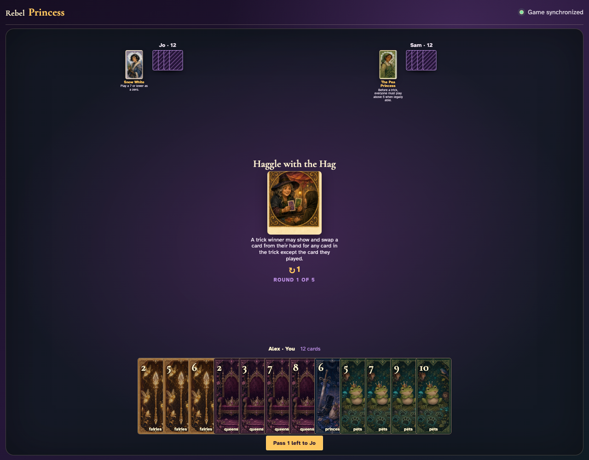
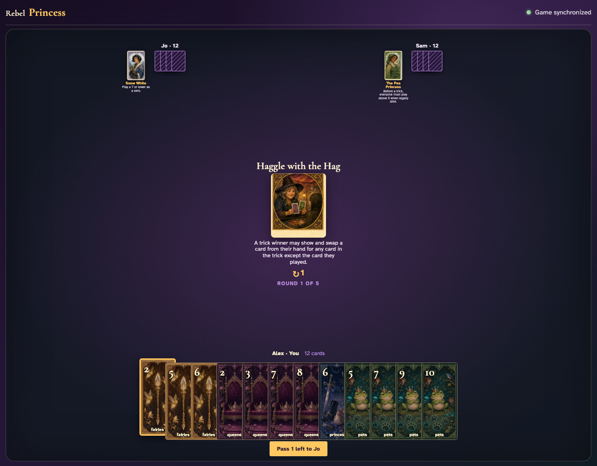
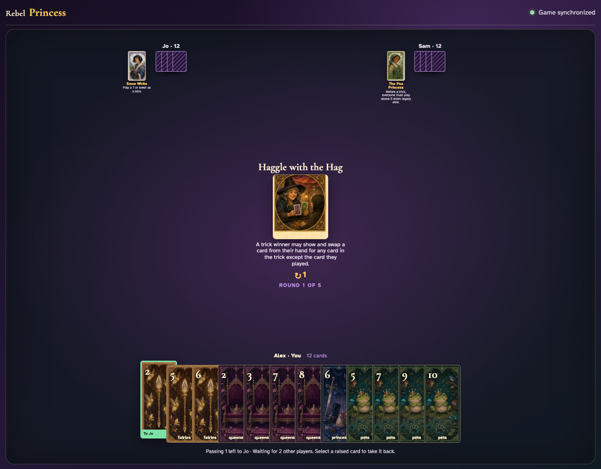
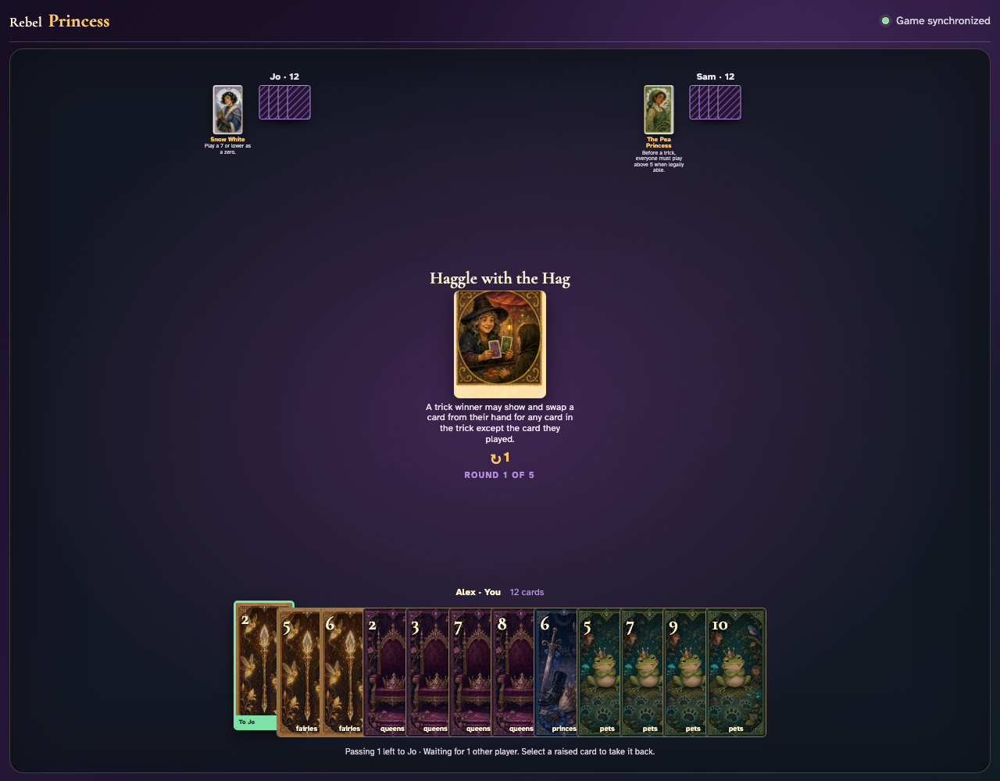
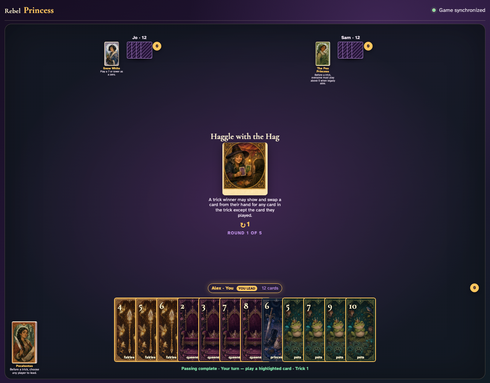
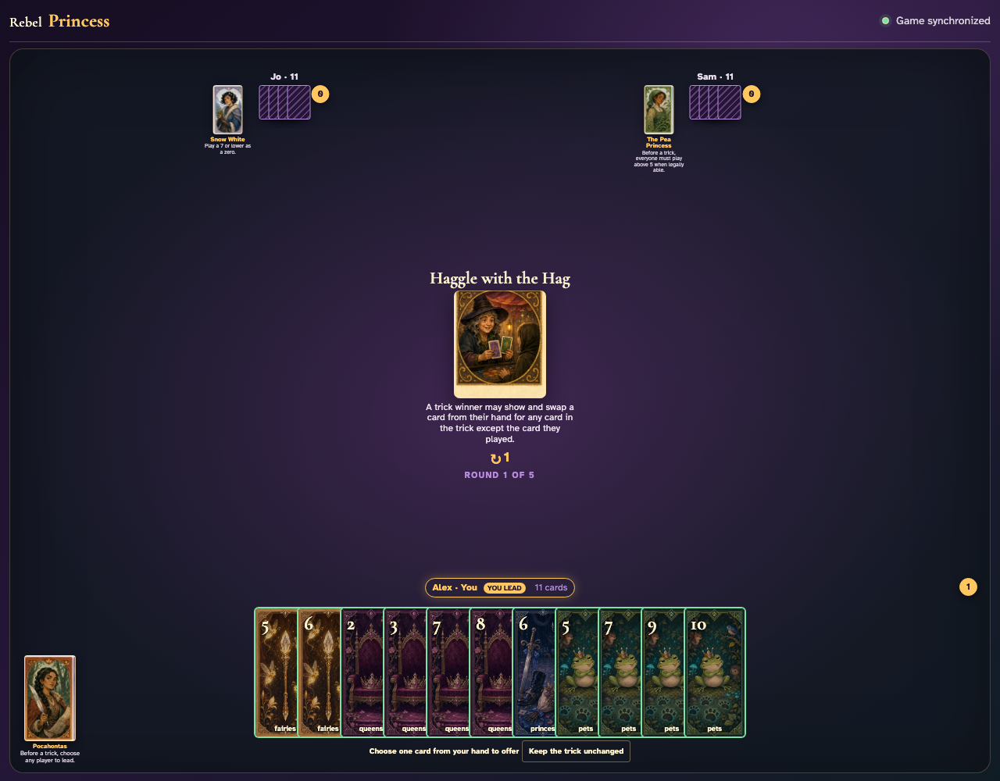
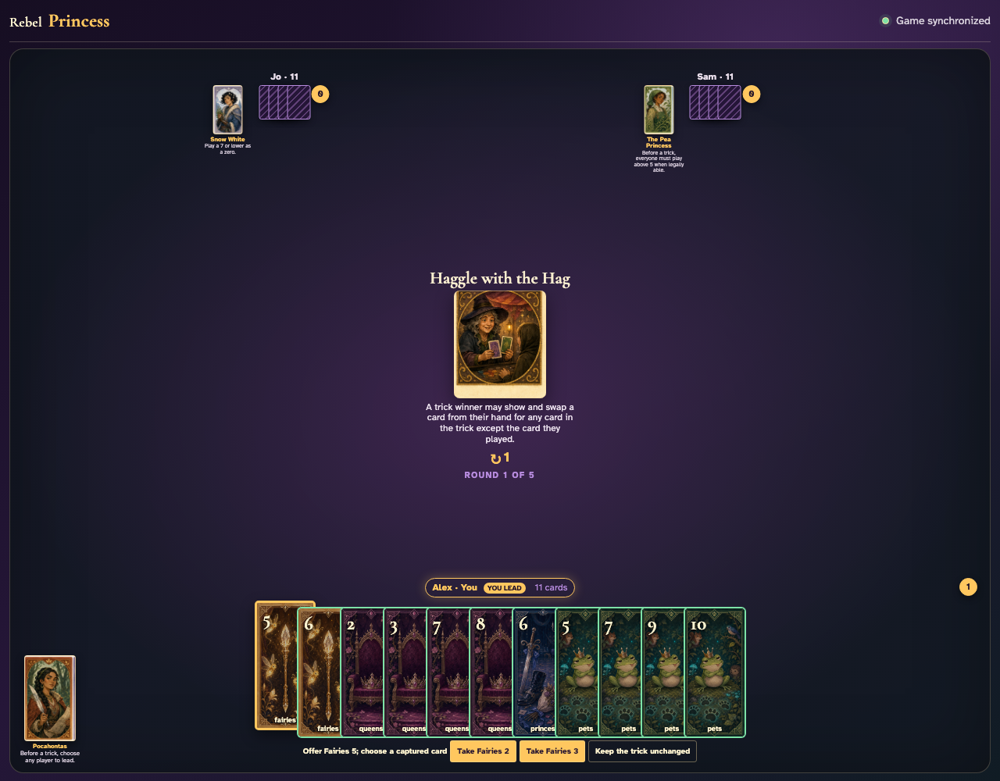
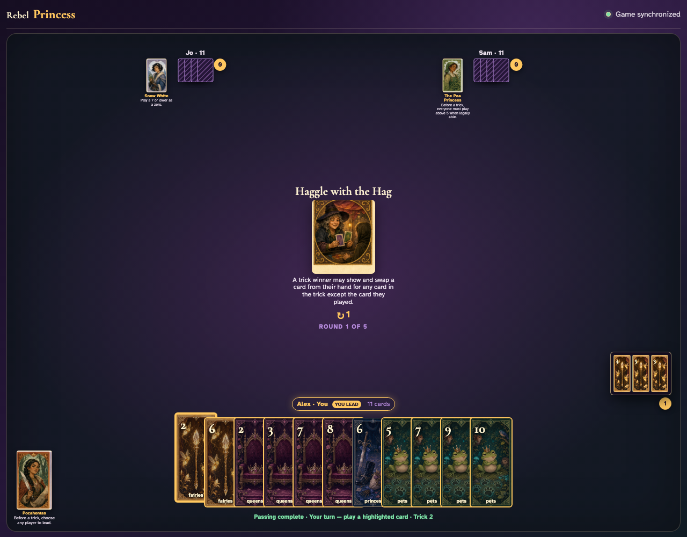

# Haggle with the Hag

Complete a trick, select an offer in the winner’s real hand, take an opponent’s played card, and inspect both sides of the exchange.

## Haggle with the Hag prints a 1-card left pass before play begins

**Verifications:**
- [x] The center icon announces Pass 1 left
- [x] The action names Jo as the recipient
- [x] The pass cannot be committed before any card is chosen

---

## Alex clicks Fairies 2; it is assignment 1 of 1 to Jo

**Verifications:**
- [x] Exactly 1 chosen card is raised
- [x] Fairies 2 stays visibly selected
- [x] The complete printed pass is ready to commit

---

## Alex commits the 1 cards toward Jo while both other players are still choosing

**Verifications:**
- [x] All 1 outgoing cards remain visible and raised
- [x] The waiting message preserves the printed left direction
- [x] No incoming cards arrive before every player commits

---

## Jo commits next; Alex still sees the cards held until Sam makes the final decision

**Verifications:**
- [x] Exactly one other player remains
- [x] Alex can still identify every outgoing card

---

## Sam commits last; all three left transfers resolve simultaneously and play can begin

**Verifications:**
- [x] Every player again holds twelve cards
- [x] Alex receives the exact left incoming card
- [x] The table leaves the simultaneous pass phase for play or the Round card’s next action

---

## The round card explains that a winner may trade for a captured card other than their own play

**Verifications:**
- [x] The exact swap restriction is readable
- [x] No haggle controls appear before a trick is won

---

## Alex wins the visible trick and receives the exclusive offer-or-decline controls

**Verifications:**
- [x] Only the winner sees Haggle controls
- [x] All other clients explicitly wait for the winner

---

## Alex clicks Fairies 5 as the visible offer; the two opponent-played cards become the only legal takes

**Verifications:**
- [x] The offer is named in the controls
- [x] Exactly two take buttons exclude the winner’s own played card

---

## Alex takes Fairies 2 into hand and Fairies 5 replaces it in the captured trick

**Verifications:**
- [x] The taken card is now in the winner’s hand and the offer is gone
- [x] The captured review contains the offered card instead of the taken card
- [x] The winner can now lead the next trick

---
