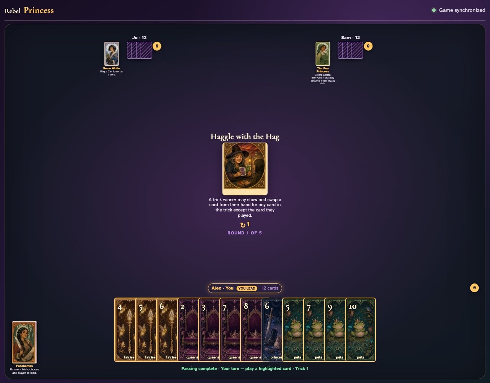
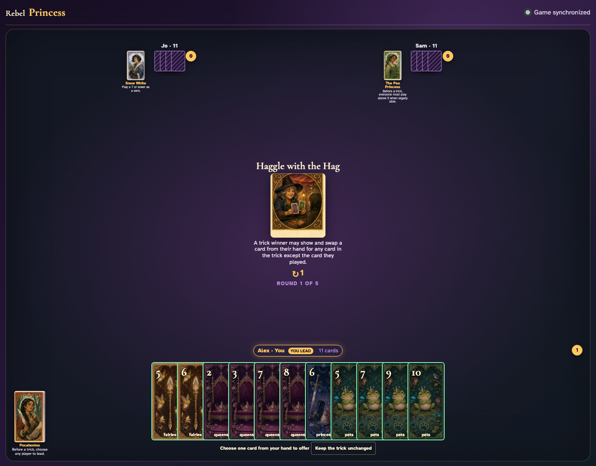
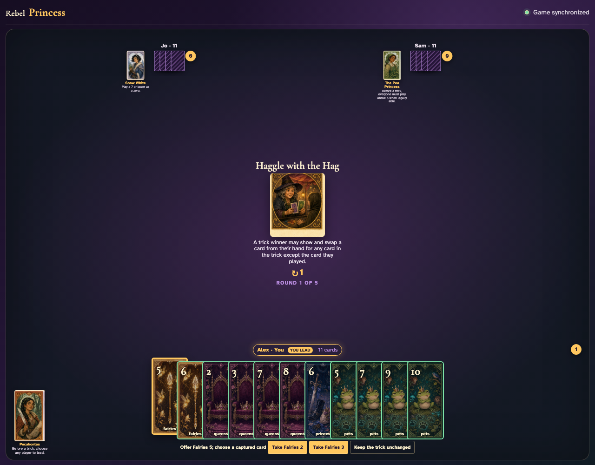
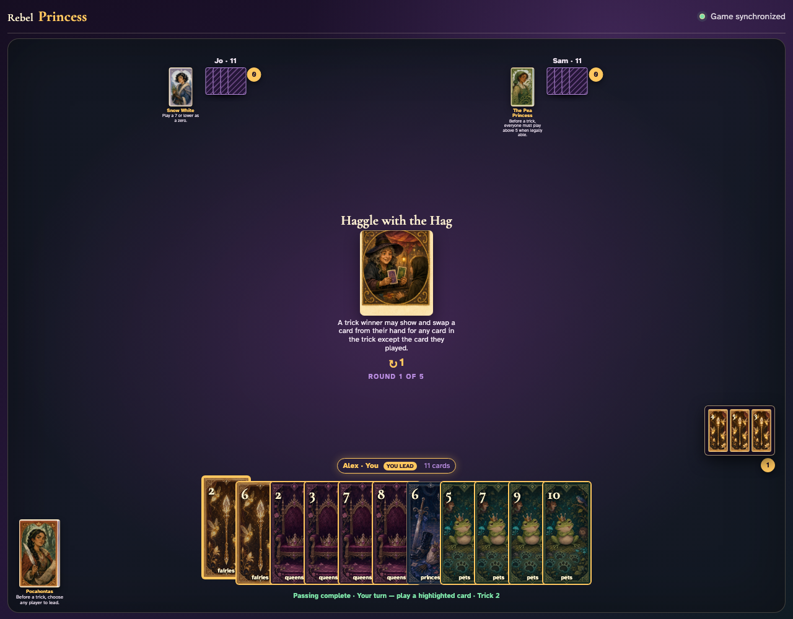

# Haggle with the Hag

Complete a trick, select an offer in the winner’s real hand, take an opponent’s played card, and inspect both sides of the exchange.

## The round card explains that a winner may trade for a captured card other than their own play

**Verifications:**
- [x] The exact swap restriction is readable
- [x] No haggle controls appear before a trick is won

---

## Alex wins the visible trick and receives the exclusive offer-or-decline controls

**Verifications:**
- [x] Only the winner sees Haggle controls
- [x] All other clients explicitly wait for the winner

---

## Alex clicks Fairies 5 as the visible offer; the two opponent-played cards become the only legal takes

**Verifications:**
- [x] The offer is named in the controls
- [x] Exactly two take buttons exclude the winner’s own played card

---

## Alex takes Fairies 2 into hand and Fairies 5 replaces it in the captured trick

**Verifications:**
- [x] The taken card is now in the winner’s hand and the offer is gone
- [x] The captured review contains the offered card instead of the taken card
- [x] The winner can now lead the next trick

---
