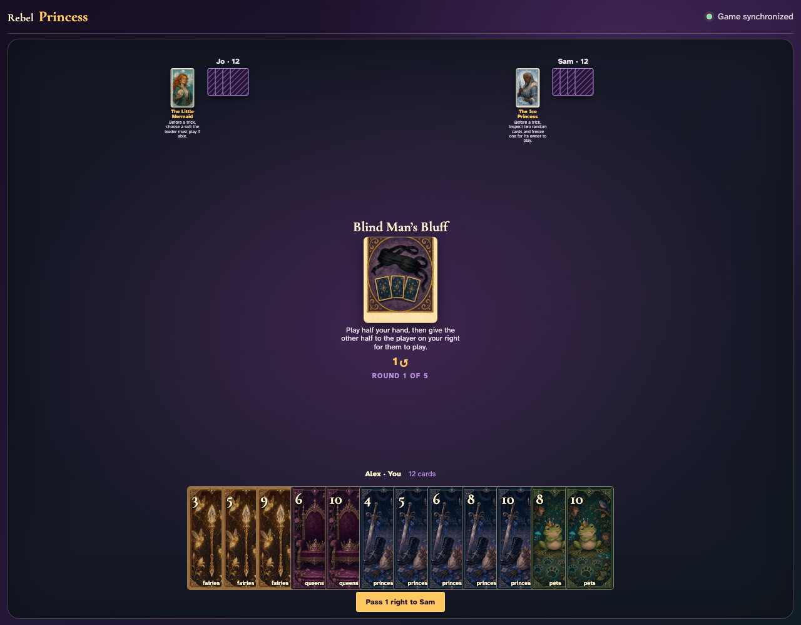
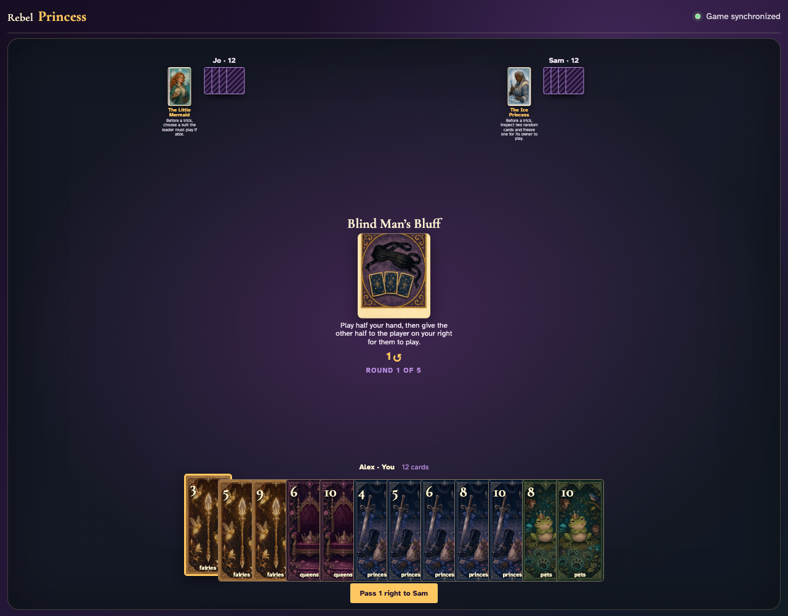
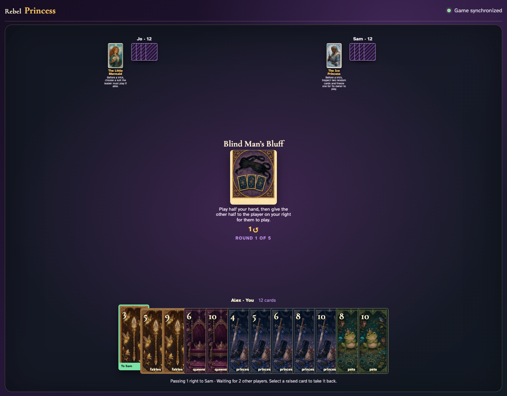
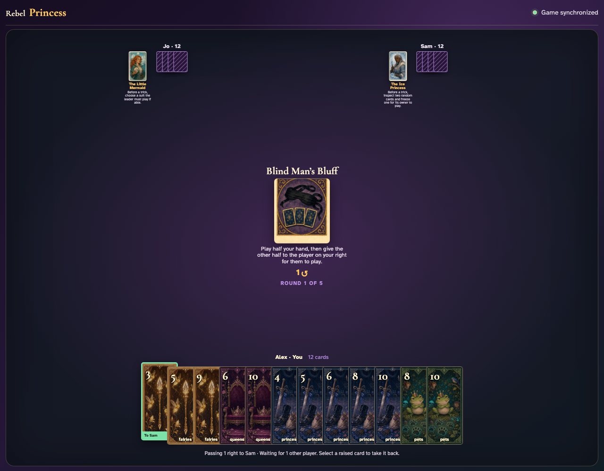
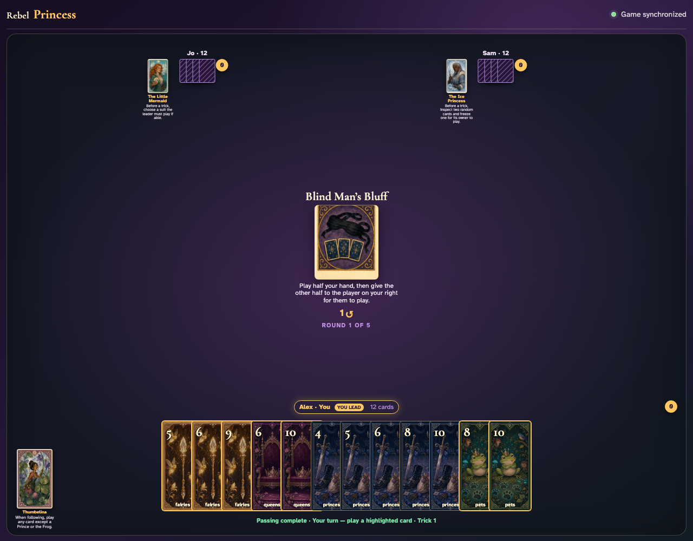
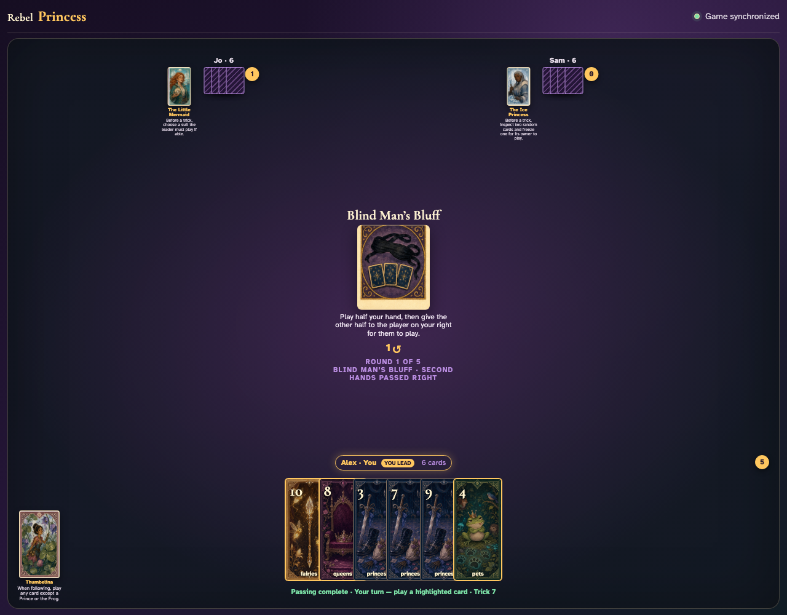
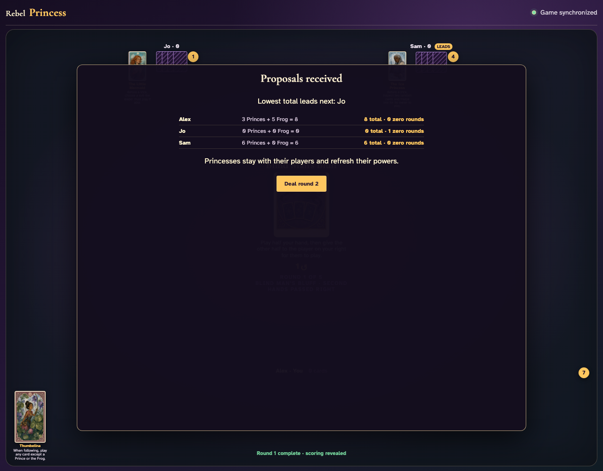

# Blind Man’s Bluff

Play the first six cards normally, inventory every remaining card, prove the exact clockwise transfer, then play the borrowed halves to round end.

## Blind Man’s Bluff prints a 1-card right pass before play begins

**Verifications:**
- [x] The center icon announces Pass 1 right
- [x] The action names Sam as the recipient
- [x] The pass cannot be committed before any card is chosen

---

## Alex clicks Fairies 3; it is assignment 1 of 1 to Sam

**Verifications:**
- [x] Exactly 1 chosen card is raised
- [x] Fairies 3 stays visibly selected
- [x] The complete printed pass is ready to commit

---

## Alex commits the 1 cards toward Sam while both other players are still choosing

**Verifications:**
- [x] All 1 outgoing cards remain visible and raised
- [x] The waiting message preserves the printed right direction
- [x] No incoming cards arrive before every player commits

---

## Jo commits next; Alex still sees the cards held until Sam makes the final decision

**Verifications:**
- [x] Exactly one other player remains
- [x] Alex can still identify every outgoing card

---

## Sam commits last; all three right transfers resolve simultaneously and play can begin

**Verifications:**
- [x] Every player again holds twelve cards
- [x] Alex receives the exact right incoming card
- [x] The table leaves the simultaneous pass phase for play or the Round card’s next action

---

## The center announces that each second half will be played by the player on its owner’s right

**Verifications:**
- [x] The exact half-hand rule is readable
- [x] Every player begins with twelve cards

---

## After five tricks, every owner has seven cards; one more played card will identify the exact six-card half to transfer

**Verifications:**
- [x] Every hand visibly contains seven cards
- [x] Trick six is announced

---

## The sixth trick triggers the automatic handoff: Alex receives Jo’s six, Jo receives Sam’s six, and Sam receives Alex’s six

**Verifications:**
- [x] The center confirms the second hands passed right
- [x] Alex has Jo’s exact remaining cards
- [x] Jo has Sam’s exact remaining cards
- [x] Sam has Alex’s exact remaining cards

---

## All eighteen borrowed-card clicks complete the final six tricks and reveal normal scoring

**Verifications:**
- [x] All borrowed hands are empty
- [x] Round one scoring is visible

---
