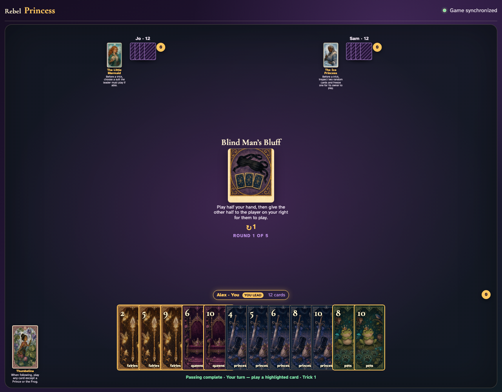
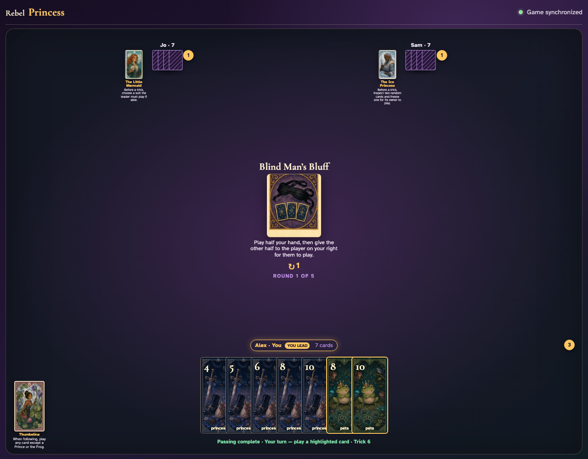
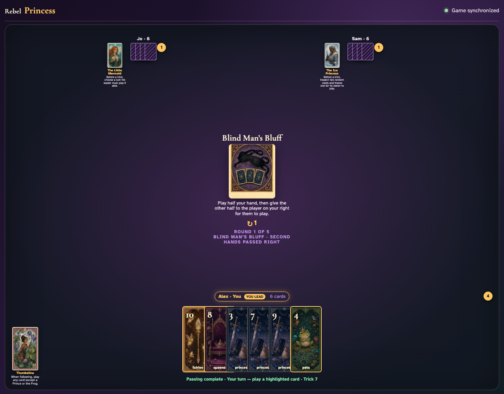
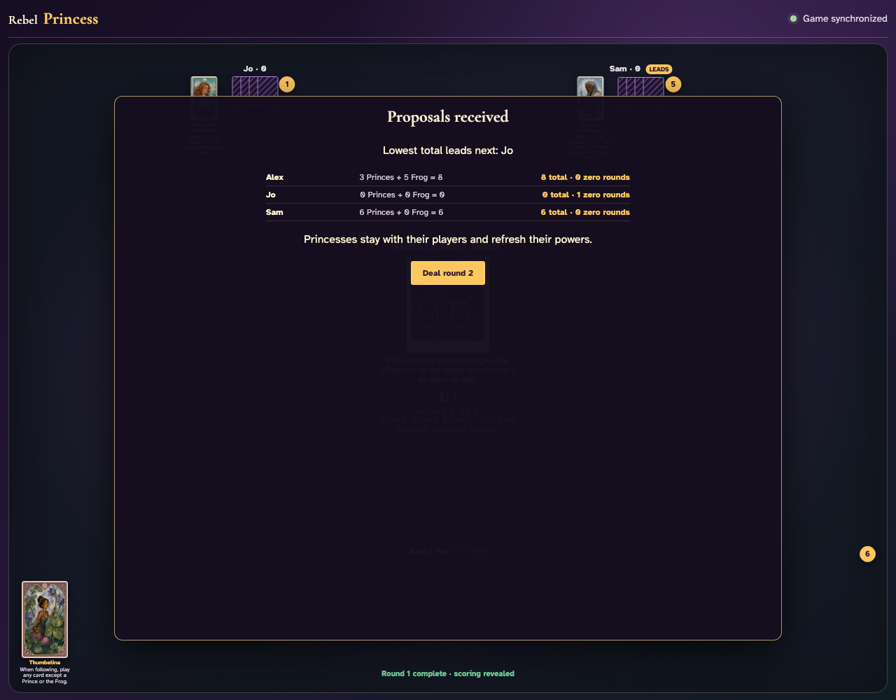

# Blind Man’s Bluff

Play the first six cards normally, inventory every remaining card, prove the exact clockwise transfer, then play the borrowed halves to round end.

## The center announces that each second half will be played by the player on its owner’s right

**Verifications:**
- [x] The exact half-hand rule is readable
- [x] Every player begins with twelve cards

---

## After five tricks, every owner has seven cards; one more played card will identify the exact six-card half to transfer

**Verifications:**
- [x] Every hand visibly contains seven cards
- [x] Trick six is announced

---

## The sixth trick triggers the automatic handoff: Alex receives Jo’s six, Jo receives Sam’s six, and Sam receives Alex’s six

**Verifications:**
- [x] The center confirms the second hands passed right
- [x] Alex has Jo’s exact remaining cards
- [x] Jo has Sam’s exact remaining cards
- [x] Sam has Alex’s exact remaining cards

---

## All eighteen borrowed-card clicks complete the final six tricks and reveal normal scoring

**Verifications:**
- [x] All borrowed hands are empty
- [x] Round one scoring is visible

---
