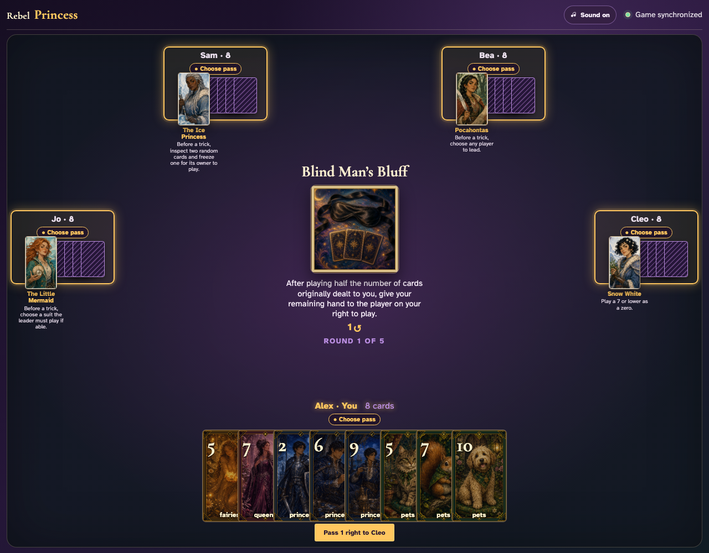
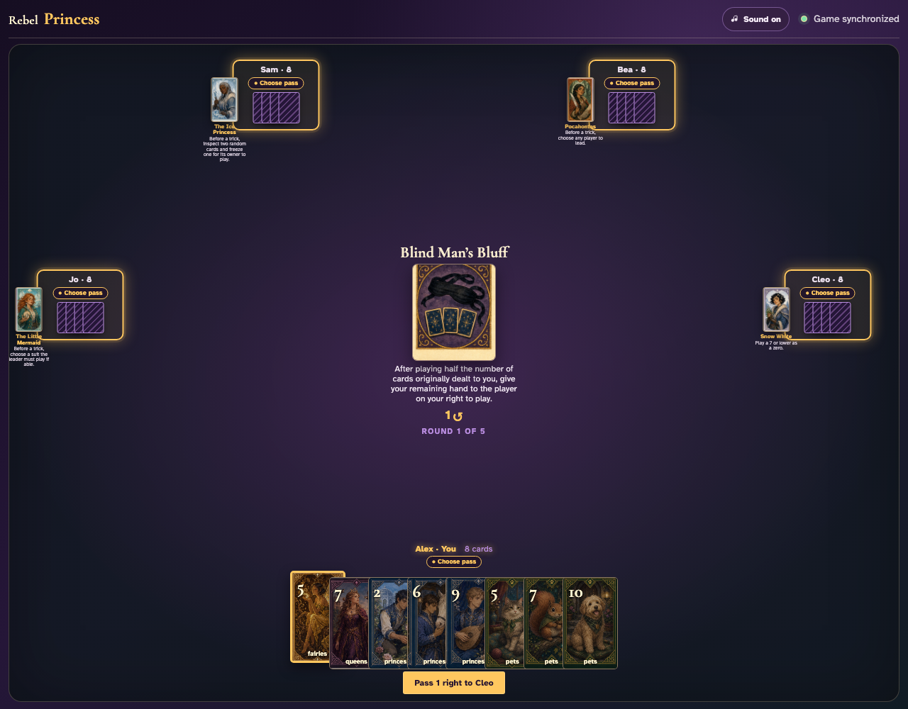
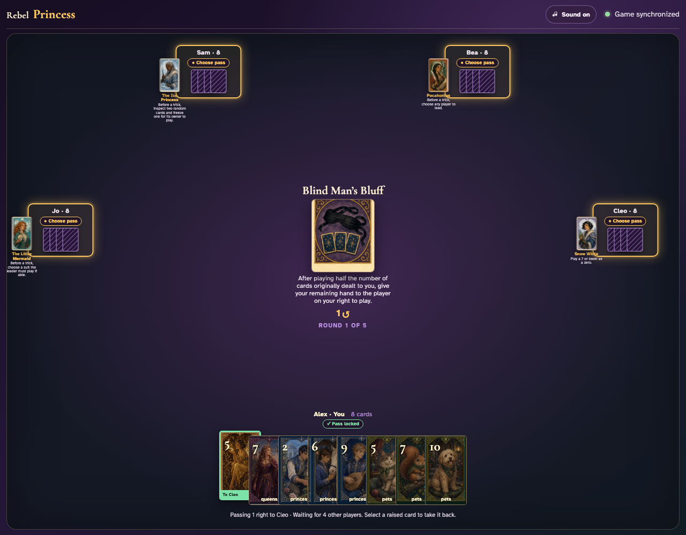
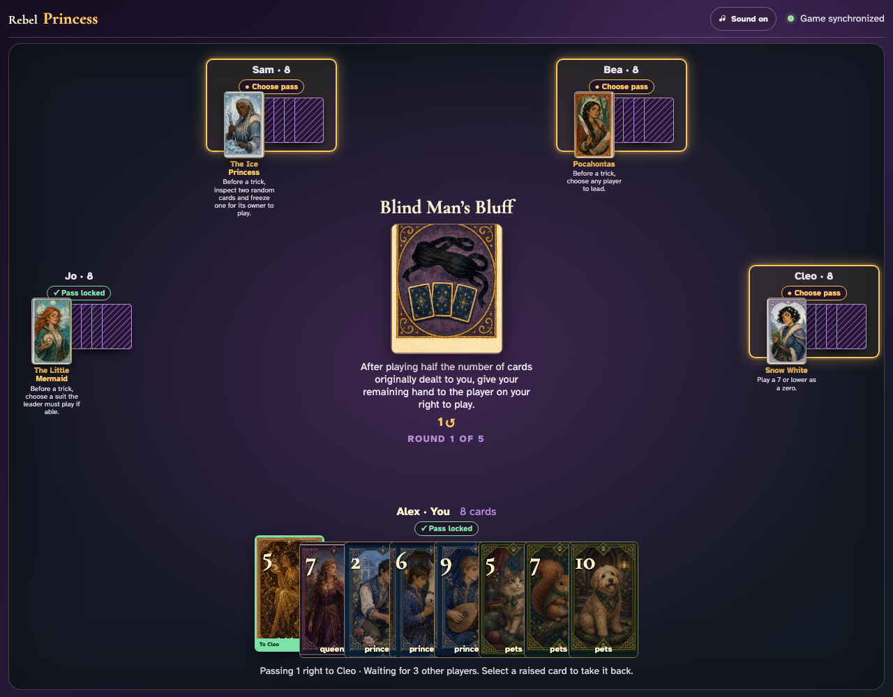
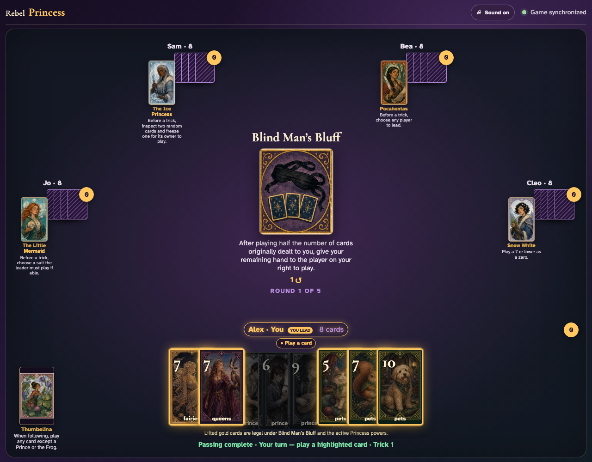
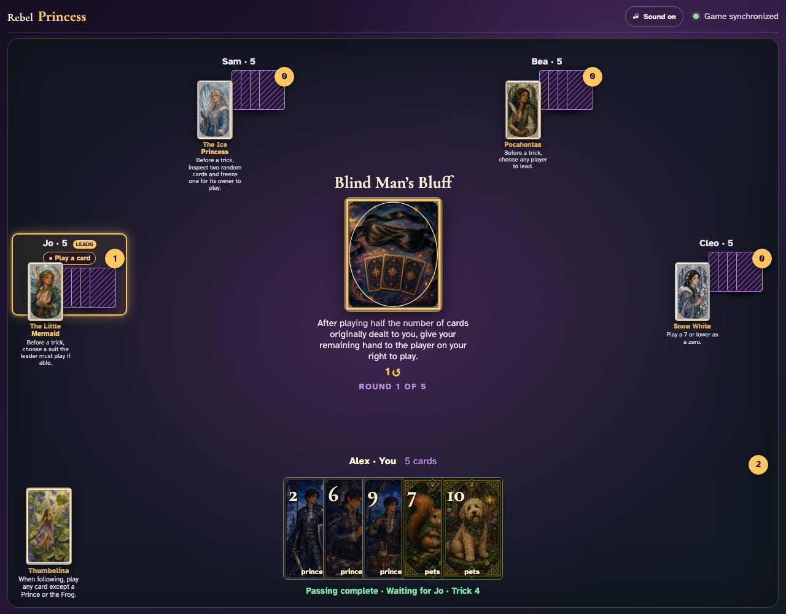
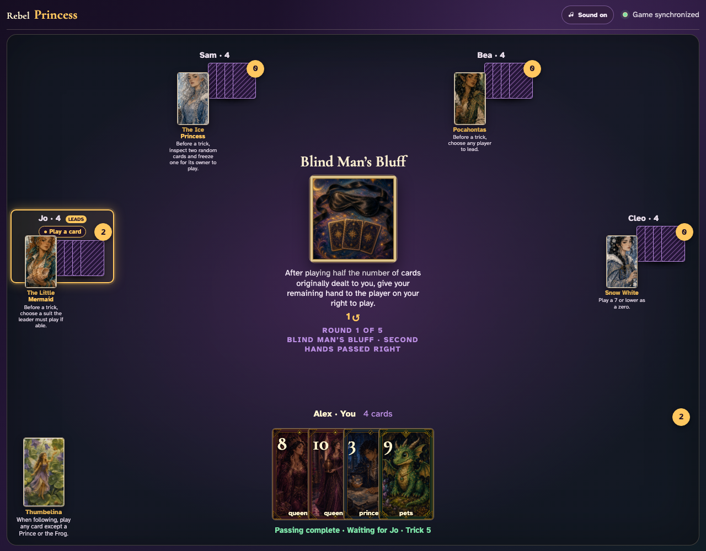
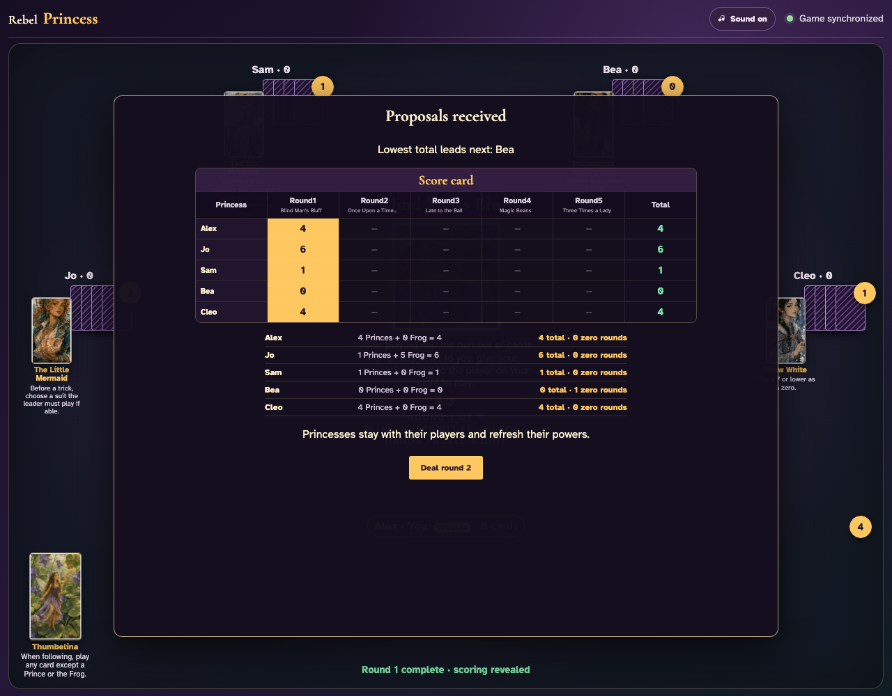

# Blind Man’s Bluff

Play half of the original deal, prove the exact clockwise transfer at a five-player desktop table, and keep the compact three-player phone scenario covered.

## Blind Man’s Bluff prints a 1-card right pass before play begins

**Verifications:**
- [x] The center icon announces Pass 1 right
- [x] The action names Cleo as the recipient
- [x] The pass cannot be committed before any card is chosen

---

## Alex clicks Fairies 5; it is assignment 1 of 1 to Cleo

**Verifications:**
- [x] Exactly 1 chosen card is raised
- [x] Fairies 5 stays visibly selected
- [x] The complete printed pass is ready to commit

---

## Alex commits the 1 cards toward Cleo while 4 other players are still choosing

**Verifications:**
- [x] All 1 outgoing cards remain visible and raised
- [x] The waiting message preserves the printed right direction
- [x] No incoming cards arrive before every player commits

---

## Jo commits next; Alex still sees the cards held until Cleo makes the final decision

**Verifications:**
- [x] Exactly 3 other players remain
- [x] Alex can still identify every outgoing card

---

## Cleo commits last; all 5 right transfers resolve simultaneously and play can begin

**Verifications:**
- [x] Every player again holds 8 cards
- [x] Alex receives the exact right incoming card
- [x] The table leaves the simultaneous pass phase for play or the Round card’s next action

---

## The center announces that each second half will be played by the player on its owner’s right

**Verifications:**
- [x] The original-deal threshold is readable
- [x] Every player begins with 8 cards

---

## After 3 tricks, every owner has 5 cards; one more played card will identify the exact 4-card half to transfer

**Verifications:**
- [x] Every hand visibly contains 5 cards
- [x] Trick 4 is announced

---

## Trick 4 triggers the automatic handoff of every original 4-card half to the player on its owner’s right

**Verifications:**
- [x] The center confirms the second hands passed right
- [x] Every player receives the next seated player’s exact remaining cards

---

## All 20 borrowed-card clicks complete the final 4 tricks and reveal normal scoring

**Verifications:**
- [x] All borrowed hands are empty
- [x] Round one scoring is visible

---
