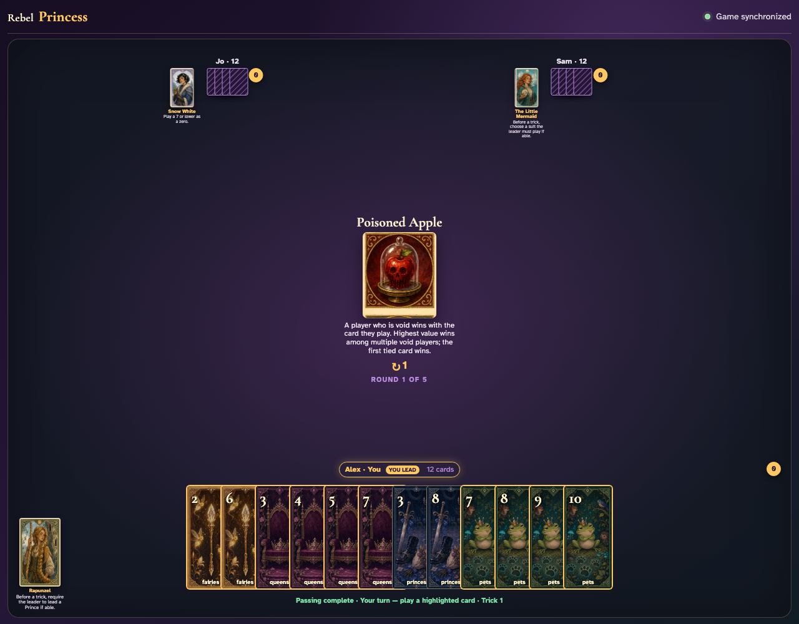
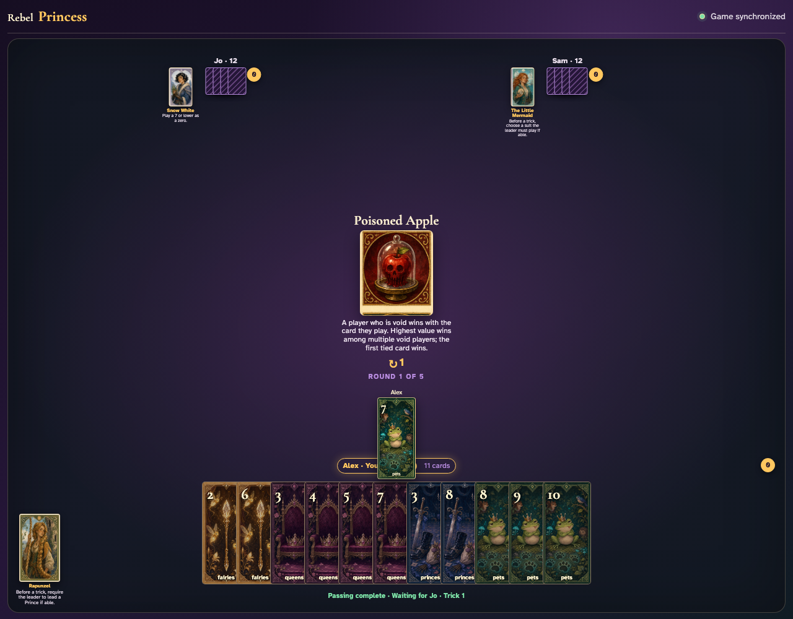
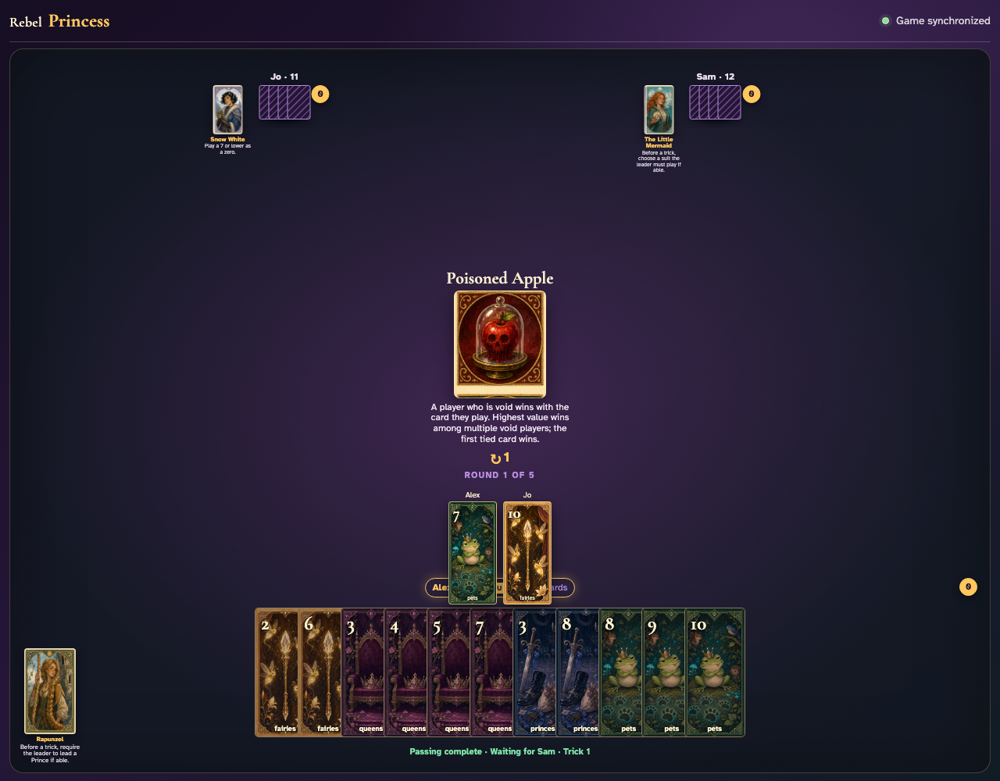
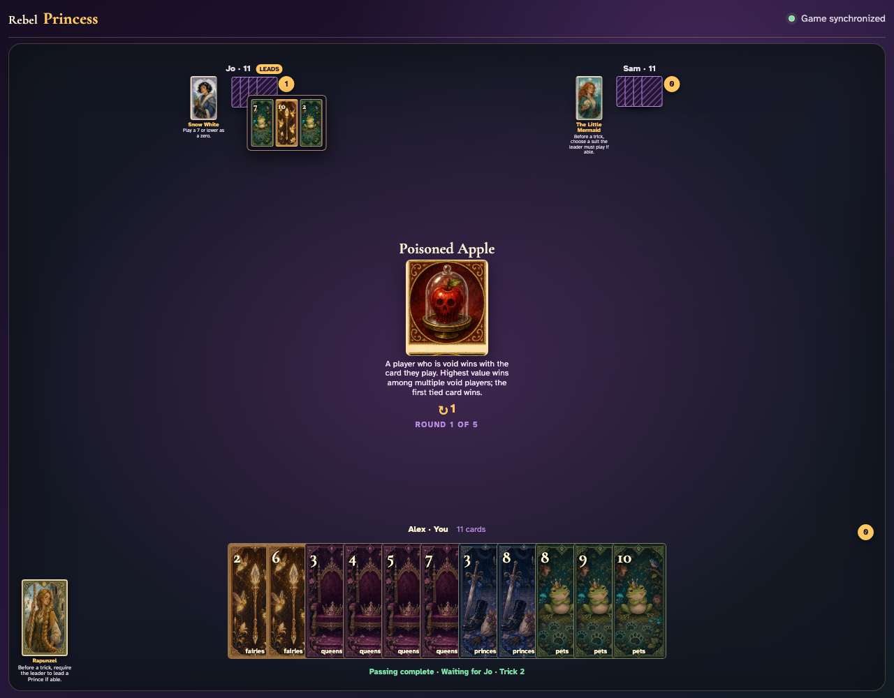

# Poisoned Apple

Lead a suit a follower cannot match, click the strongest off-suit response, finish the trick, and review the poisoned winner.

## The center announces that failing to follow suit changes who wins, with earliest play resolving equal void values

**Verifications:**
- [x] The exact void-card rule is readable
- [x] Alex can lead the deterministic Pets 7

---

## Alex clicks Pets 7; Jo is visibly void in Pets and may choose from another suit

**Verifications:**
- [x] The exact Pet lead is visible
- [x] Jo receives a turn with no enabled Pet

---

## Jo clicks off-suit Fairies 10; the actual graphic shows the Poisoned Apple condition in action

**Verifications:**
- [x] Jo’s off-suit card is visible beside Pets 7
- [x] Sam receives the final normal UI turn

---

## Jo’s Fairies 10 is the highest off-suit card and captures the trick despite the Pet lead

**Verifications:**
- [x] The trick counter awards Jo
- [x] The open review contains all three exact cards

---
