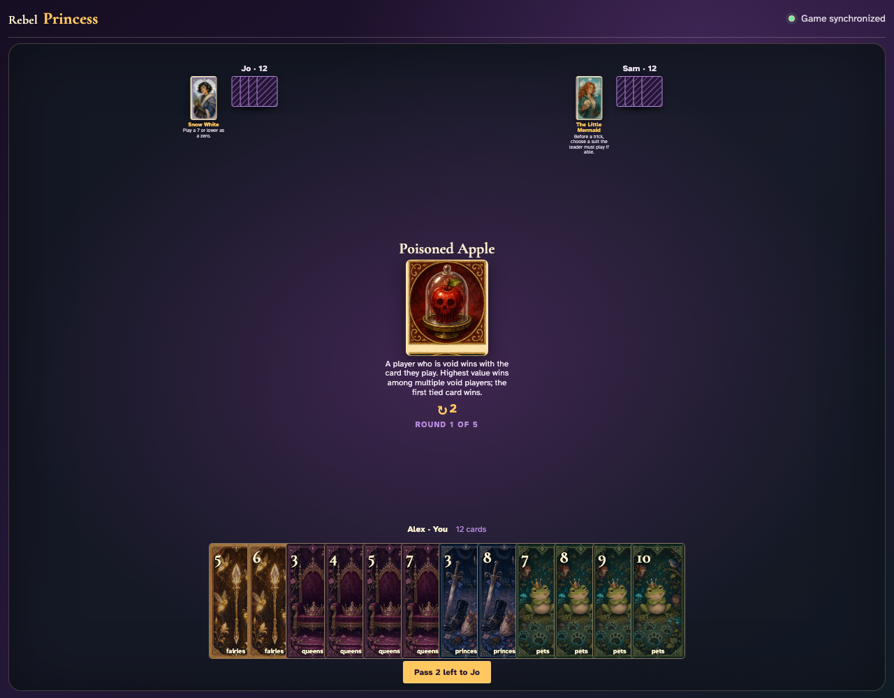
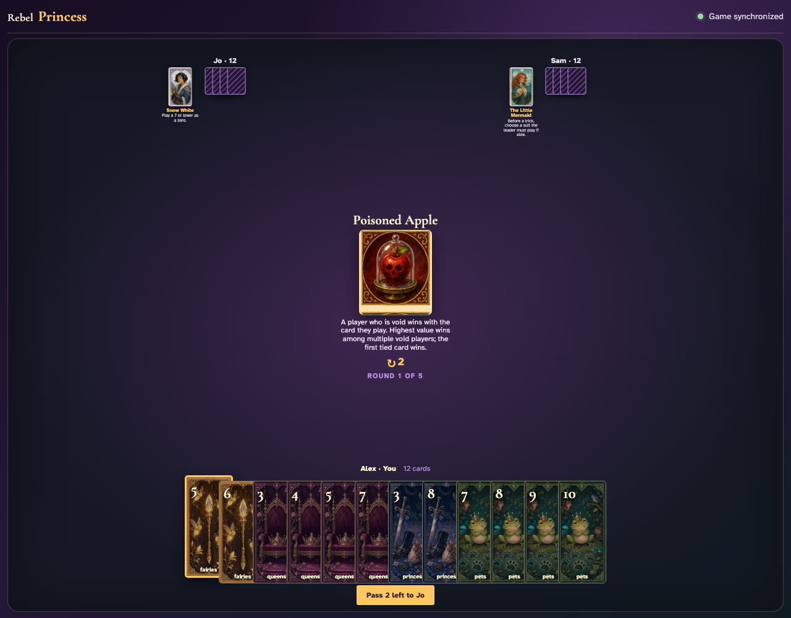
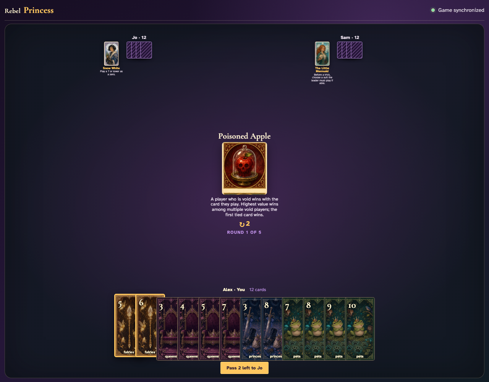
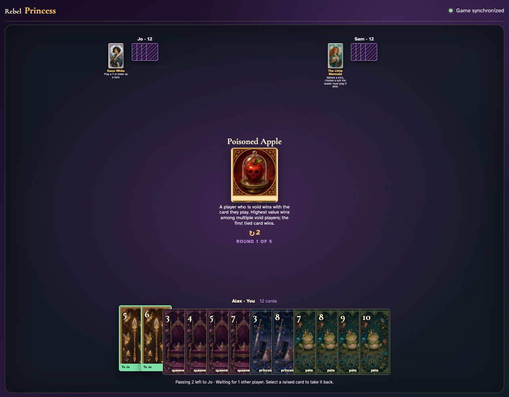
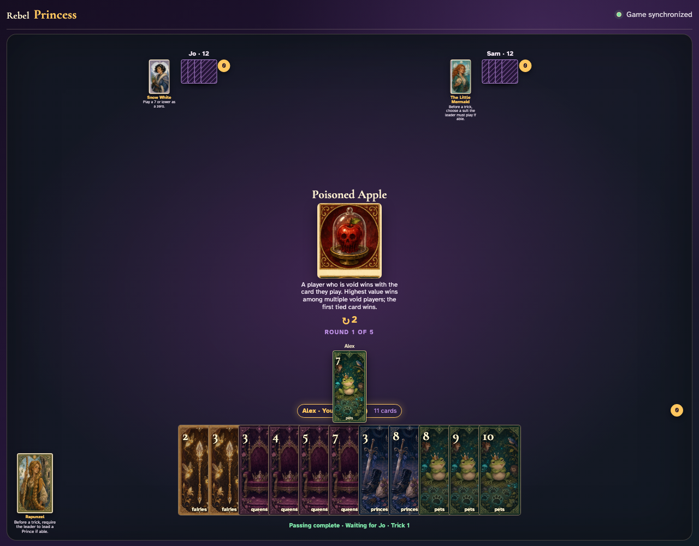
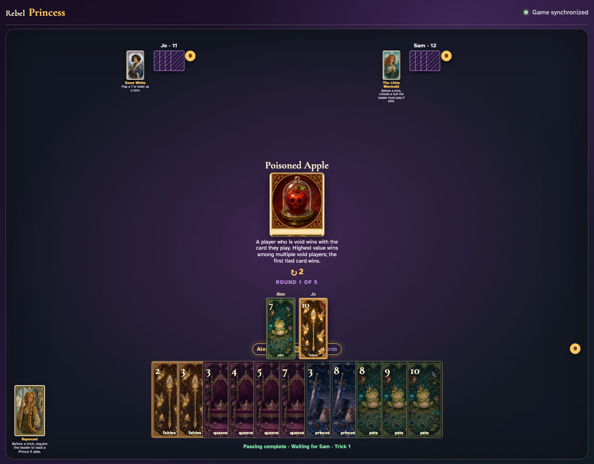
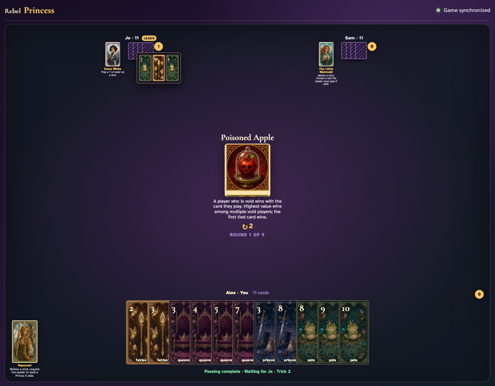

# Poisoned Apple

Lead a suit a follower cannot match, click the strongest off-suit response, finish the trick, and review the poisoned winner.

## Poisoned Apple prints a 2-card left pass before play begins

**Verifications:**
- [x] The center icon announces Pass 2 left
- [x] The action names Jo as the recipient
- [x] The pass cannot be committed before any card is chosen

---

## Alex clicks Fairies 5; it is assignment 1 of 2 to Jo

**Verifications:**
- [x] Exactly 1 chosen card is raised
- [x] Fairies 5 stays visibly selected
- [x] 1 more selection is still required

---

## Alex clicks Fairies 6; it is assignment 2 of 2 to Jo

**Verifications:**
- [x] Exactly 2 chosen cards are raised
- [x] Fairies 6 stays visibly selected
- [x] The complete printed pass is ready to commit

---

## Alex commits the 2 cards toward Jo while both other players are still choosing

**Verifications:**
- [x] All 2 outgoing cards remain visible and raised
- [x] The waiting message preserves the printed left direction
- [x] No incoming cards arrive before every player commits

---

## Jo commits next; Alex still sees the cards held until Sam makes the final decision

**Verifications:**
- [x] Exactly one other player remains
- [x] Alex can still identify every outgoing card

---

## Sam commits last; all three left transfers resolve simultaneously and play can begin

**Verifications:**
- [x] Every player again holds twelve cards
- [x] Alex receives the exact left incoming cards
- [x] The table leaves the simultaneous pass phase for play or the Round card’s next action

---

## The center announces that failing to follow suit changes who wins, with earliest play resolving equal void values

**Verifications:**
- [x] The exact void-card rule is readable
- [x] Alex can lead the deterministic Pets 7

---

## Alex clicks Pets 7; Jo is visibly void in Pets and may choose from another suit

**Verifications:**
- [x] The exact Pet lead is visible
- [x] Jo receives a turn with no enabled Pet

---

## Jo clicks off-suit Fairies 10; the actual graphic shows the Poisoned Apple condition in action

**Verifications:**
- [x] Jo’s off-suit card is visible beside Pets 7
- [x] Sam receives the final normal UI turn

---

## Jo’s Fairies 10 is the highest off-suit card and captures the trick despite the Pet lead

**Verifications:**
- [x] The trick counter awards Jo
- [x] The open review contains all three exact cards

---
