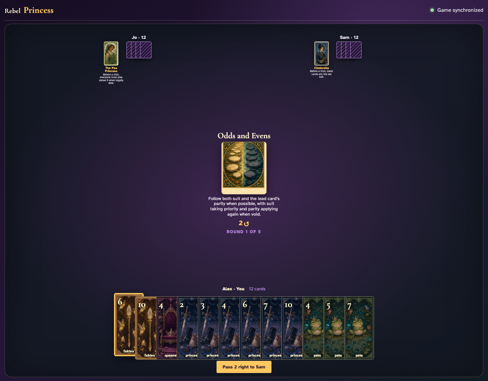
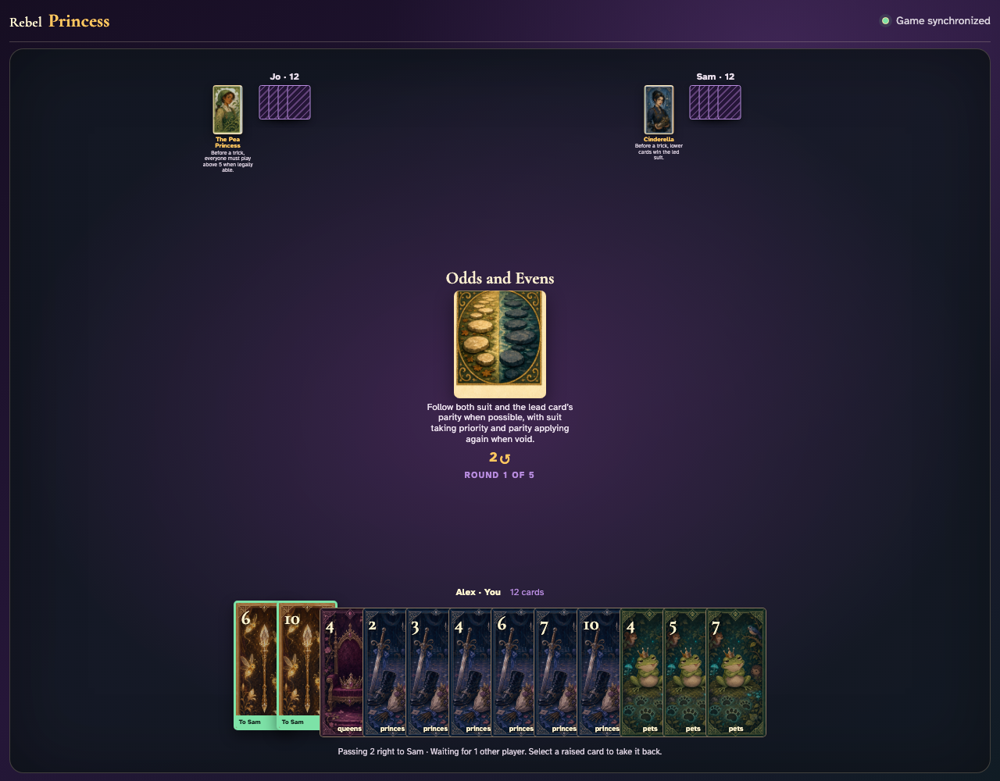
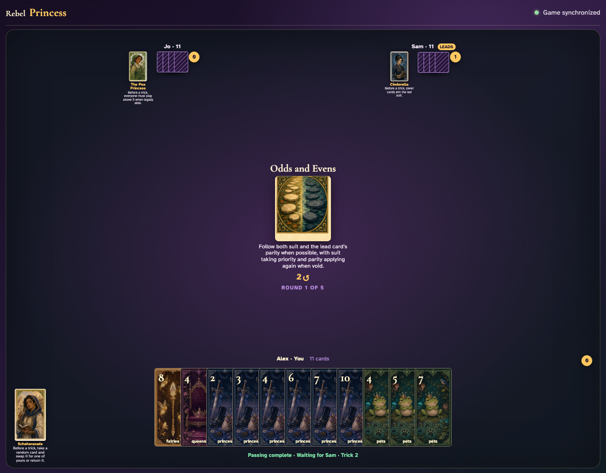

# Odds and Evens

Lead a card, inventory the next hand, prove the exact suit-then-parity enabled set, and complete the trick only through legal clicks.

## Odds and Evens prints a 2-card right pass before play begins

**Verifications:**
- [x] The center icon announces Pass 2 right
- [x] The action names Sam as the recipient
- [x] The pass cannot be committed before any card is chosen

---

## Alex clicks Fairies 6; it is assignment 1 of 2 to Sam

**Verifications:**
- [x] Exactly 1 chosen card is raised
- [x] Fairies 6 stays visibly selected
- [x] 1 more selection is still required

---

## Alex clicks Fairies 10; it is assignment 2 of 2 to Sam

**Verifications:**
- [x] Exactly 2 chosen cards are raised
- [x] Fairies 10 stays visibly selected
- [x] The complete printed pass is ready to commit

---

## Alex commits the 2 cards toward Sam while both other players are still choosing

**Verifications:**
- [x] All 2 outgoing cards remain visible and raised
- [x] The waiting message preserves the printed right direction
- [x] No incoming cards arrive before every player commits

---

## Jo commits next; Alex still sees the cards held until Sam makes the final decision

**Verifications:**
- [x] Exactly one other player remains
- [x] Alex can still identify every outgoing card

---

## Sam commits last; all three right transfers resolve simultaneously and play can begin

**Verifications:**
- [x] Every player again holds twelve cards
- [x] Alex receives the exact right incoming cards
- [x] The table leaves the simultaneous pass phase for play or the Round card’s next action

---

## The center explains that suit takes priority and parity narrows the legal choices whenever possible

**Verifications:**
- [x] The exact priority rule is readable
- [x] The leader may choose normally

---

## Alex clicks Fairies 4, establishing even parity and Fairies as the primary obligation

**Verifications:**
- [x] The exact lead graphic is visible
- [x] Exactly one next player has enabled cards

---

## The follower’s hand is filtered to the exact legal set: Fairies 2

**Verifications:**
- [x] Enabled cards equal the independently calculated suit-then-parity set
- [x] At least one nonmatching card remains visibly disabled

---

## Jo plays legal Fairies 2, Sam follows, and the ordinary winner receives the completed trick

**Verifications:**
- [x] All three exact graphics are visible during collection
- [x] Exactly one trick was awarded

---
