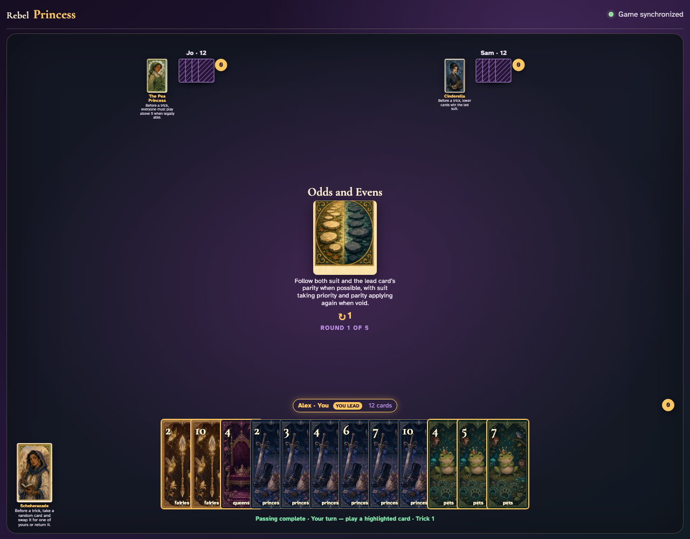
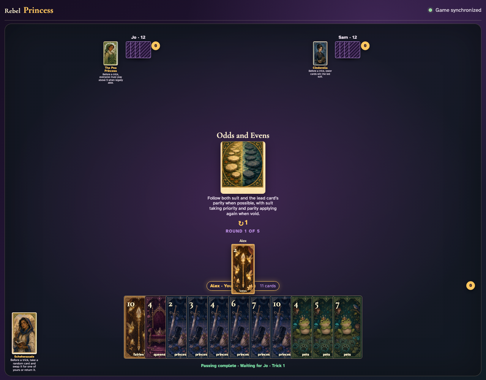
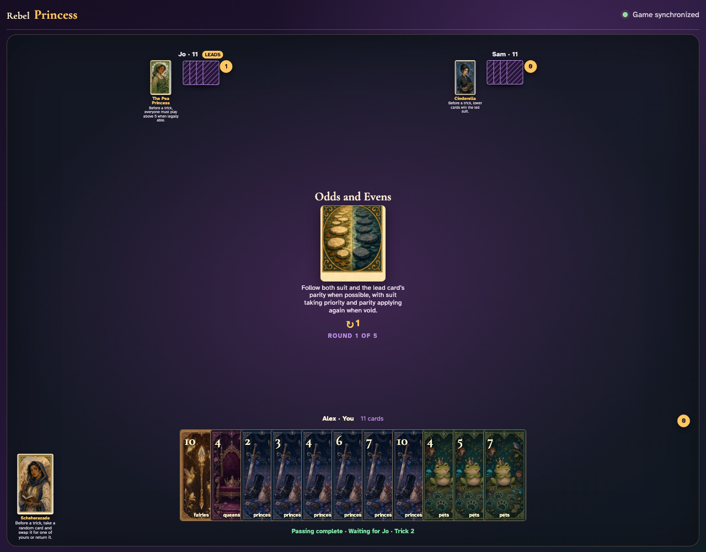

# Odds and Evens

Lead a card, inventory the next hand, prove the exact suit-then-parity enabled set, and complete the trick only through legal clicks.

## The center explains that suit takes priority and parity narrows the legal choices whenever possible

**Verifications:**
- [x] The exact priority rule is readable
- [x] The leader may choose normally

---

## Alex clicks Fairies 2, establishing even parity and Fairies as the primary obligation

**Verifications:**
- [x] The exact lead graphic is visible
- [x] Exactly one next player has enabled cards

---

## The follower’s hand is filtered to the exact legal set: Fairies 6, Fairies 8

**Verifications:**
- [x] Enabled cards equal the independently calculated suit-then-parity set
- [x] At least one nonmatching card remains visibly disabled

---

## Jo plays legal Fairies 6, Sam follows, and the ordinary winner receives the completed trick

**Verifications:**
- [x] All three exact graphics are visible during collection
- [x] Exactly one trick was awarded

---
