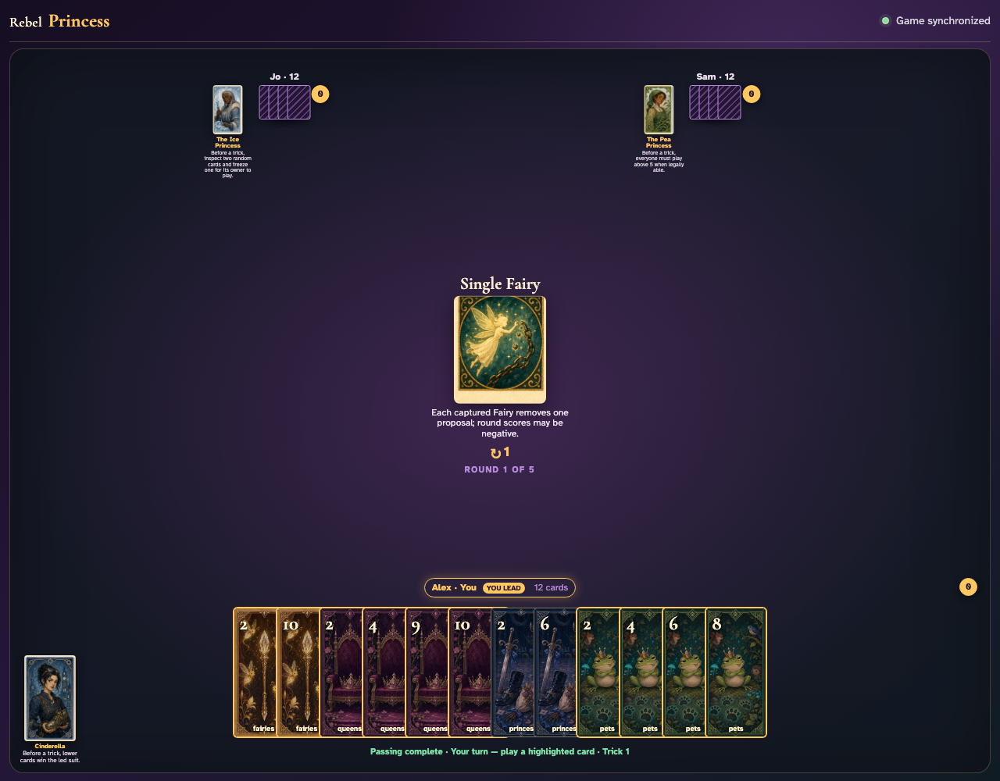
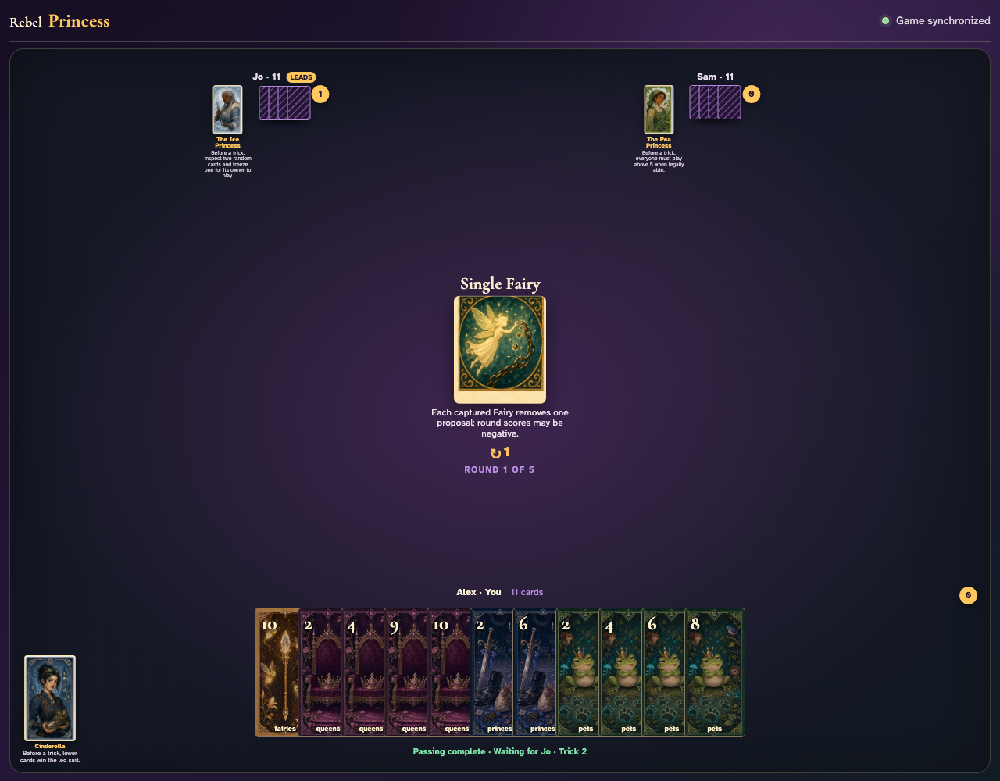
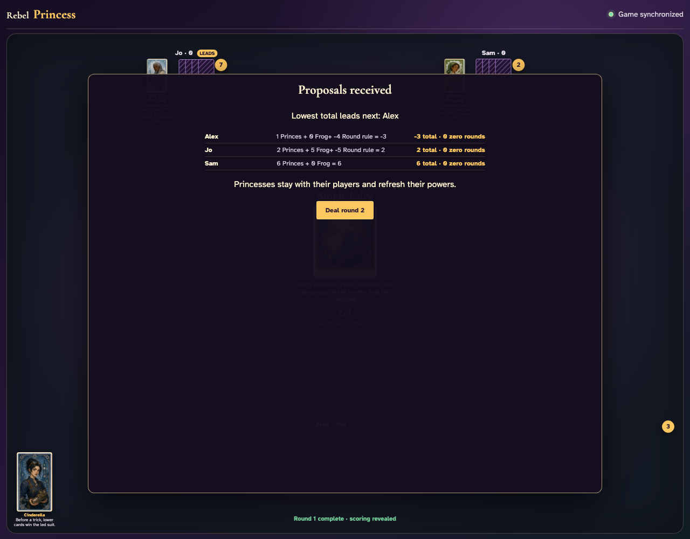

# Single Fairy

Count all Fairies in the shared deal, play every trick through ordinary clicks, and reconcile the complete negative scoring modifier.

## The round begins with all nine three-player Fairies and a visible minus-one rule

**Verifications:**
- [x] The exact negative scoring rule is readable
- [x] The complete shared deal contains exactly nine Fairies

---

## The first ordinary trick uses the actual graphics (Fairies 2, Fairies 4, Fairies 3) before any scoring is applied

**Verifications:**
- [x] Exactly one player receives the first trick
- [x] Every player retains eleven cards

---

## After all 36 clicks, the three negative Round-rule entries account for every Fairy and reduce the deck’s base fourteen proposals to five

**Verifications:**
- [x] All nine Fairies are subtracted exactly once
- [x] Combined round totals equal five proposals
- [x] All hands are empty after the twelve tricks

---
