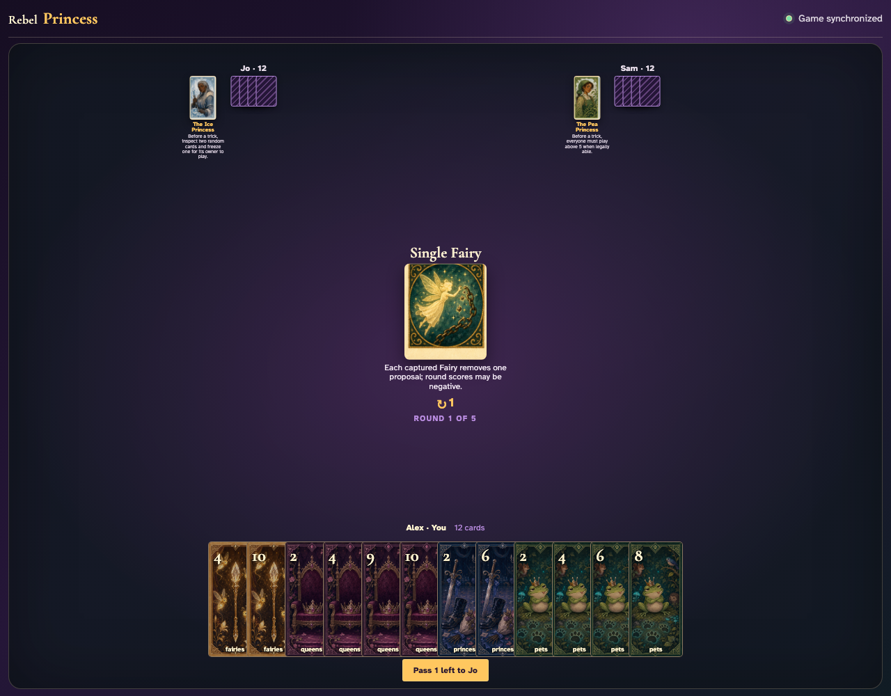
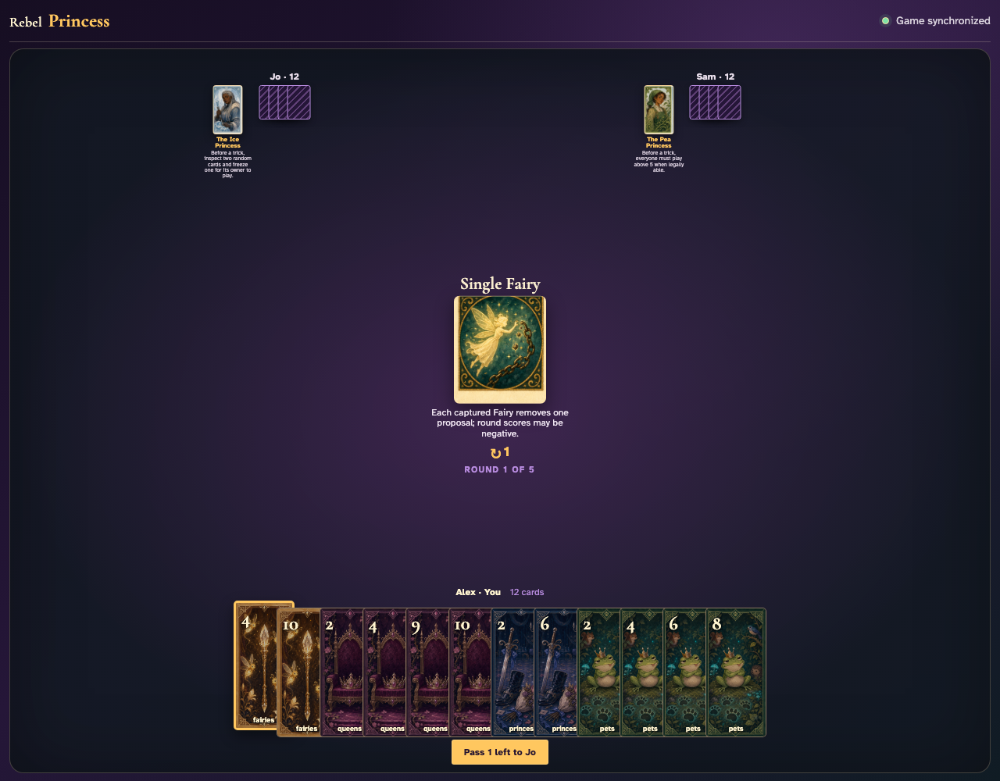
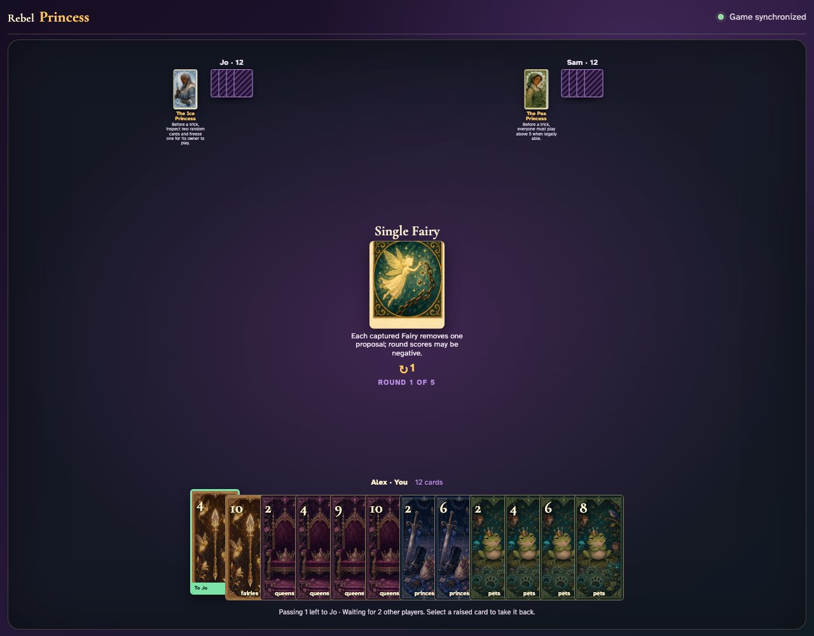
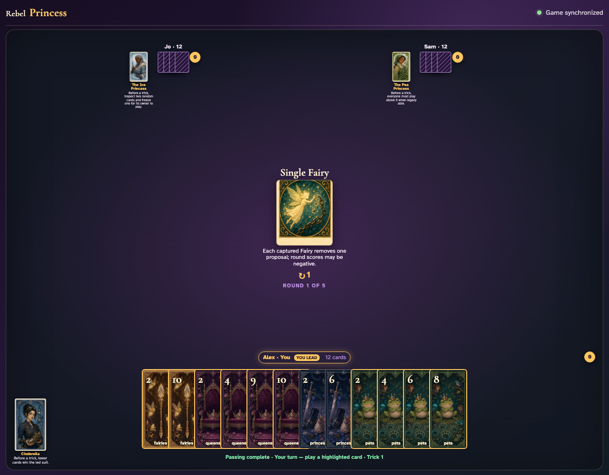
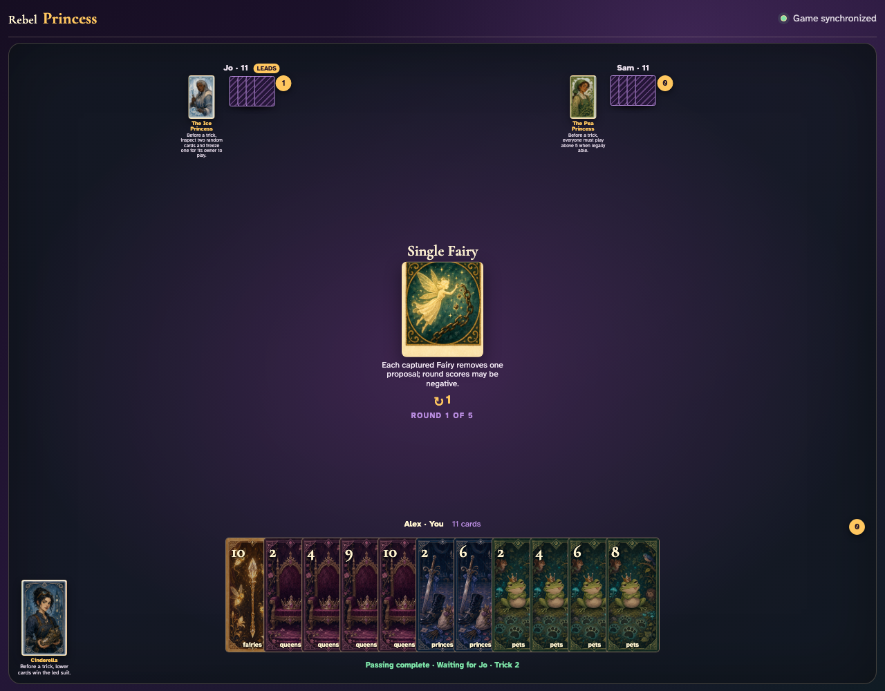
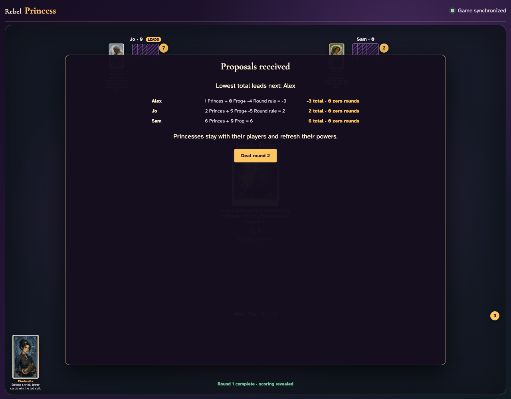

# Single Fairy

Count all Fairies in the shared deal, play every trick through ordinary clicks, and reconcile the complete negative scoring modifier.

## Single Fairy prints a 1-card left pass before play begins

**Verifications:**
- [x] The center icon announces Pass 1 left
- [x] The action names Jo as the recipient
- [x] The pass cannot be committed before any card is chosen

---

## Alex clicks Fairies 4; it is assignment 1 of 1 to Jo

**Verifications:**
- [x] Exactly 1 chosen card is raised
- [x] Fairies 4 stays visibly selected
- [x] The complete printed pass is ready to commit

---

## Alex commits the 1 cards toward Jo while both other players are still choosing

**Verifications:**
- [x] All 1 outgoing cards remain visible and raised
- [x] The waiting message preserves the printed left direction
- [x] No incoming cards arrive before every player commits

---

## Jo commits next; Alex still sees the cards held until Sam makes the final decision

**Verifications:**
- [x] Exactly one other player remains
- [x] Alex can still identify every outgoing card

---

## Sam commits last; all three left transfers resolve simultaneously and play can begin

**Verifications:**
- [x] Every player again holds twelve cards
- [x] Alex receives the exact left incoming card
- [x] The table leaves the simultaneous pass phase for play or the Round card’s next action

---

## The round begins with all nine three-player Fairies and a visible minus-one rule

**Verifications:**
- [x] The exact negative scoring rule is readable
- [x] The complete shared deal contains exactly nine Fairies

---

## The first ordinary trick uses the actual graphics (Fairies 2, Fairies 4, Fairies 3) before any scoring is applied

**Verifications:**
- [x] Exactly one player receives the first trick
- [x] Every player retains eleven cards

---

## After all 36 clicks, the three negative Round-rule entries account for every Fairy and reduce the deck’s base fourteen proposals to five

**Verifications:**
- [x] All nine Fairies are subtracted exactly once
- [x] Combined round totals equal five proposals
- [x] All hands are empty after the twelve tricks

---
