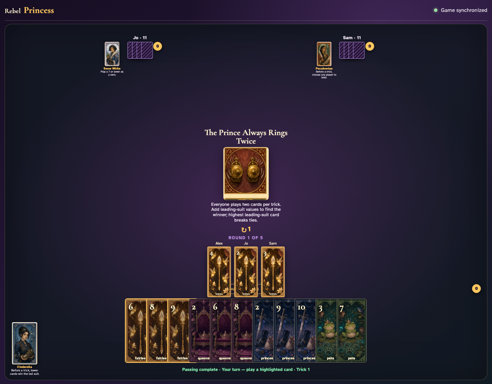
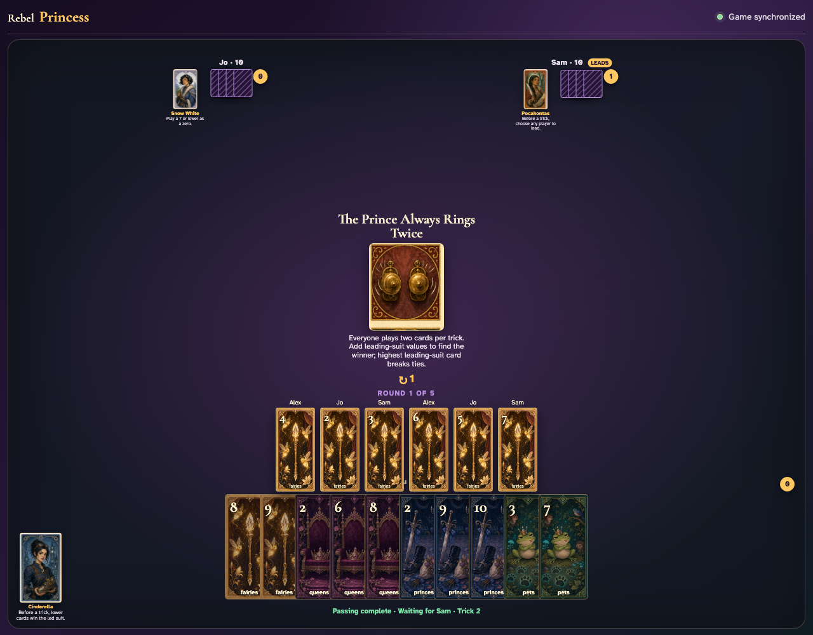
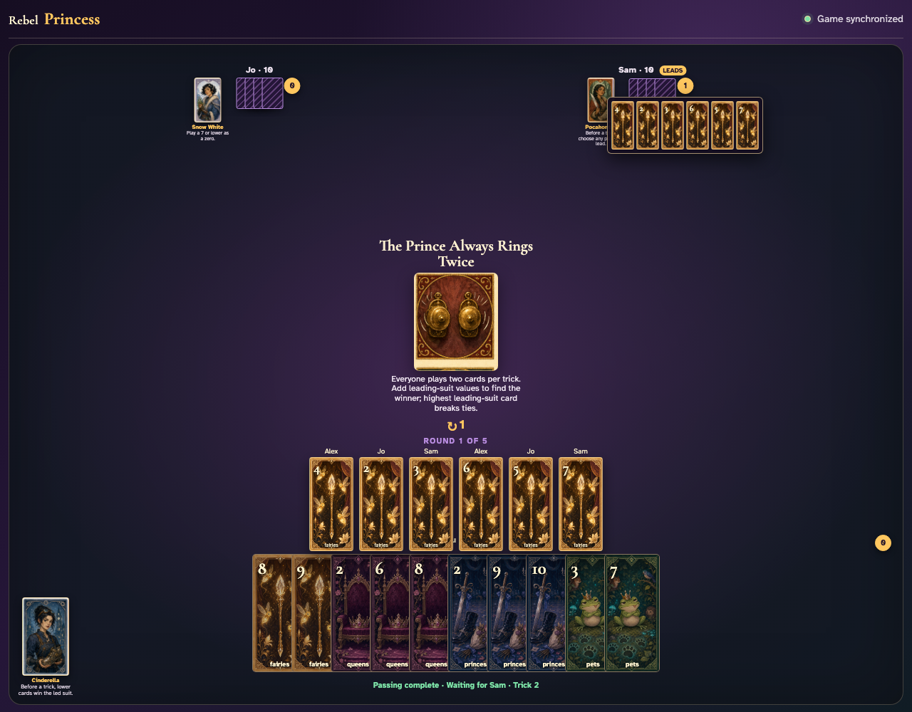
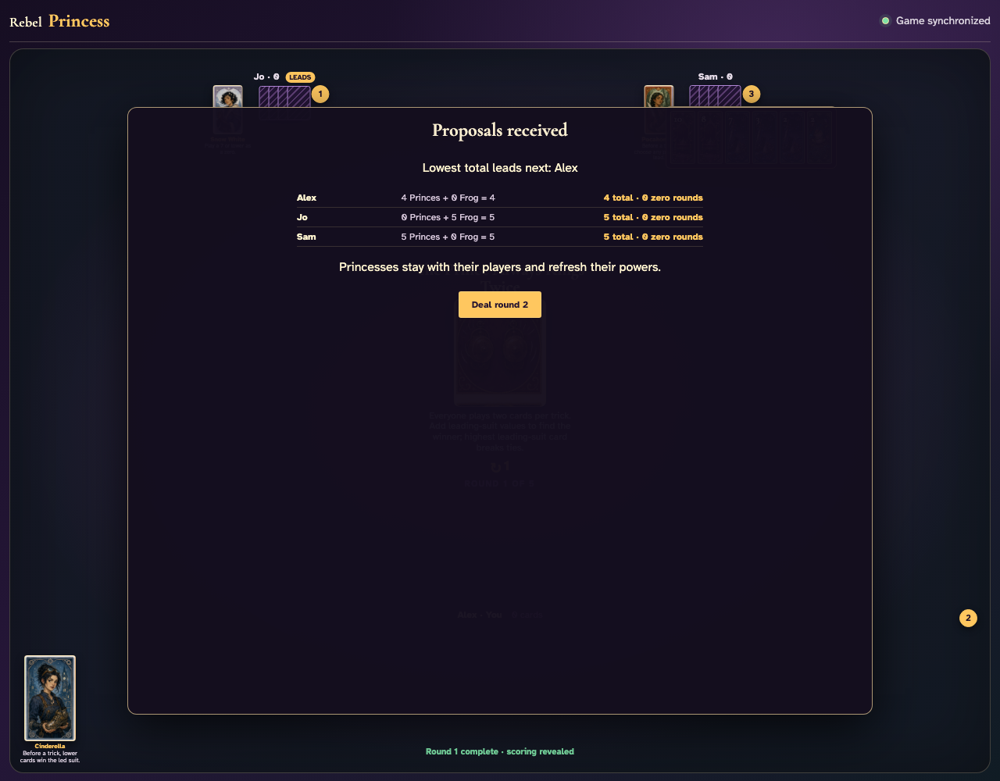

# The Prince Always Rings Twice

Play one complete six-card trick in two visible laps, independently total the leading suit, inspect the winner’s six cards, and finish all six tricks.

## The center announces two cards per player, summed only in the leading suit with a highest-card tie-break

**Verifications:**
- [x] The exact double-play rule is readable
- [x] All players begin with twelve cards

---

## The first clockwise lap places Fairies 4, Fairies 2, Fairies 3 in the center without resolving the trick

**Verifications:**
- [x] Three actual card graphics remain in the current trick
- [x] No trick counter increments after only one lap

---

## The second lap completes six cards; Sam has the greatest Fairies sum (then highest-card tie-break) and receives the trick

**Verifications:**
- [x] All six graphics are visible during collection
- [x] The trick counter awards Sam

---

## Sam opens the six-card capture so both cards from every player can be recomputed

**Verifications:**
- [x] The review contains all six played cards
- [x] Each hand has ten cards after two plays

---

## Five more six-card tricks consume all hands and reveal normal round scoring

**Verifications:**
- [x] Exactly six tricks were awarded
- [x] Round one scoring is visible

---
