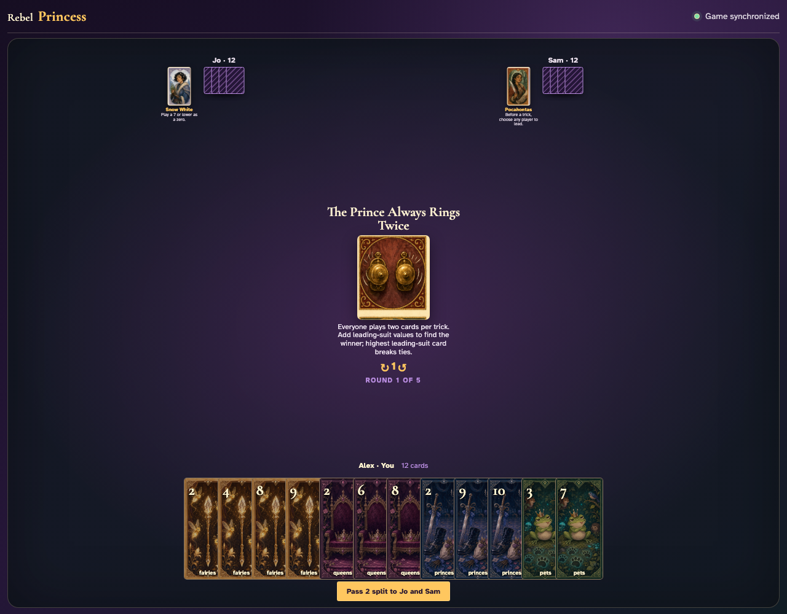
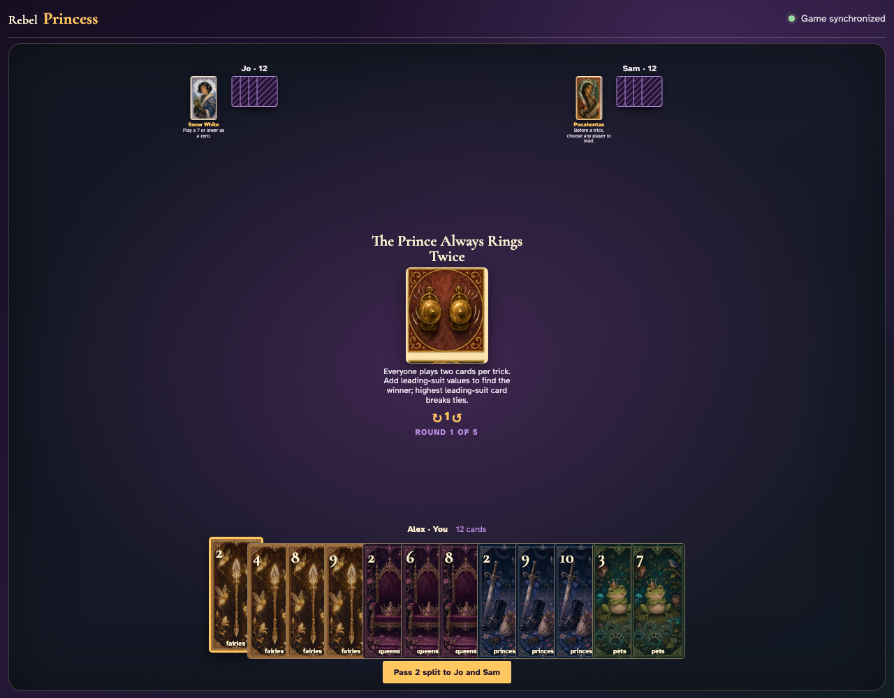
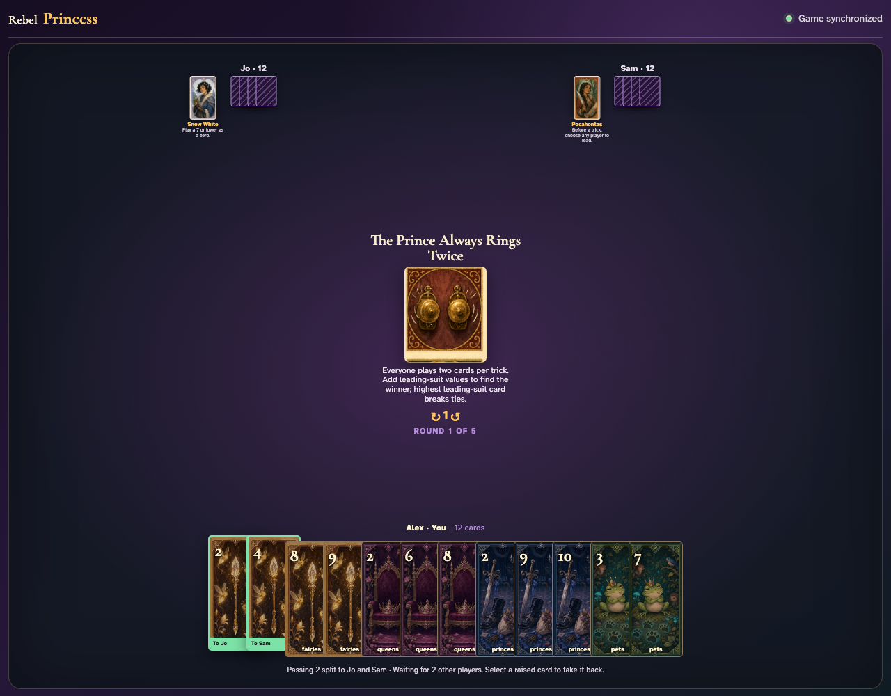
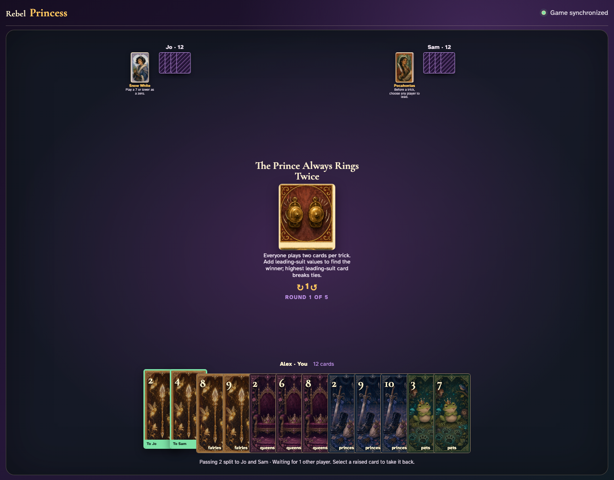
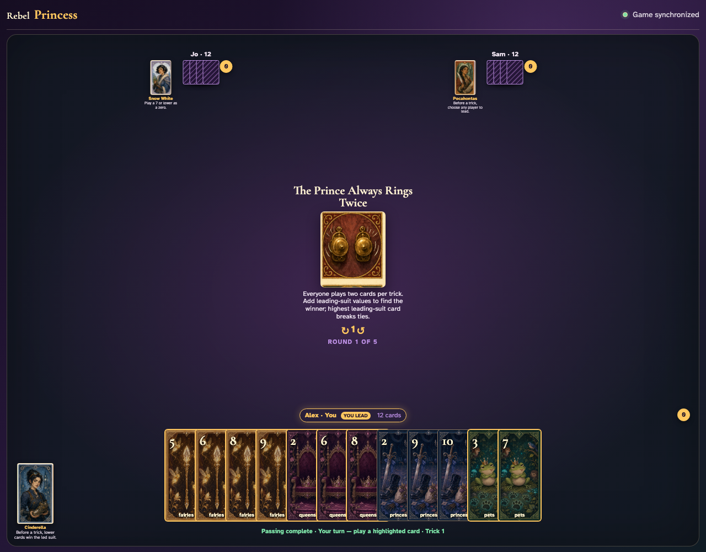
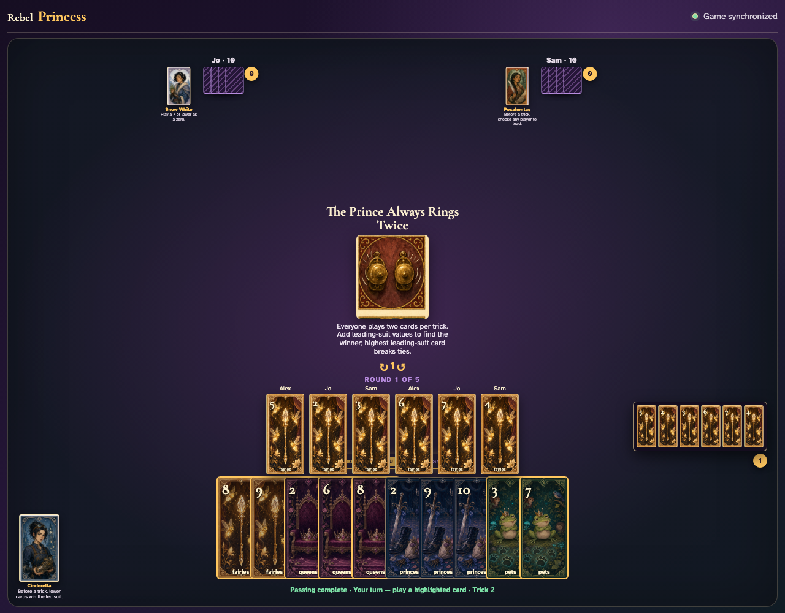
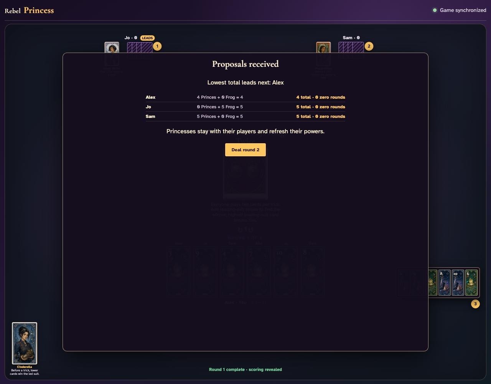

# The Prince Always Rings Twice

Play one complete six-card trick in two visible laps, independently total the leading suit, inspect the winner’s six cards, and finish all six tricks.

## The Prince Always Rings Twice prints a 2-card split pass before play begins

**Verifications:**
- [x] The center icon announces Pass 2 split
- [x] The action names Jo and Sam as the recipients
- [x] The pass cannot be committed before any card is chosen

---

## Alex clicks Fairies 2; it is assignment 1 of 2 to Jo

**Verifications:**
- [x] Exactly 1 chosen card is raised
- [x] Fairies 2 stays visibly selected
- [x] 1 more selection is still required

---

## Alex clicks Fairies 4; it is assignment 2 of 2 to Sam

**Verifications:**
- [x] Exactly 2 chosen cards are raised
- [x] Fairies 4 stays visibly selected
- [x] The complete printed pass is ready to commit

---

## Alex commits the 2 cards toward Jo and Sam while both other players are still choosing

**Verifications:**
- [x] All 2 outgoing cards remain visible and raised
- [x] The waiting message preserves the printed split direction
- [x] No incoming cards arrive before every player commits

---

## Jo commits next; Alex still sees the cards held until Sam makes the final decision

**Verifications:**
- [x] Exactly one other player remains
- [x] Alex can still identify every outgoing card

---

## Sam commits last; all three split transfers resolve simultaneously and play can begin

**Verifications:**
- [x] Every player again holds twelve cards
- [x] Alex receives the exact split incoming cards
- [x] The table leaves the simultaneous pass phase for play or the Round card’s next action

---

## The center announces two cards per player, summed only in the leading suit with a highest-card tie-break

**Verifications:**
- [x] The exact double-play rule is readable
- [x] All players begin with twelve cards

---

## The first clockwise lap places Fairies 5, Fairies 2, Fairies 3 in the center without resolving the trick

**Verifications:**
- [x] Three actual card graphics remain in the current trick
- [x] No trick counter increments after only one lap

---

## The second lap completes six cards; Alex has the greatest Fairies sum (then highest-card tie-break) and receives the trick

**Verifications:**
- [x] All six graphics are visible during collection
- [x] The trick counter awards Alex

---

## Alex opens the six-card capture so both cards from every player can be recomputed

**Verifications:**
- [x] The review contains all six played cards
- [x] Each hand has ten cards after two plays

---

## Five more six-card tricks consume all hands and reveal normal round scoring

**Verifications:**
- [x] Exactly six tricks were awarded
- [x] Round one scoring is visible

---
