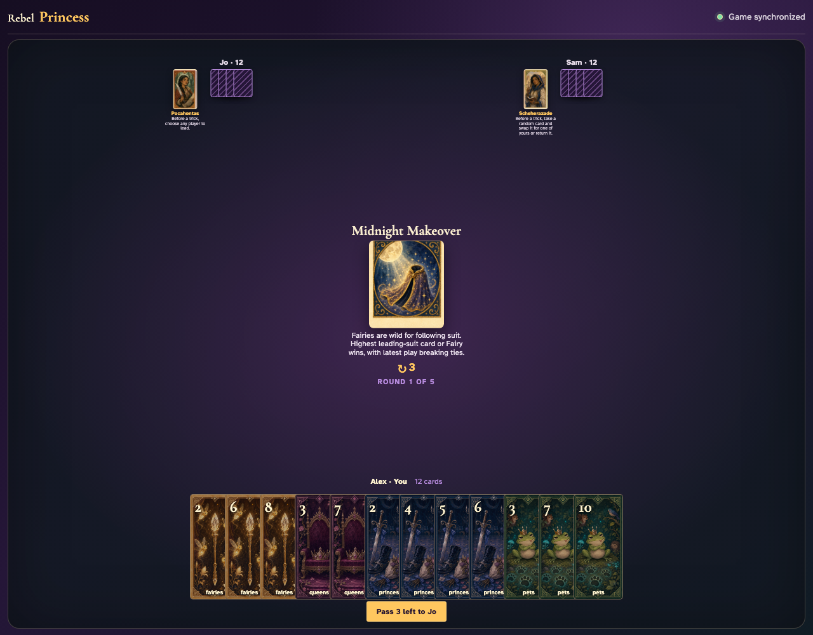
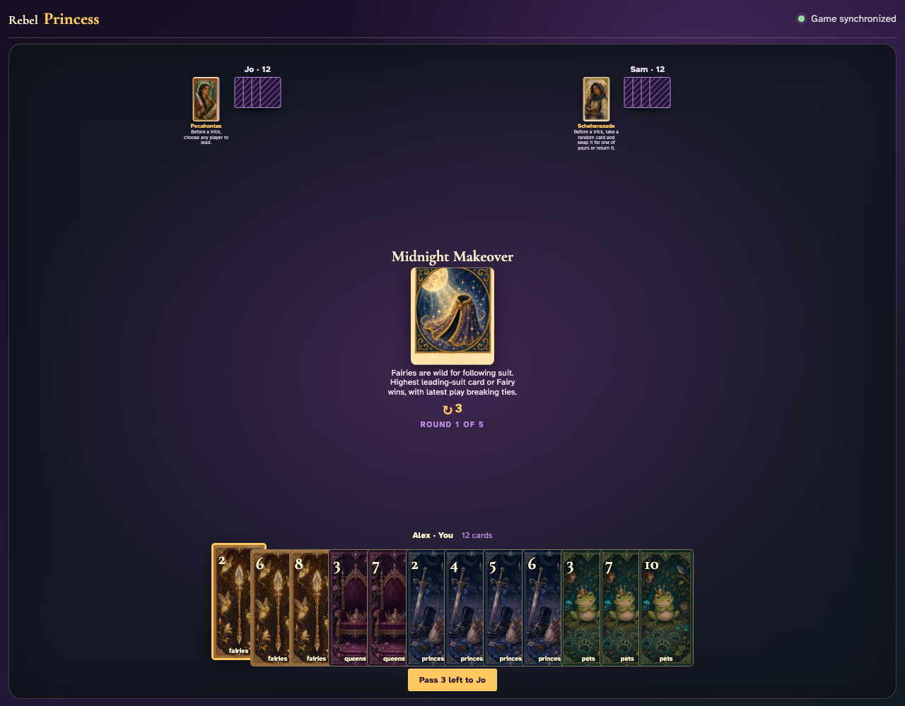
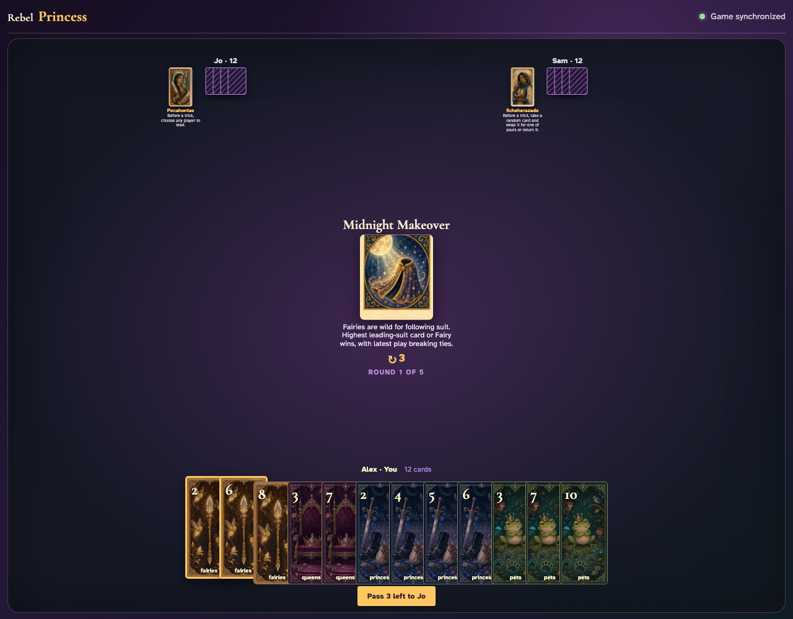
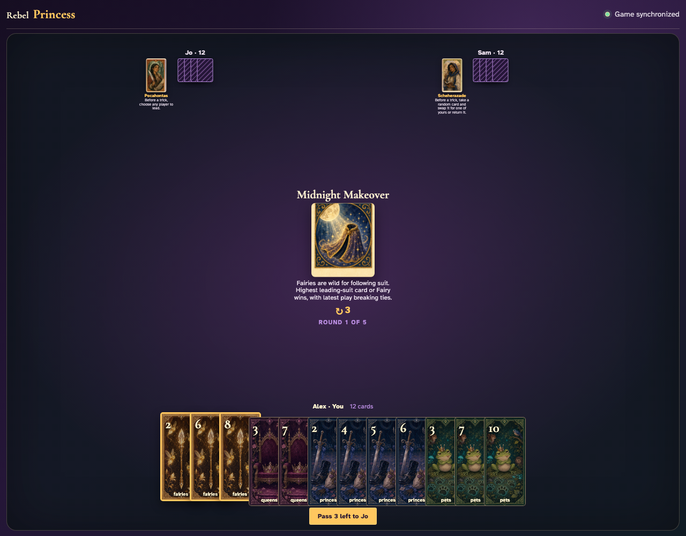
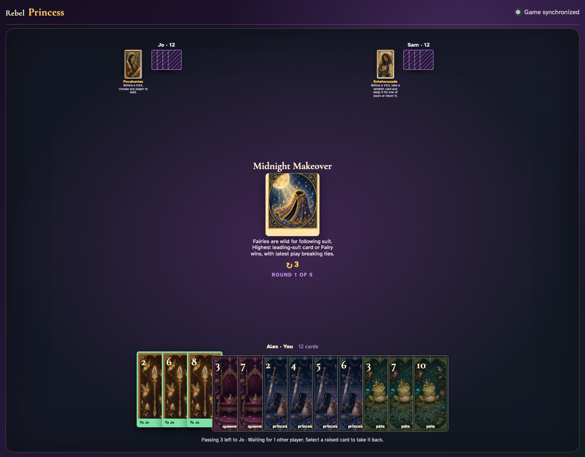
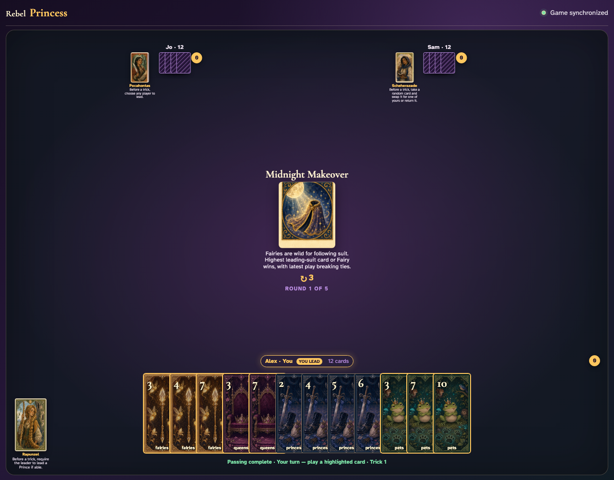
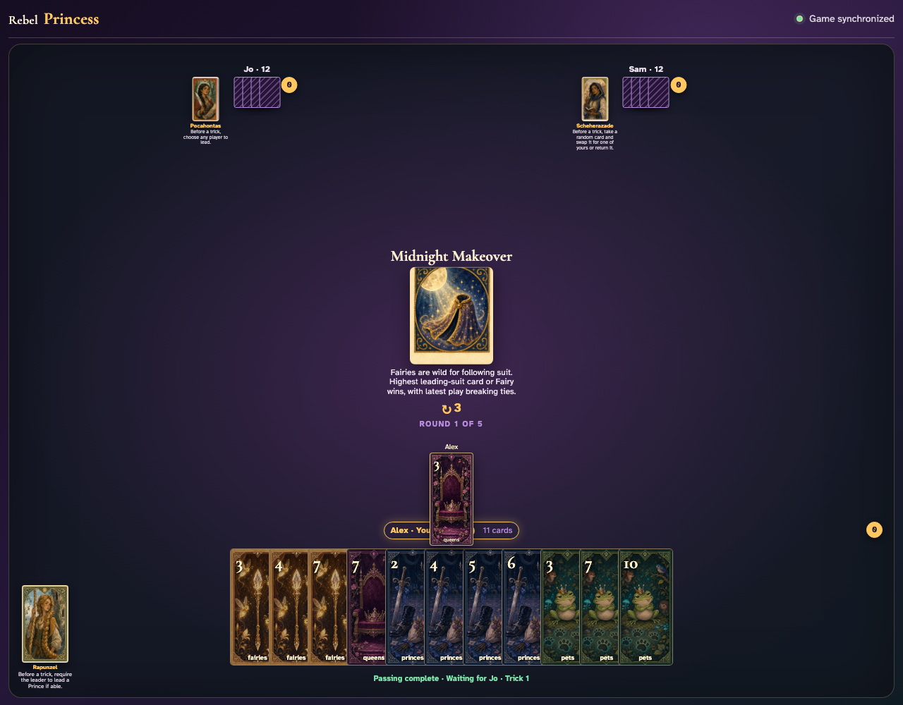
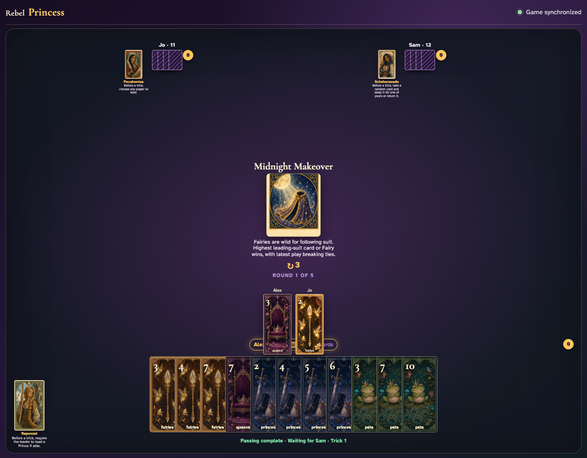
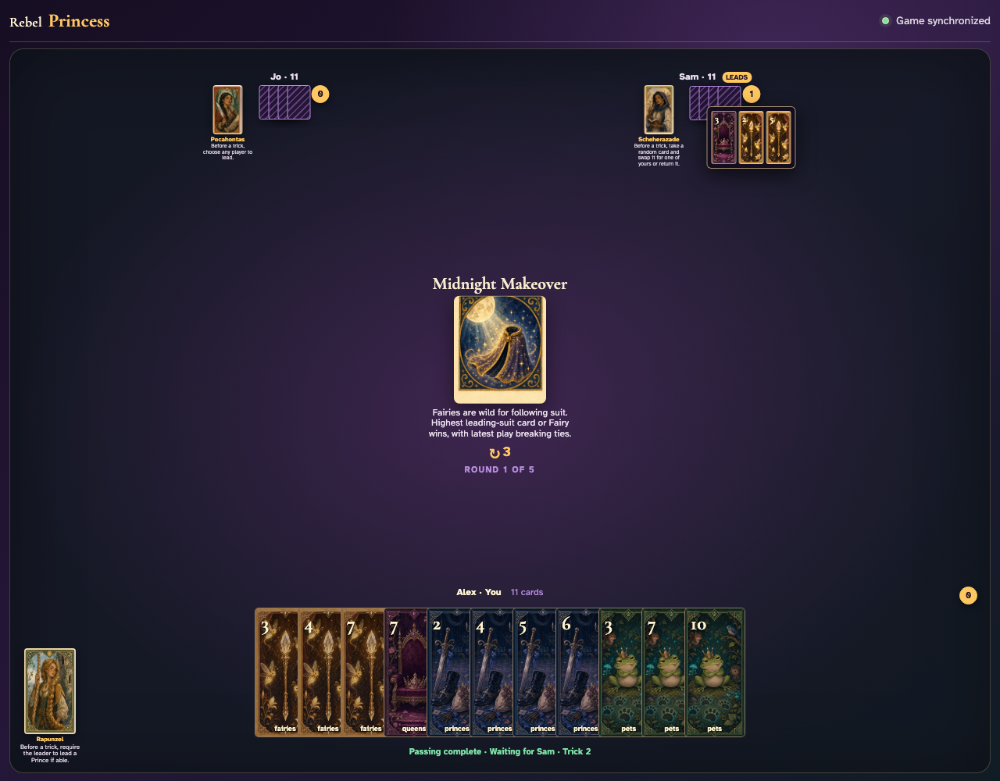

# Midnight Makeover

Choose a lead whose follower holds both that suit and a Fairy, click the Fairy instead, and prove it competes as a leading-suit card.

## Midnight Makeover prints a 3-card left pass before play begins

**Verifications:**
- [x] The center icon announces Pass 3 left
- [x] The action names Jo as the recipient
- [x] The pass cannot be committed before any card is chosen

---

## Alex clicks Fairies 2; it is assignment 1 of 3 to Jo

**Verifications:**
- [x] Exactly 1 chosen card is raised
- [x] Fairies 2 stays visibly selected
- [x] 2 more selections are still required

---

## Alex clicks Fairies 6; it is assignment 2 of 3 to Jo

**Verifications:**
- [x] Exactly 2 chosen cards are raised
- [x] Fairies 6 stays visibly selected
- [x] 1 more selection is still required

---

## Alex clicks Fairies 8; it is assignment 3 of 3 to Jo

**Verifications:**
- [x] Exactly 3 chosen cards are raised
- [x] Fairies 8 stays visibly selected
- [x] The complete printed pass is ready to commit

---

## Alex commits the 3 cards toward Jo while both other players are still choosing

**Verifications:**
- [x] All 3 outgoing cards remain visible and raised
- [x] The waiting message preserves the printed left direction
- [x] No incoming cards arrive before every player commits

---

## Jo commits next; Alex still sees the cards held until Sam makes the final decision

**Verifications:**
- [x] Exactly one other player remains
- [x] Alex can still identify every outgoing card

---

## Sam commits last; all three left transfers resolve simultaneously and play can begin

**Verifications:**
- [x] Every player again holds twelve cards
- [x] Alex receives the exact left incoming cards
- [x] The table leaves the simultaneous pass phase for play or the Round card’s next action

---

## The center announces that Fairies may follow as wild cards and equal values favor the latest play

**Verifications:**
- [x] The exact wild-card rule is readable
- [x] A leader is ready to choose a non-Fairy suit

---

## Alex leads Queens 3; Jo visibly holds both Queens and a Fairy

**Verifications:**
- [x] The exact non-Fairy lead is visible
- [x] Both an ordinary follower and a Fairy are enabled

---

## Jo clicks Fairies 2 despite holding Queens; the Fairy graphic is accepted as a wild follower

**Verifications:**
- [x] The Fairy is visible beside the normal lead
- [x] The final player receives the normal next turn

---

## Fairies 5 is highest among the Queens cards and wild Fairy, so Sam receives the trick

**Verifications:**
- [x] The review contains the wild Fairy
- [x] The trick counter awards Sam

---
