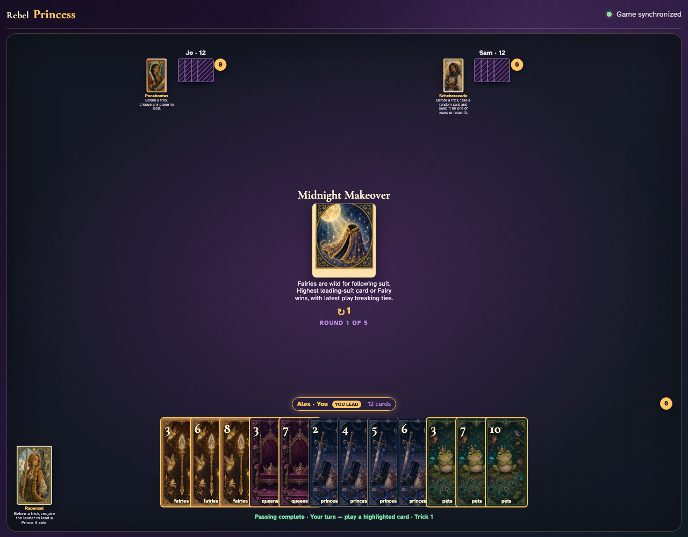
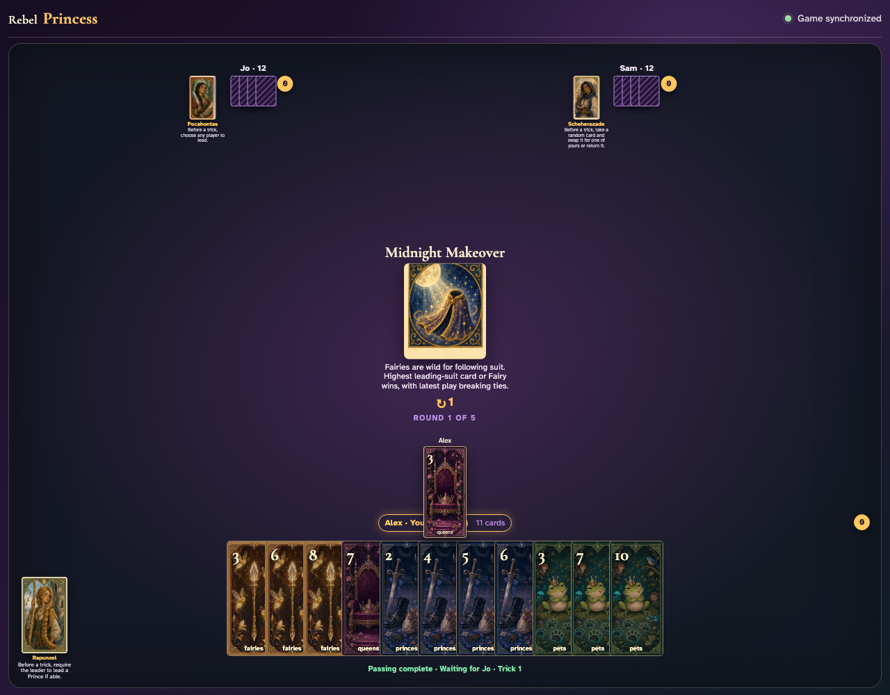
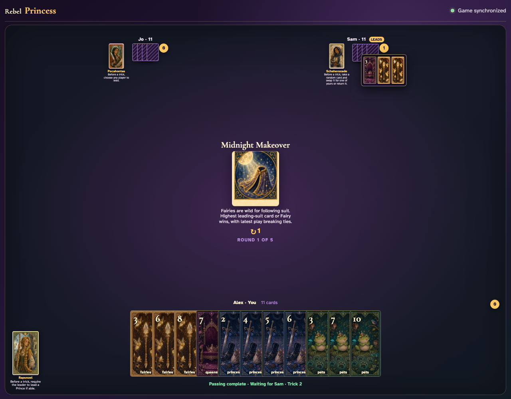

# Midnight Makeover

Choose a lead whose follower holds both that suit and a Fairy, click the Fairy instead, and prove it competes as a leading-suit card.

## The center announces that Fairies may follow as wild cards and equal values favor the latest play

**Verifications:**
- [x] The exact wild-card rule is readable
- [x] A leader is ready to choose a non-Fairy suit

---

## Alex leads Queens 3; Jo visibly holds both Queens and a Fairy

**Verifications:**
- [x] The exact non-Fairy lead is visible
- [x] Both an ordinary follower and a Fairy are enabled

---

## Jo clicks Fairies 2 despite holding Queens; the Fairy graphic is accepted as a wild follower

**Verifications:**
- [x] The Fairy is visible beside the normal lead
- [x] The final player receives the normal next turn

---

## Fairies 4 is highest among the Queens cards and wild Fairy, so Sam receives the trick

**Verifications:**
- [x] The review contains the wild Fairy
- [x] The trick counter awards Sam

---
