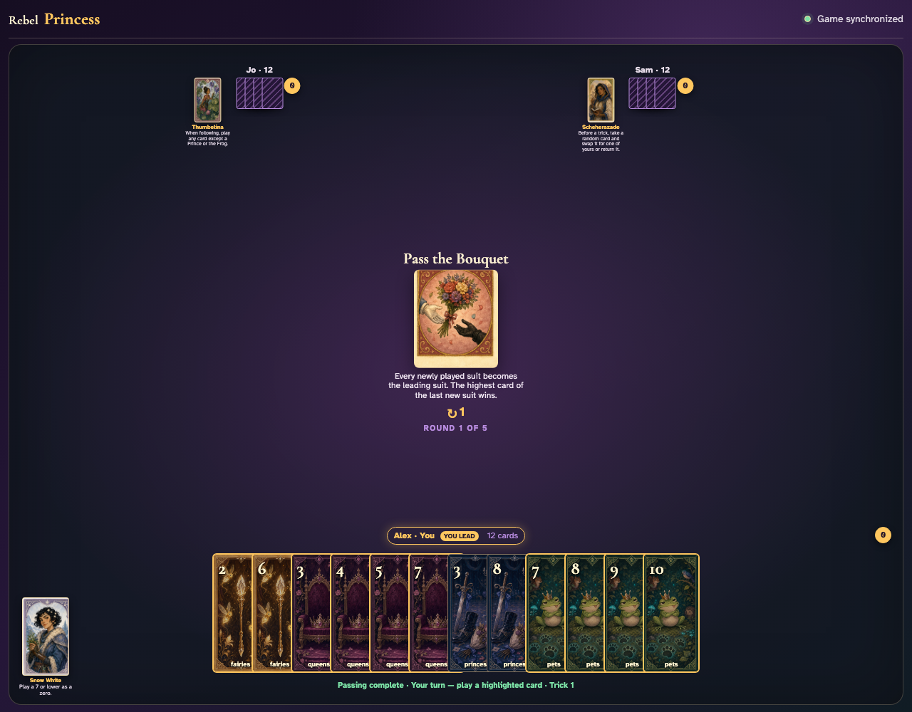
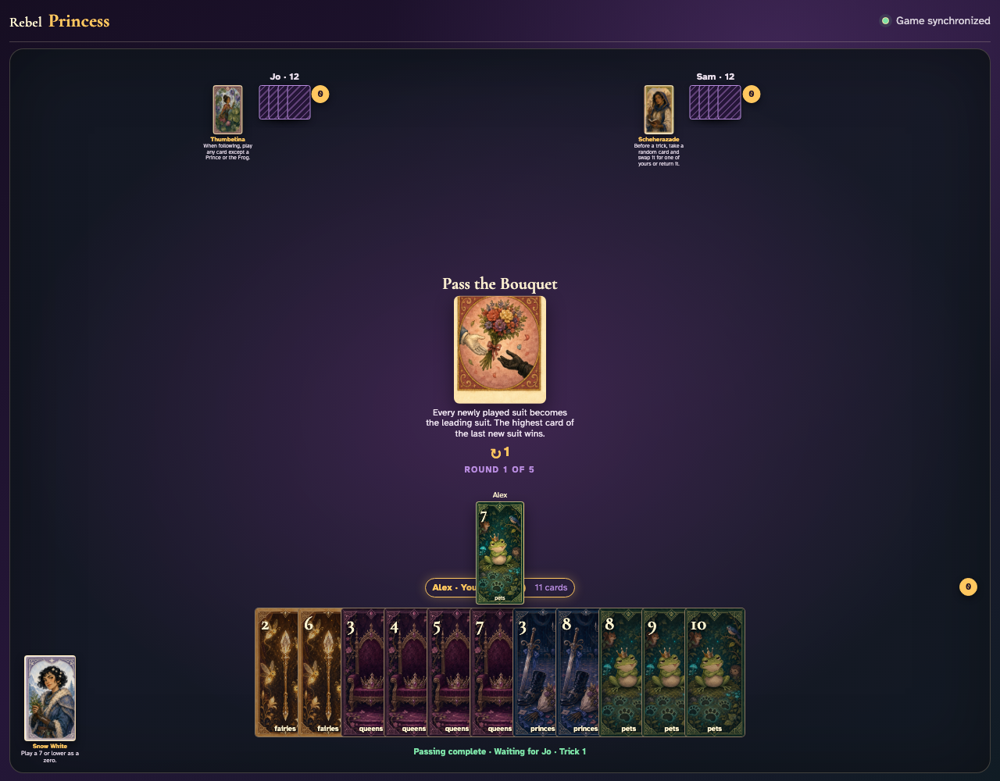
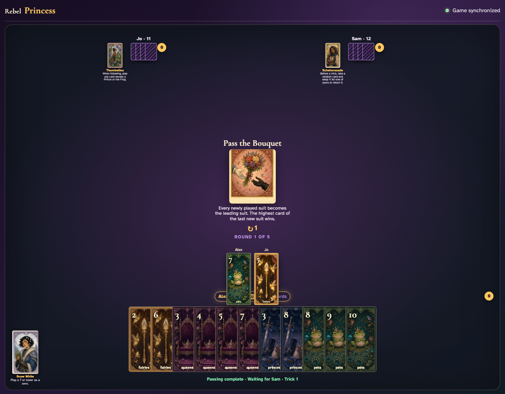
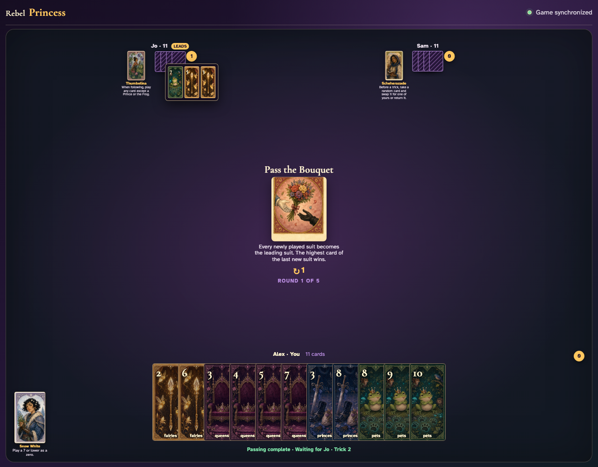

# Pass the Bouquet

Lead Pets to a void player, introduce a new suit through a click, prove the last player must follow that new suit, and award its highest card.

## The center announces that each newly introduced suit takes the bouquet and becomes the winning suit

**Verifications:**
- [x] The exact moving-suit rule is readable
- [x] Alex can lead deterministic Pets 7

---

## Alex clicks Pets 7, but Jo is void and therefore may introduce a new suit

**Verifications:**
- [x] The Pet lead is visible
- [x] Jo has no enabled Pet card

---

## Jo clicks Fairies 5; Fairies takes the bouquet and immediately replaces Pets as Sam’s required suit

**Verifications:**
- [x] Jo’s exact new-suit graphic is visible
- [x] Every enabled Sam card is Fairies

---

## Fairies 5 is the highest Fairies card and wins; Alex’s original Pet no longer controls the trick

**Verifications:**
- [x] The trick counter awards Jo
- [x] The review contains the old Pet lead and both new-suit cards

---
