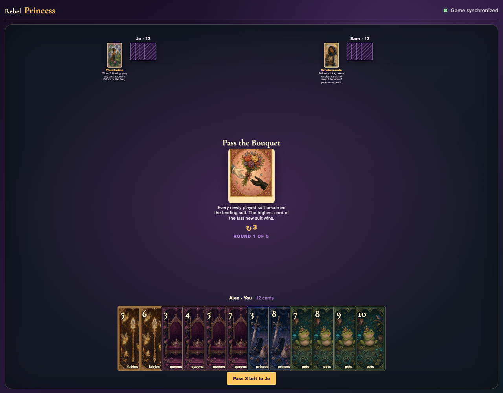
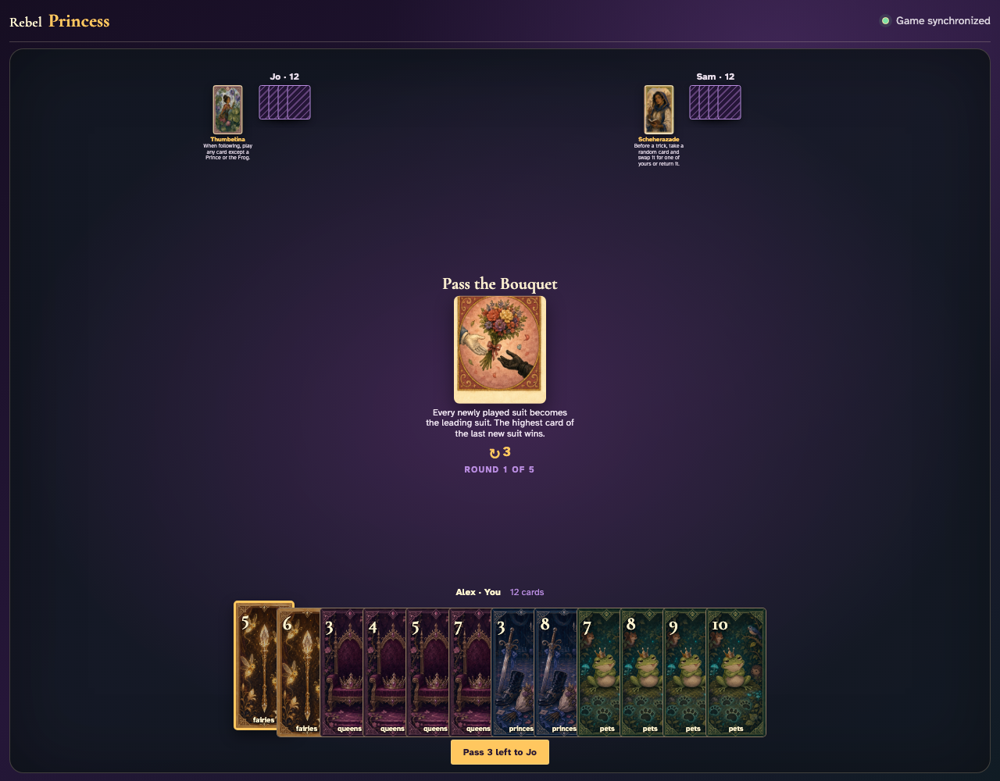
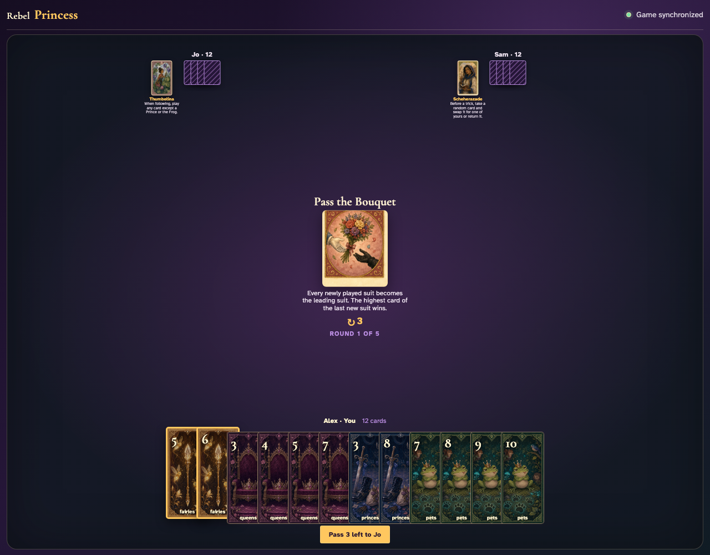
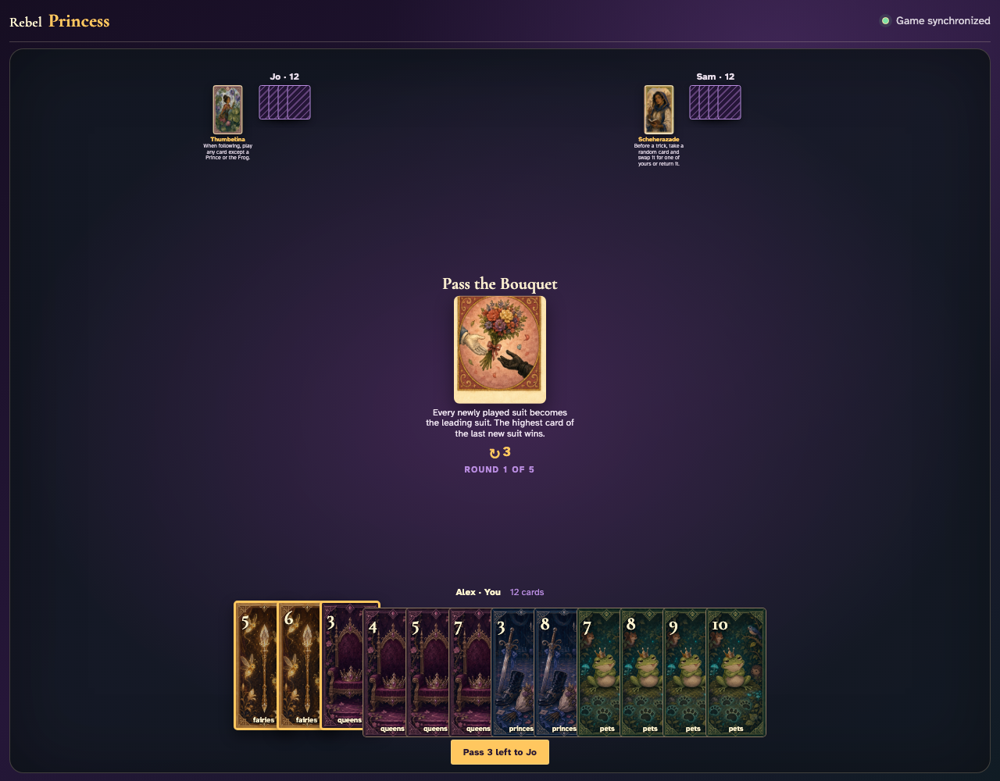
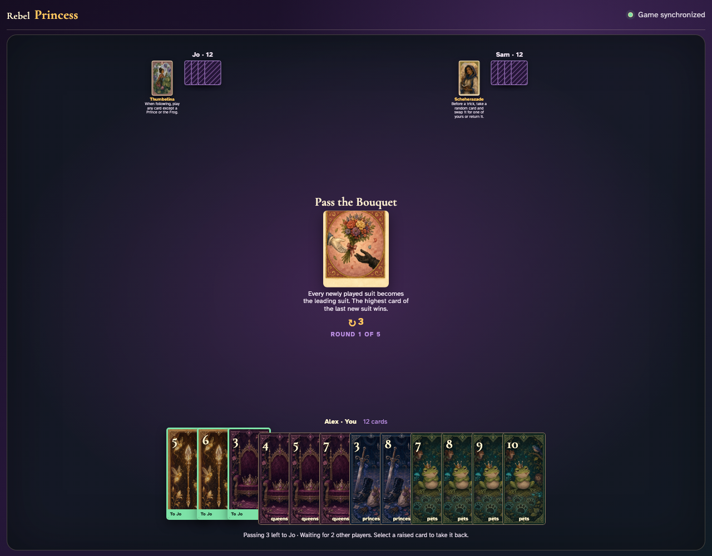
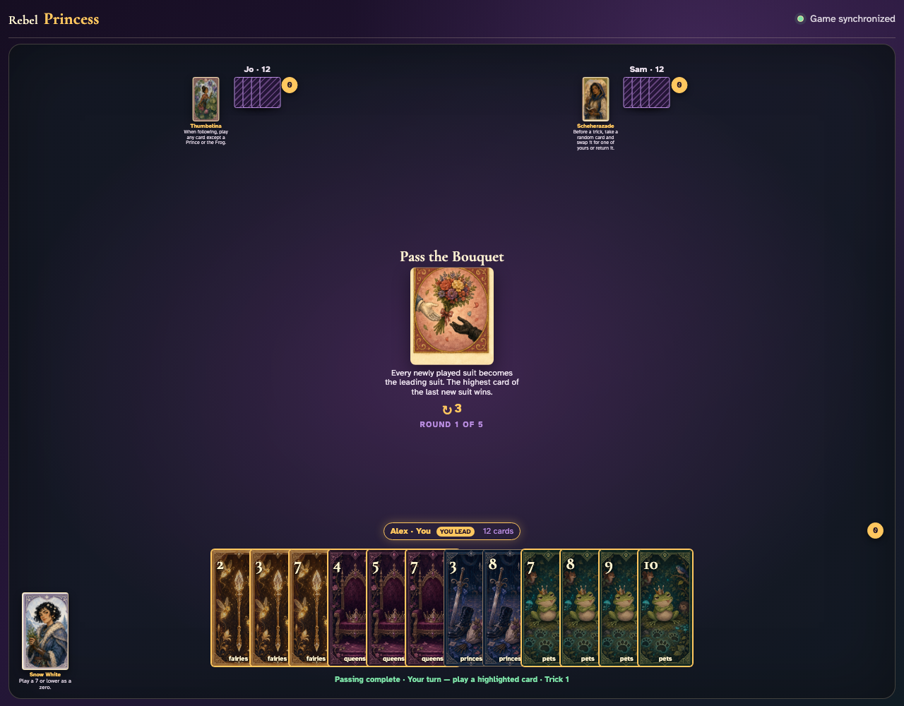
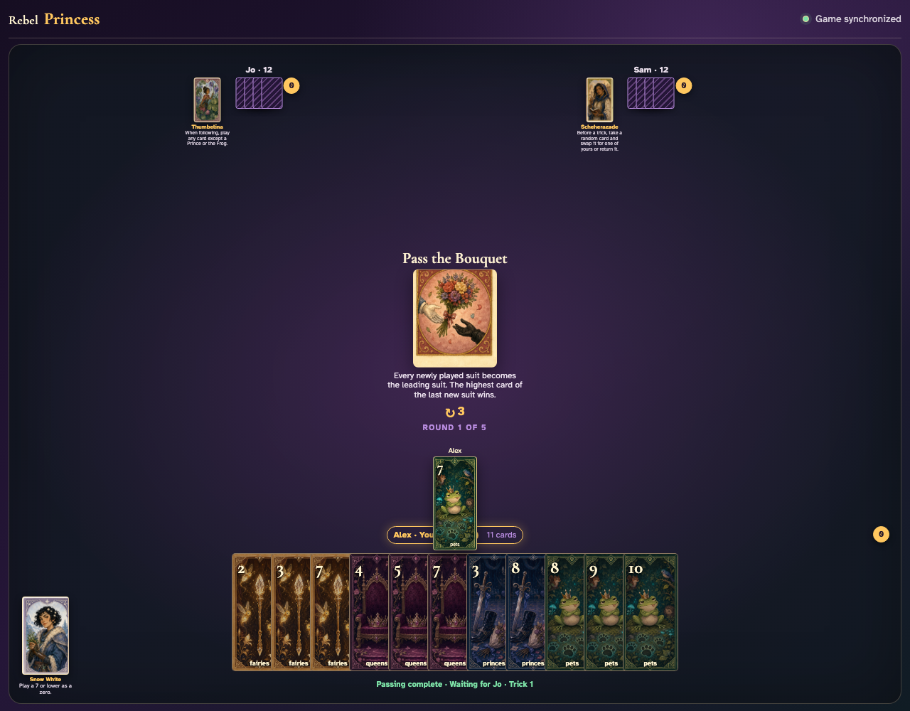
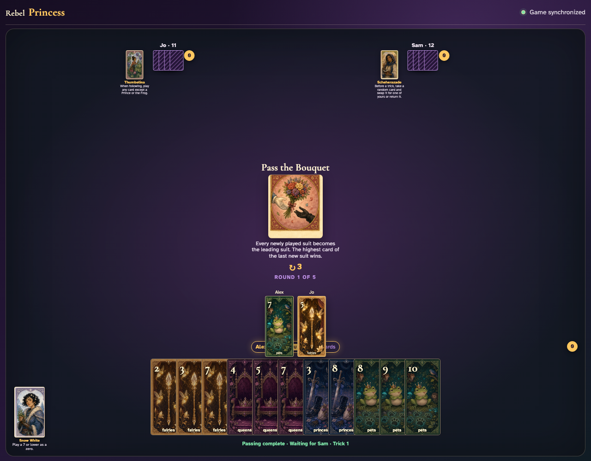
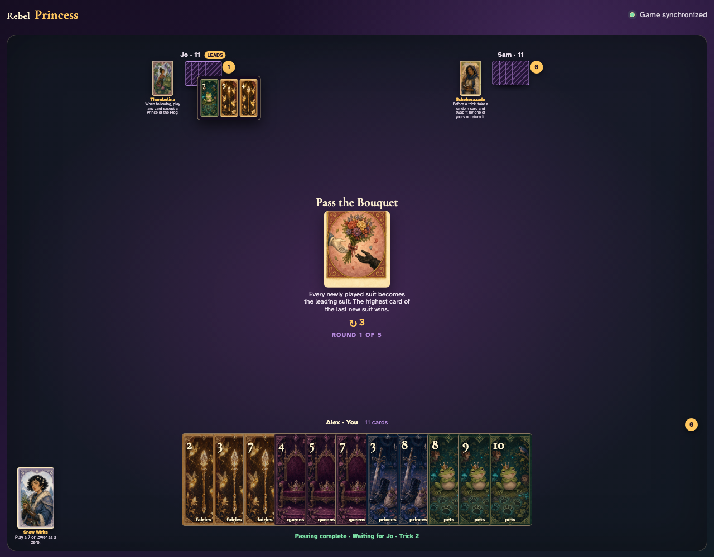

# Pass the Bouquet

Lead Pets to a void player, introduce a new suit through a click, prove the last player must follow that new suit, and award its highest card.

## Pass the Bouquet prints a 3-card left pass before play begins

**Verifications:**
- [x] The center icon announces Pass 3 left
- [x] The action names Jo as the recipient
- [x] The pass cannot be committed before any card is chosen

---

## Alex clicks Fairies 5; it is assignment 1 of 3 to Jo

**Verifications:**
- [x] Exactly 1 chosen card is raised
- [x] Fairies 5 stays visibly selected
- [x] 2 more selections are still required

---

## Alex clicks Fairies 6; it is assignment 2 of 3 to Jo

**Verifications:**
- [x] Exactly 2 chosen cards are raised
- [x] Fairies 6 stays visibly selected
- [x] 1 more selection is still required

---

## Alex clicks Queens 3; it is assignment 3 of 3 to Jo

**Verifications:**
- [x] Exactly 3 chosen cards are raised
- [x] Queens 3 stays visibly selected
- [x] The complete printed pass is ready to commit

---

## Alex commits the 3 cards toward Jo while both other players are still choosing

**Verifications:**
- [x] All 3 outgoing cards remain visible and raised
- [x] The waiting message preserves the printed left direction
- [x] No incoming cards arrive before every player commits

---

## Jo commits next; Alex still sees the cards held until Sam makes the final decision

**Verifications:**
- [x] Exactly one other player remains
- [x] Alex can still identify every outgoing card

---

## Sam commits last; all three left transfers resolve simultaneously and play can begin

**Verifications:**
- [x] Every player again holds twelve cards
- [x] Alex receives the exact left incoming cards
- [x] The table leaves the simultaneous pass phase for play or the Round card’s next action

---

## The center announces that each newly introduced suit takes the bouquet and becomes the winning suit

**Verifications:**
- [x] The exact moving-suit rule is readable
- [x] Alex can lead deterministic Pets 7

---

## Alex clicks Pets 7, but Jo is void and therefore may introduce a new suit

**Verifications:**
- [x] The Pet lead is visible
- [x] Jo has no enabled Pet card

---

## Jo clicks Fairies 5; Fairies takes the bouquet and immediately replaces Pets as Sam’s required suit

**Verifications:**
- [x] Jo’s exact new-suit graphic is visible
- [x] Every enabled Sam card is Fairies

---

## Fairies 5 is the highest Fairies card and wins; Alex’s original Pet no longer controls the trick

**Verifications:**
- [x] The trick counter awards Jo
- [x] The review contains the old Pet lead and both new-suit cards

---
