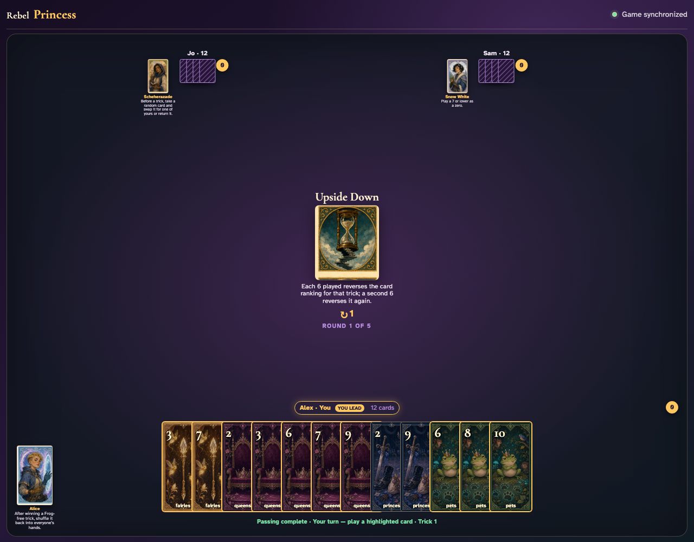
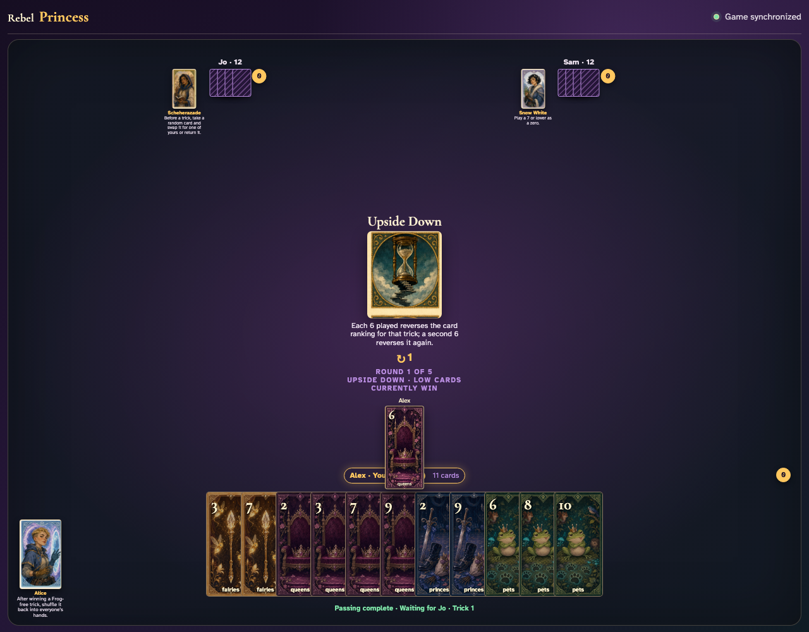
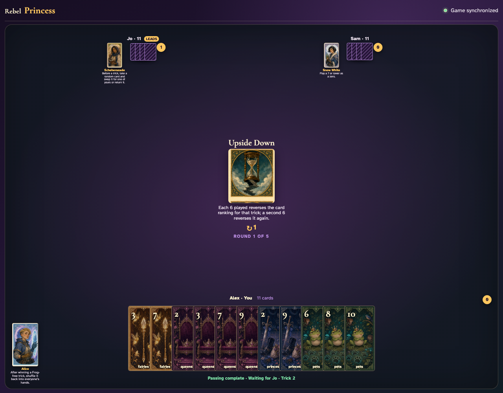
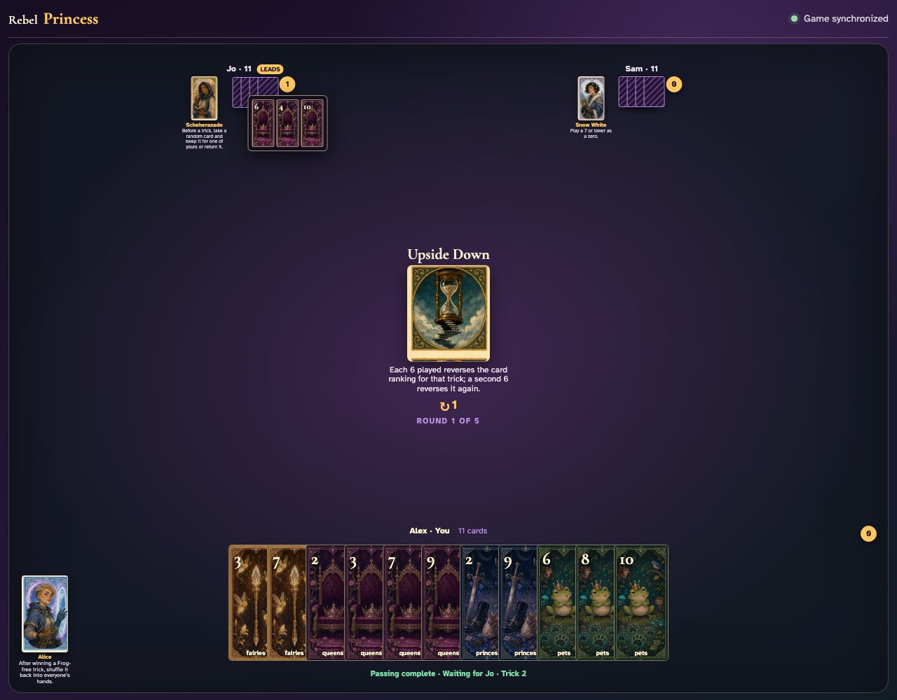

# Upside Down

Reach and click an actual legal 6, observe the low-card direction, complete that trick, and calculate the winner from visible 6 parity.

## The center announces that each 6 flips the ranking and a second 6 flips it back

**Verifications:**
- [x] The exact toggle rule is readable
- [x] No reversal status appears before a 6

---

## Alex clicks Queens 6; an odd 6 immediately changes the table to low-card-wins

**Verifications:**
- [x] The actual 6 graphic is visible
- [x] The center explicitly shows the reversed direction

---

## 1 visible 6 leaves ranking reversed; Queens 4 therefore wins the led suit

**Verifications:**
- [x] All three exact graphics are visible during collection
- [x] The trick counter increments Jo

---

## Jo opens the captured cards so the 6 parity and final rank direction can be reviewed

**Verifications:**
- [x] The captured review contains every played card
- [x] The next trick resets to normal ranking

---
