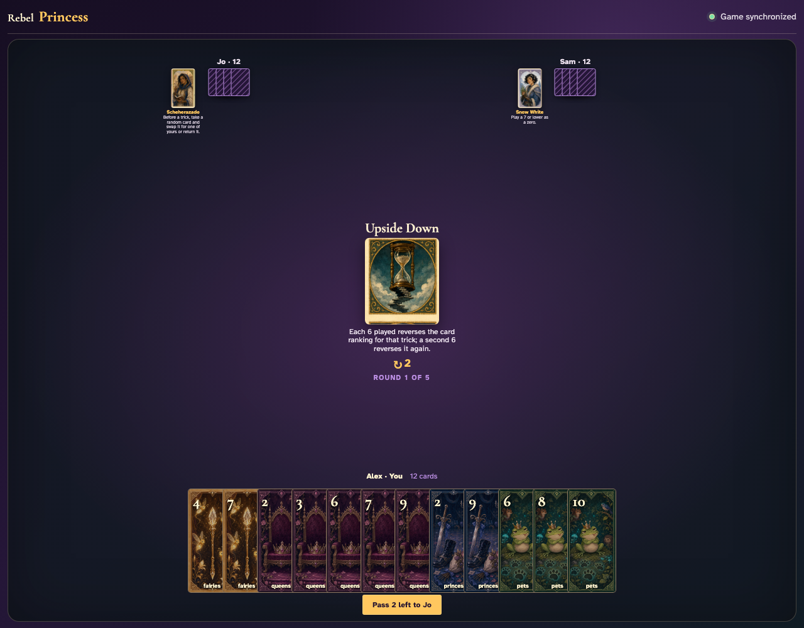
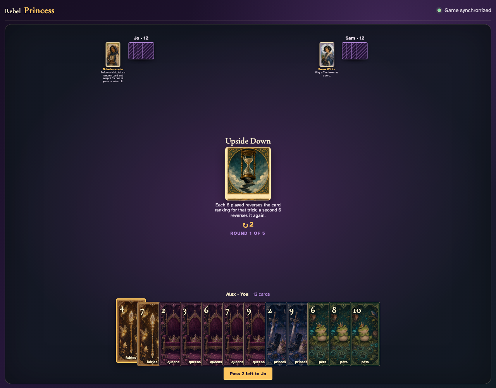
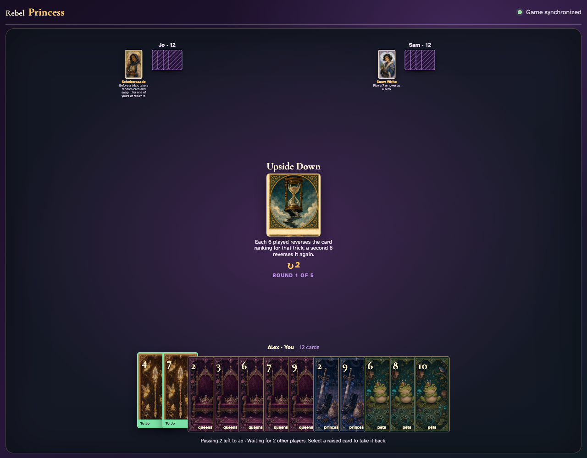
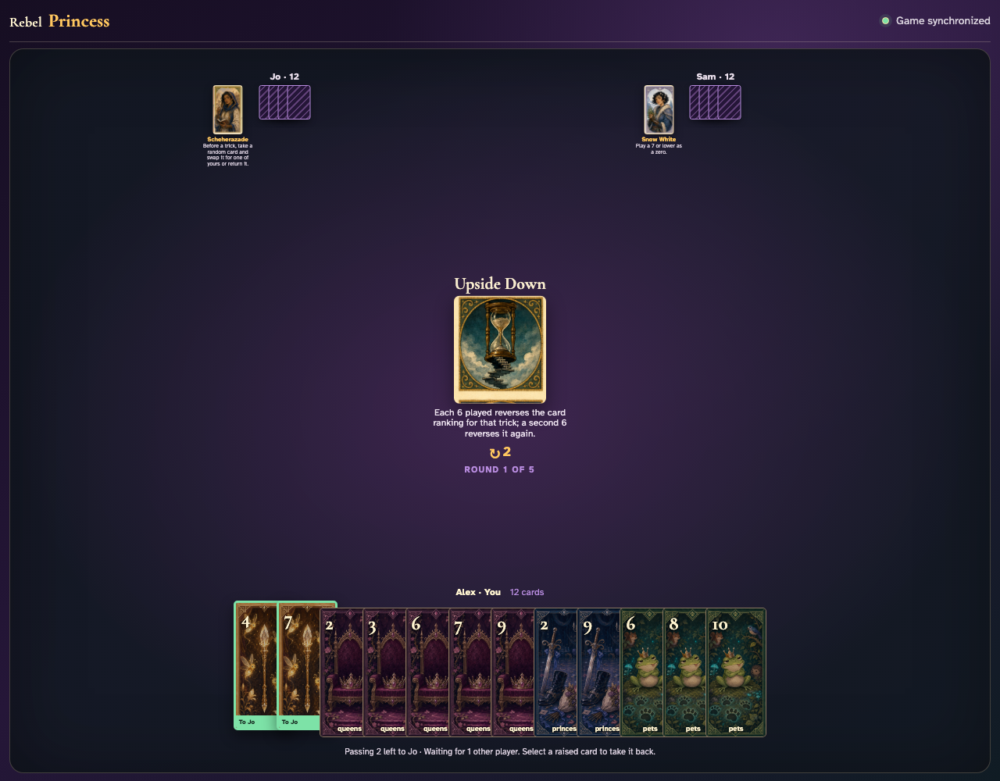
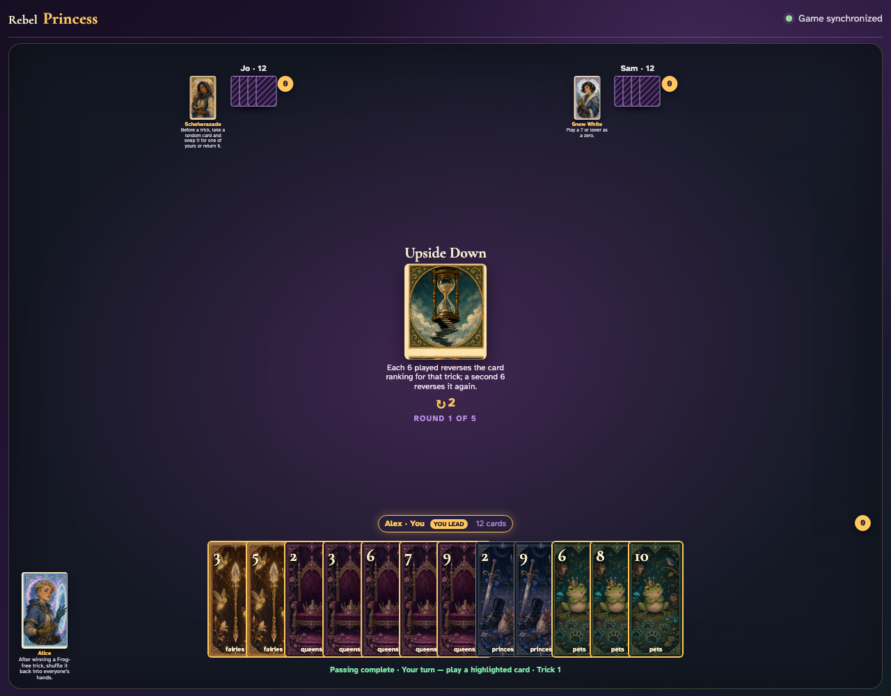
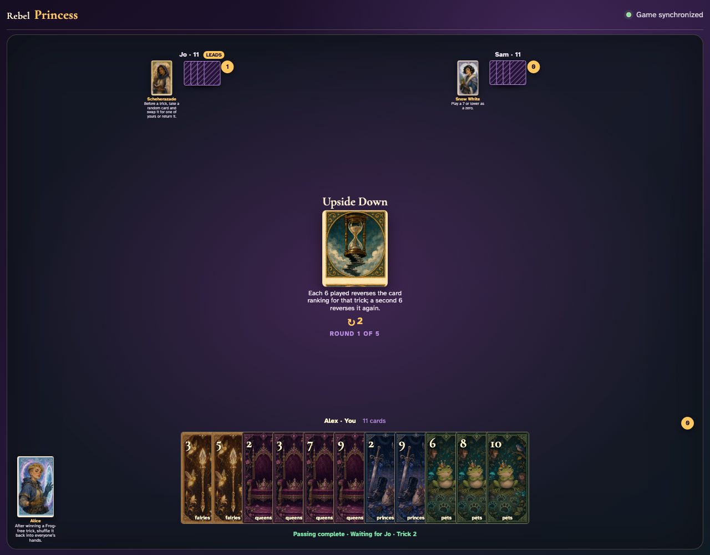
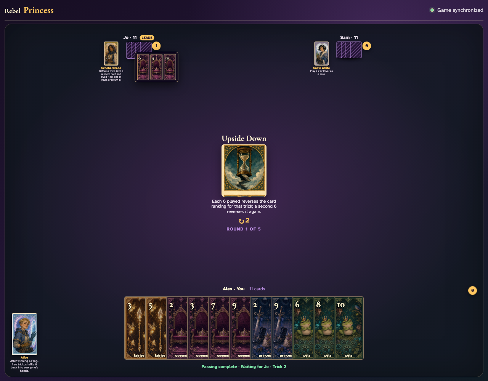

# Upside Down

Reach and click an actual legal 6, observe the low-card direction, complete that trick, and calculate the winner from visible 6 parity.

## Upside Down prints a 2-card left pass before play begins

**Verifications:**
- [x] The center icon announces Pass 2 left
- [x] The action names Jo as the recipient
- [x] The pass cannot be committed before any card is chosen

---

## Alex clicks Fairies 4; it is assignment 1 of 2 to Jo

**Verifications:**
- [x] Exactly 1 chosen card is raised
- [x] Fairies 4 stays visibly selected
- [x] 1 more selection is still required

---

## Alex clicks Fairies 7; it is assignment 2 of 2 to Jo

**Verifications:**
- [x] Exactly 2 chosen cards are raised
- [x] Fairies 7 stays visibly selected
- [x] The complete printed pass is ready to commit

---

## Alex commits the 2 cards toward Jo while both other players are still choosing

**Verifications:**
- [x] All 2 outgoing cards remain visible and raised
- [x] The waiting message preserves the printed left direction
- [x] No incoming cards arrive before every player commits

---

## Jo commits next; Alex still sees the cards held until Sam makes the final decision

**Verifications:**
- [x] Exactly one other player remains
- [x] Alex can still identify every outgoing card

---

## Sam commits last; all three left transfers resolve simultaneously and play can begin

**Verifications:**
- [x] Every player again holds twelve cards
- [x] Alex receives the exact left incoming cards
- [x] The table leaves the simultaneous pass phase for play or the Round card’s next action

---

## The center announces that each 6 flips the ranking and a second 6 flips it back

**Verifications:**
- [x] The exact toggle rule is readable
- [x] No reversal status appears before a 6

---

## Alex clicks Queens 6; an odd 6 immediately changes the table to low-card-wins

**Verifications:**
- [x] The actual 6 graphic is visible
- [x] The center explicitly shows the reversed direction

---

## 1 visible 6 leaves ranking reversed; Queens 4 therefore wins the led suit

**Verifications:**
- [x] All three exact graphics are visible during collection
- [x] The trick counter increments Jo

---

## Jo opens the captured cards so the 6 parity and final rank direction can be reviewed

**Verifications:**
- [x] The captured review contains every played card
- [x] The next trick resets to normal ranking

---
