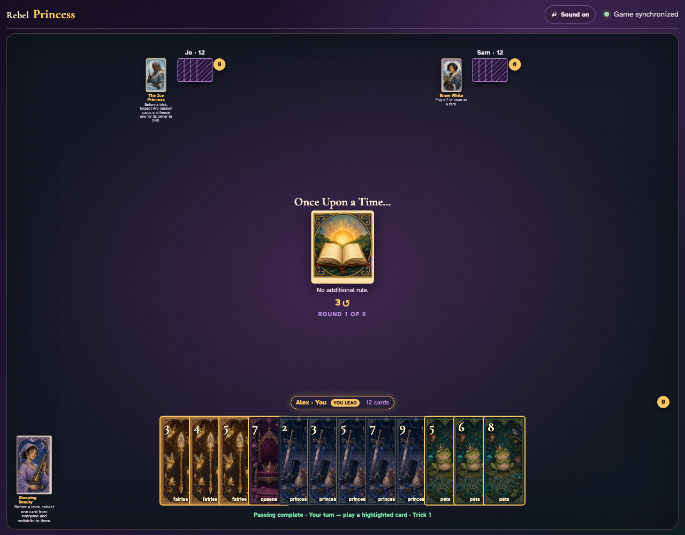
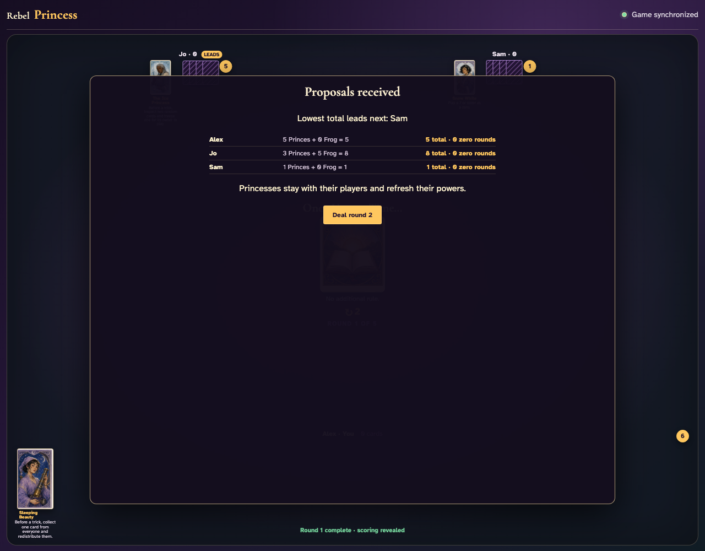
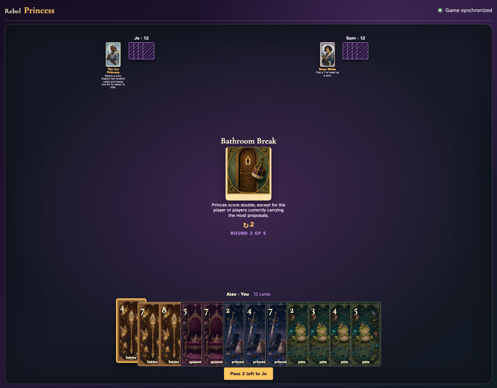
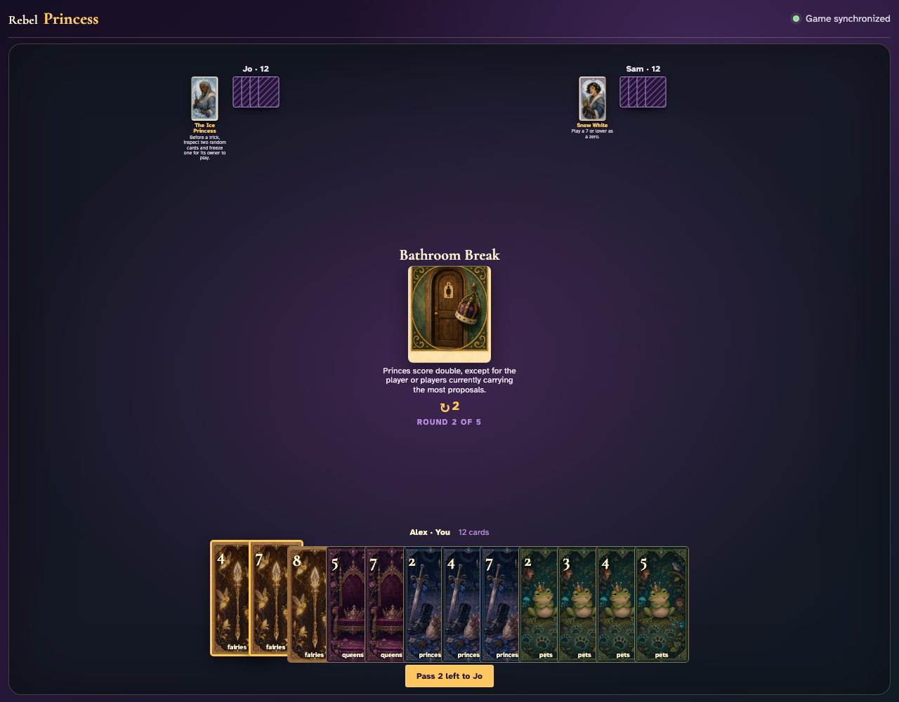
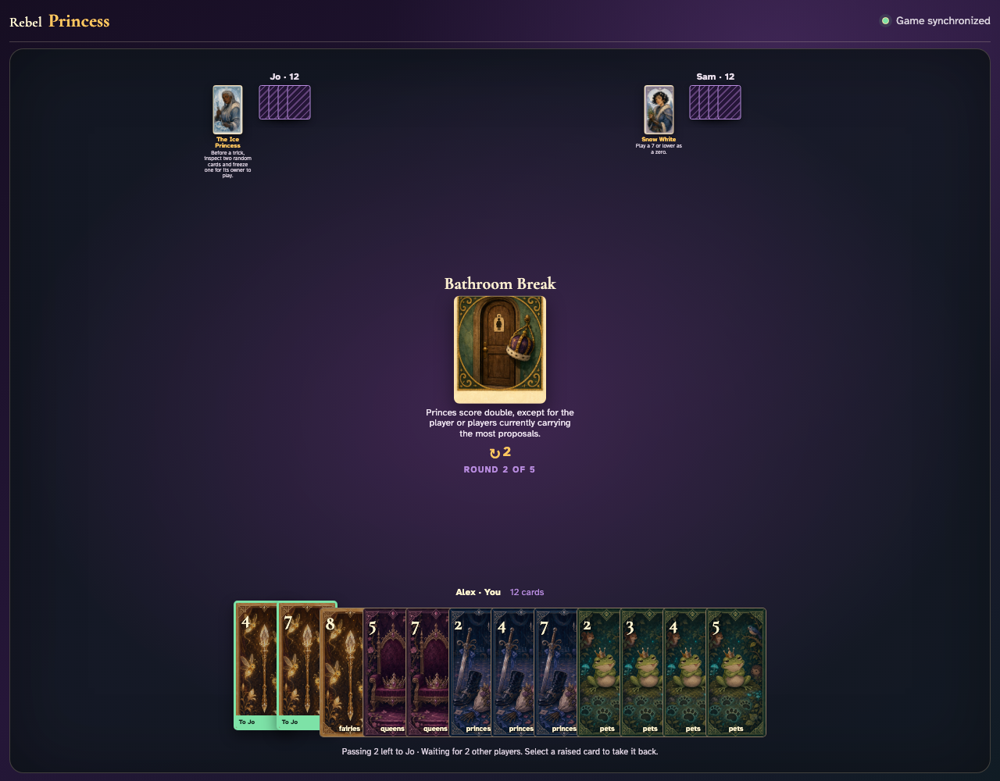
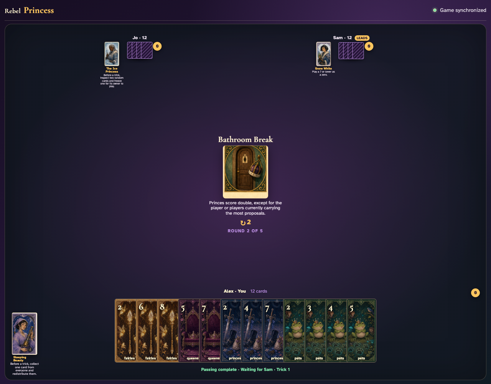
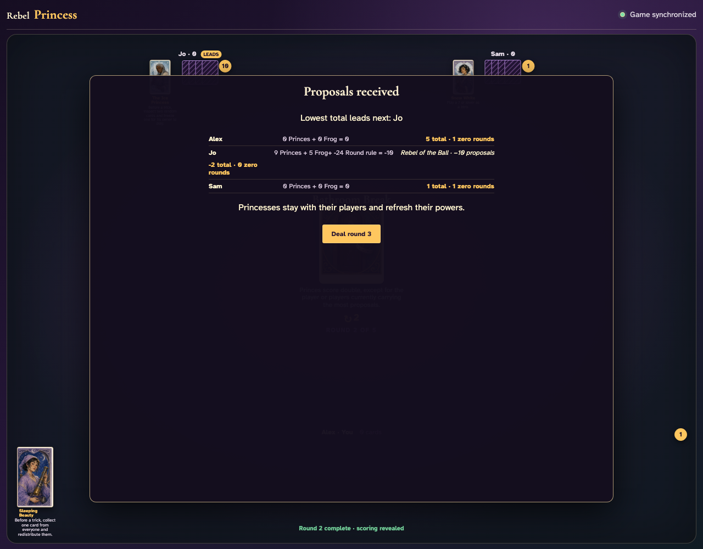

# Bathroom Break

Play an unshortened setup round, record cumulative leaders, deal and pass round two through the UI, then reconcile every doubled or exempt Prince.

## Round one begins normally so Bathroom Break will have real prior proposal totals rather than an all-zero tie

**Verifications:**
- [x] The ordinary first round is visible
- [x] Every player starts with twelve cards

---

## The complete first round establishes Jo at the current highest total of 8; only they will avoid doubling

**Verifications:**
- [x] The recorded totals come from the visible scoring rows
- [x] The host can deal round two

---

## Bathroom Break prints a two-card pass to Jo on Alex’s left before round-two play

**Verifications:**
- [x] The center icon announces Pass 2 left
- [x] The disabled action names Jo as the recipient

---

## Fairies 4 is selected as the first of two cards headed left to Jo

**Verifications:**
- [x] Exactly one card is raised and the pass remains disabled

---

## Fairies 7 completes Alex’s explicit two-card choice for Jo

**Verifications:**
- [x] Both chosen cards are raised and the pass is enabled

---

## Alex commits both exact cards while Jo and Sam continue deciding

**Verifications:**
- [x] Both outgoing cards remain visibly committed
- [x] The table says Alex is waiting for two other players

---

## Jo commits two cards to Sam; Alex now waits only for Sam’s leftward pass

**Verifications:**
- [x] Alex’s exact cards remain committed
- [x] The table reports one remaining player

---

## Sam commits last; every two-card leftward transfer resolves simultaneously without losing or duplicating a card

**Verifications:**
- [x] Every player again holds twelve cards
- [x] Alex retains the ten untouched cards and the resolved hand contains exactly two incoming slots
- [x] The simultaneous pass phase has ended

---

## Bathroom Break is dealt as round two after all three clients complete its real pass

**Verifications:**
- [x] The exact prior-score exception is readable
- [x] Round 2 of 5 is visible

---

## The complete second-round breakdown doubles each nonleader’s Princes and leaves every prior high-score player exempt

**Verifications:**
- [x] Each scoring row matches its prior-total exemption
- [x] All hands are empty after both unshortened rounds

---
