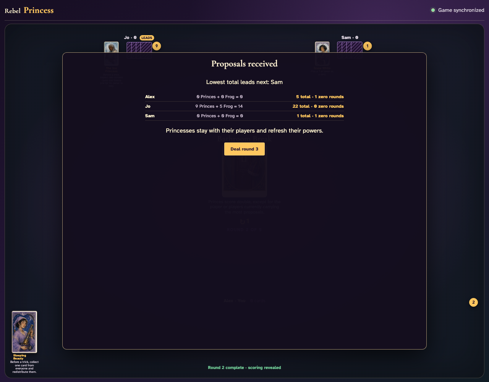

# Bathroom Break

Play an unshortened setup round, record cumulative leaders, deal and pass round two through the UI, then reconcile every doubled or exempt Prince.

## Round one begins normally so Bathroom Break will have real prior proposal totals rather than an all-zero tie

**Verifications:**
- [x] The ordinary first round is visible
- [x] Every player starts with twelve cards

---

## The complete first round establishes Jo at the current highest total of 8; only they will avoid doubling

**Verifications:**
- [x] The recorded totals come from the visible scoring rows
- [x] The host can deal round two

---

## Bathroom Break is dealt as round two after all three clients complete its real pass

**Verifications:**
- [x] The exact prior-score exception is readable
- [x] Round 2 of 5 is visible

---

## The complete second-round breakdown doubles each nonleader’s Princes and leaves every prior high-score player exempt

**Verifications:**
- [x] Each scoring row matches its prior-total exemption
- [x] All hands are empty after both unshortened rounds

---
