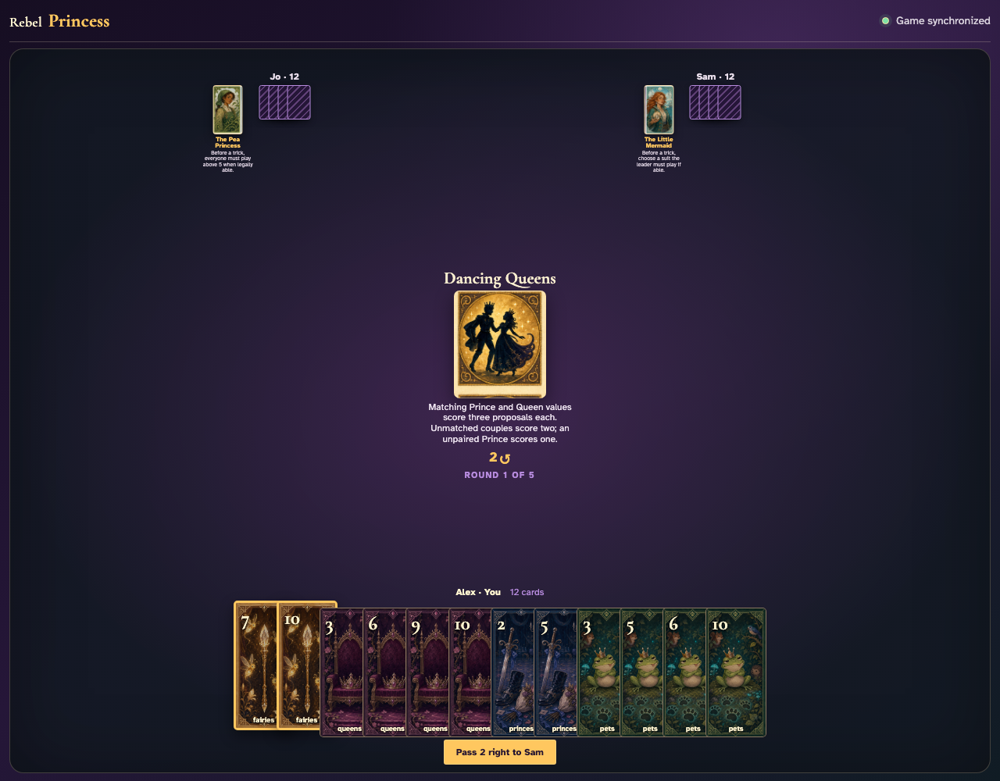
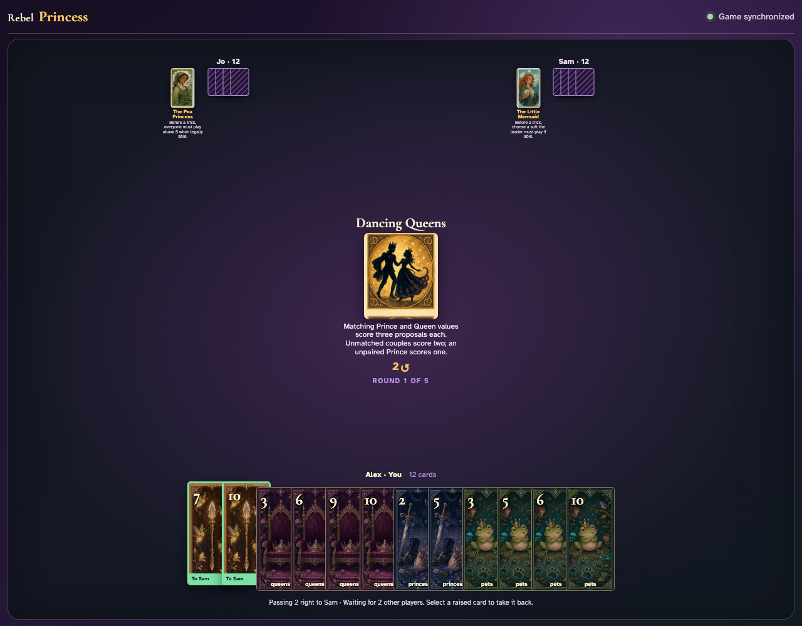
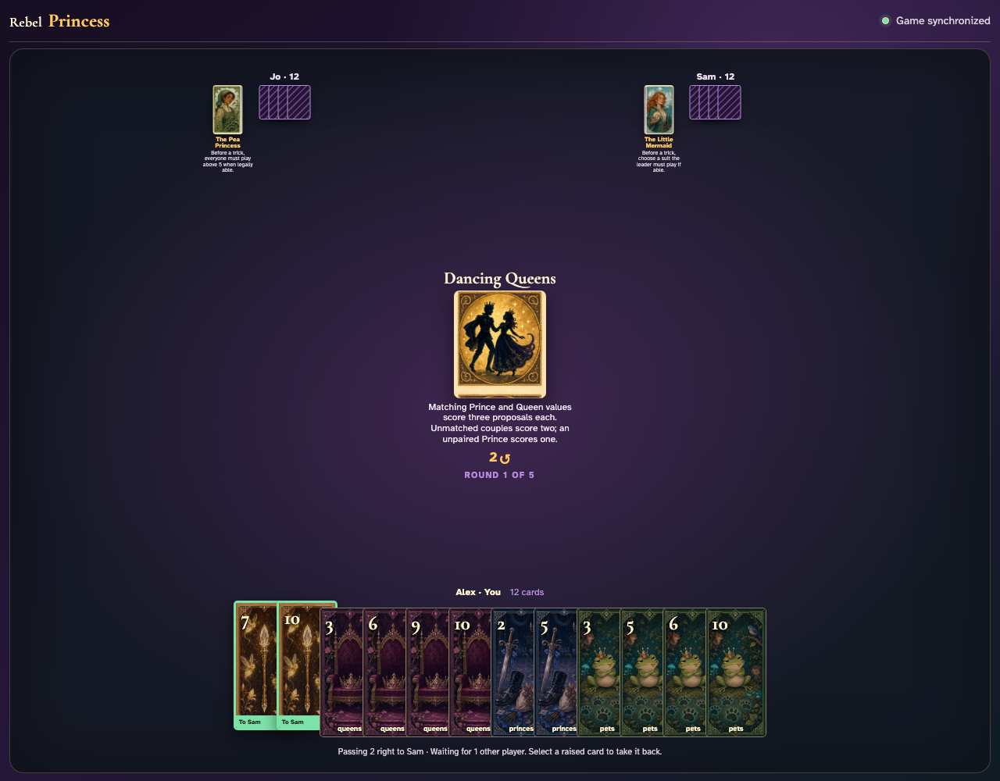
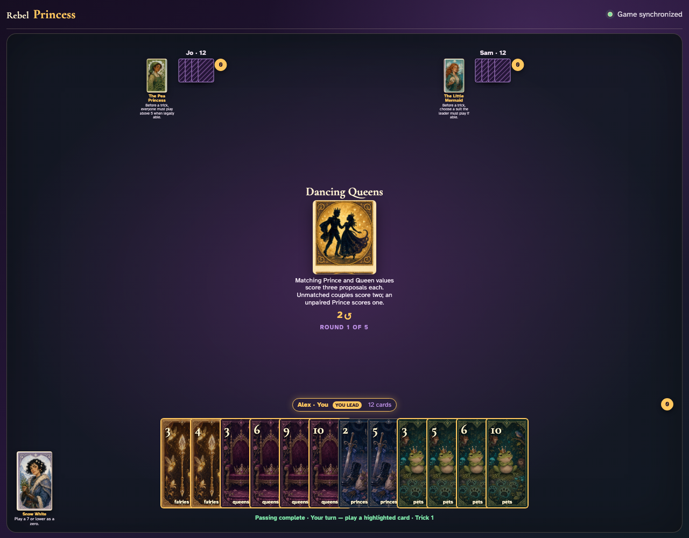
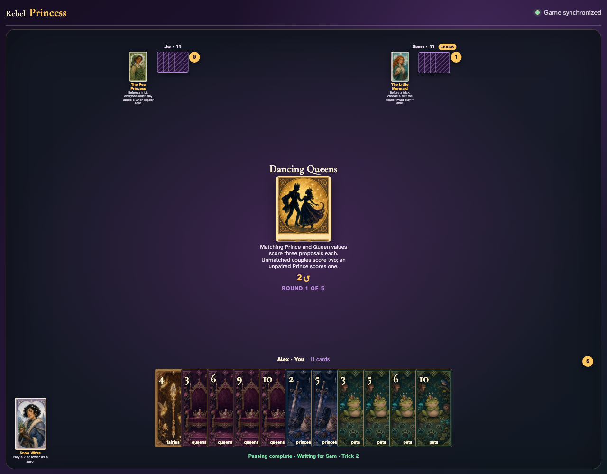
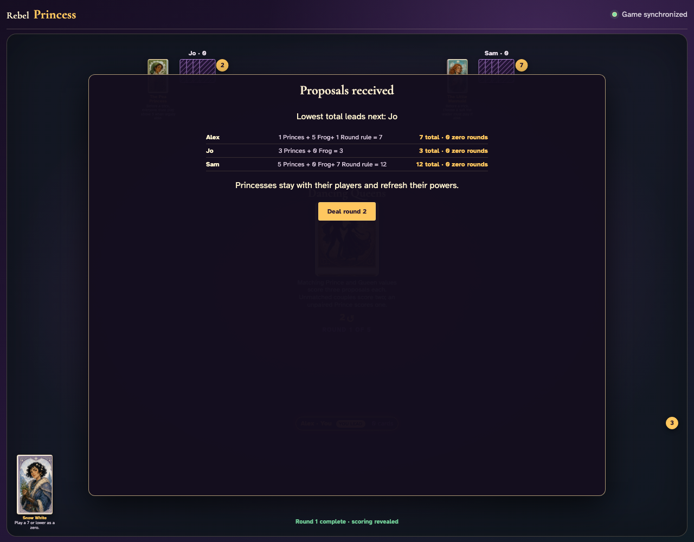

# Dancing Queens

Count every Prince and Queen, play all twelve tricks through real card clicks, and reconcile base Princes, couple bonuses, Frog, and final totals.

## Dancing Queens prints a 2-card right pass before play begins

**Verifications:**
- [x] The center icon announces Pass 2 right
- [x] The action names Sam as the recipient
- [x] The pass cannot be committed before any card is chosen

---

## Alex clicks Fairies 7; it is assignment 1 of 2 to Sam

**Verifications:**
- [x] Exactly 1 chosen card is raised
- [x] Fairies 7 stays visibly selected
- [x] 1 more selection is still required

---

## Alex clicks Fairies 10; it is assignment 2 of 2 to Sam

**Verifications:**
- [x] Exactly 2 chosen cards are raised
- [x] Fairies 10 stays visibly selected
- [x] The complete printed pass is ready to commit

---

## Alex commits the 2 cards toward Sam while both other players are still choosing

**Verifications:**
- [x] All 2 outgoing cards remain visible and raised
- [x] The waiting message preserves the printed right direction
- [x] No incoming cards arrive before every player commits

---

## Jo commits next; Alex still sees the cards held until Sam makes the final decision

**Verifications:**
- [x] Exactly one other player remains
- [x] Alex can still identify every outgoing card

---

## Sam commits last; all three right transfers resolve simultaneously and play can begin

**Verifications:**
- [x] Every player again holds twelve cards
- [x] Alex receives the exact right incoming cards
- [x] The table leaves the simultaneous pass phase for play or the Round card’s next action

---

## The round begins with all nine Princes and nine Queens available for exact-rank and unmatched couples

**Verifications:**
- [x] The complete couple-scoring rule is readable
- [x] The shared deal contains exactly nine Princes and nine Queens

---

## The first of twelve ordinary tricks resolves from visible cards: Fairies 3, Fairies 2, Fairies 7

**Verifications:**
- [x] Exactly one first trick is awarded
- [x] Every hand retains eleven cards

---

## The final rows account for nine base Princes, 8 couple bonus proposals, and the five-point Frog

**Verifications:**
- [x] Every Prince is counted once before pairing
- [x] At least one captured couple earns a visible Round-rule bonus
- [x] All row arithmetic reconciles globally
- [x] All hands are empty after the unshortened round

---
