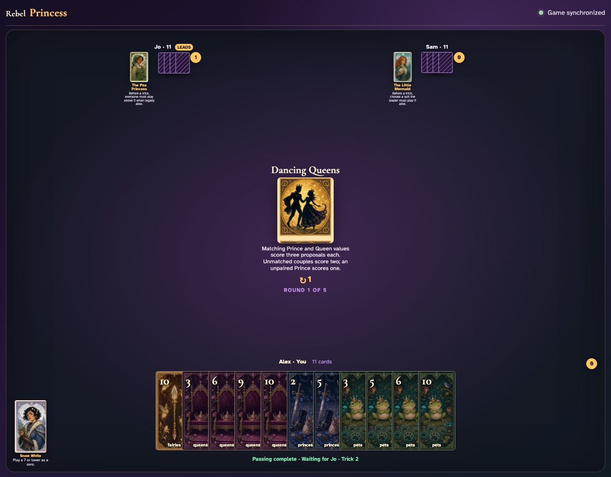

# Dancing Queens

Count every Prince and Queen, play all twelve tricks through real card clicks, and reconcile base Princes, couple bonuses, Frog, and final totals.

## The round begins with all nine Princes and nine Queens available for exact-rank and unmatched couples

**Verifications:**
- [x] The complete couple-scoring rule is readable
- [x] The shared deal contains exactly nine Princes and nine Queens

---

## The first of twelve ordinary tricks resolves from visible cards: Fairies 2, Fairies 4, Fairies 3

**Verifications:**
- [x] Exactly one first trick is awarded
- [x] Every hand retains eleven cards

---

## The final rows account for nine base Princes, 10 couple bonus proposals, and the five-point Frog

**Verifications:**
- [x] Every Prince is counted once before pairing
- [x] At least one captured couple earns a visible Round-rule bonus
- [x] All row arithmetic reconciles globally
- [x] All hands are empty after the unshortened round

---
