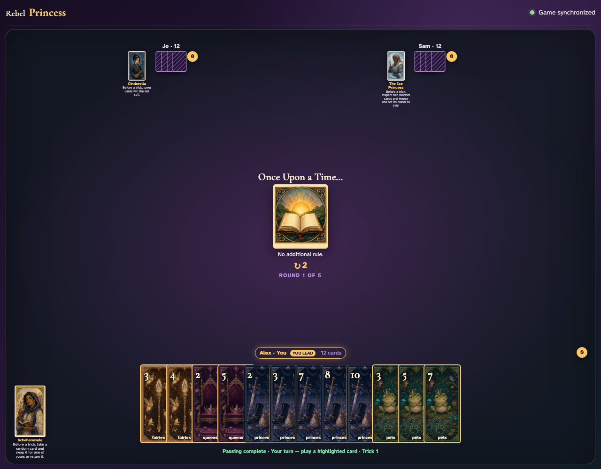
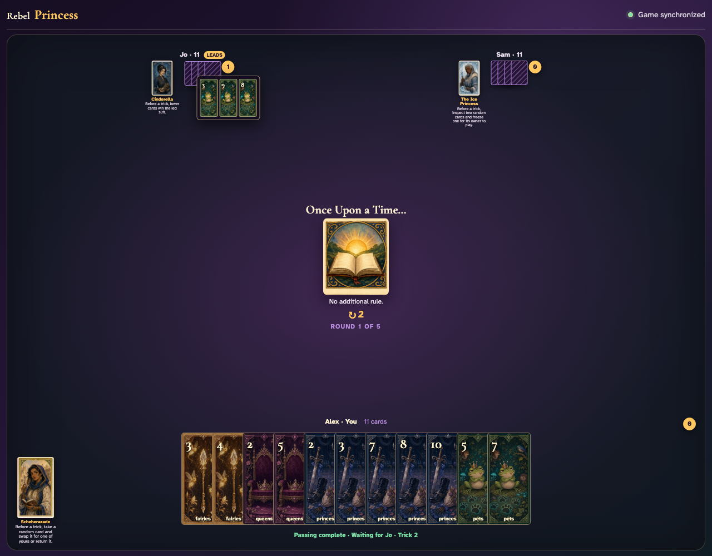
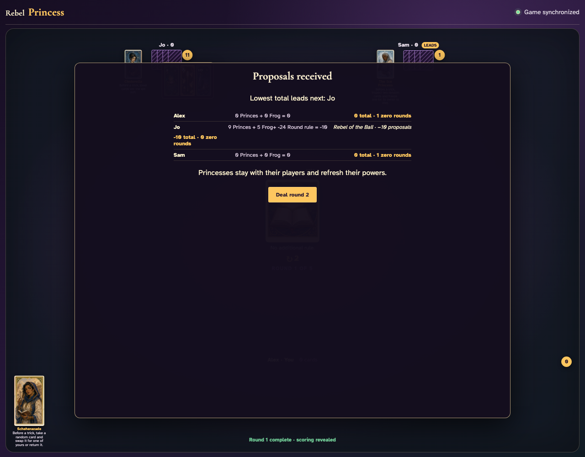

# Rebel of the Ball

Use only visible hand-card clicks to play all twelve tricks, deliberately collect all nine Princes and the Frog with Jo, and prove the exact −10 override.

## The complete shared deal visibly contains the nine in-deck Princes and the Frog required for Rebel of the Ball

**Verifications:**
- [x] Exactly nine Princes are in the three-player deck
- [x] Exactly one Frog is present

---

## Jo’s first planned target trick visibly captures Pets 8

**Verifications:**
- [x] The open review contains every target from this trick
- [x] The target count has begun without injecting any events

---

## All 36 ordinary UI clicks finish the round with Jo holding every one of the ten required target cards

**Verifications:**
- [x] The cooperative play captured all nine Princes plus the Frog
- [x] Every hand is empty after twelve complete tricks
- [x] Jo receives the explicit Rebel of the Ball status
- [x] Jo’s round equation and cumulative total are exactly −10

---
