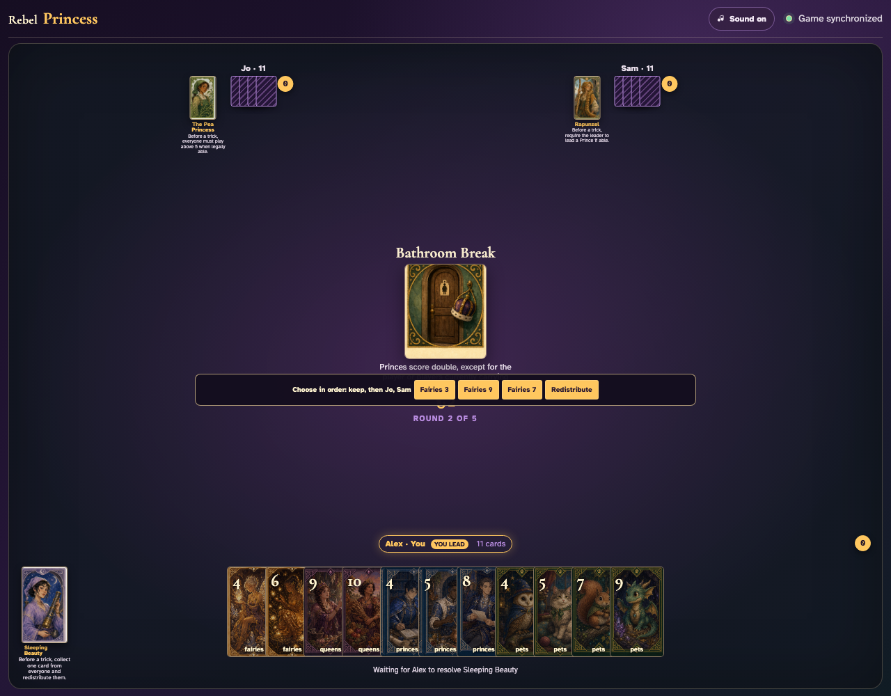
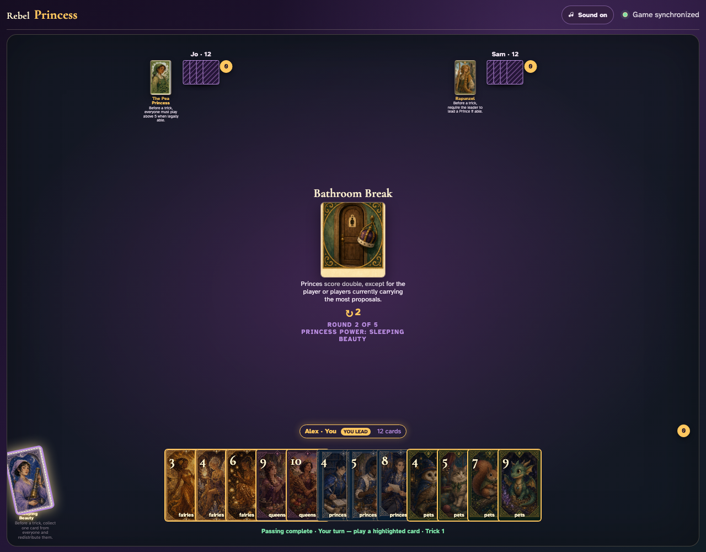

# Sleeping Beauty resets between rounds

Use Sleeping Beauty in consecutive rounds on the same live clients and prove that the second redistribution starts with only its current contributions.

## Bathroom Break begins a fresh Sleeping Beauty redistribution with no hidden assignments from round one

**Verifications:**
- [x] The collection control is hidden after collection begins
- [x] All three current contributions are visible and unnumbered
- [x] Redistribute remains disabled until the current cards are ordered

---

## Sleeping Beauty assigns exactly the three Bathroom Break contributions and ordinary play resumes

**Verifications:**
- [x] Every player again holds twelve cards
- [x] The table is no longer waiting for Sleeping Beauty
- [x] Sleeping Beauty is exhausted for round two

---
