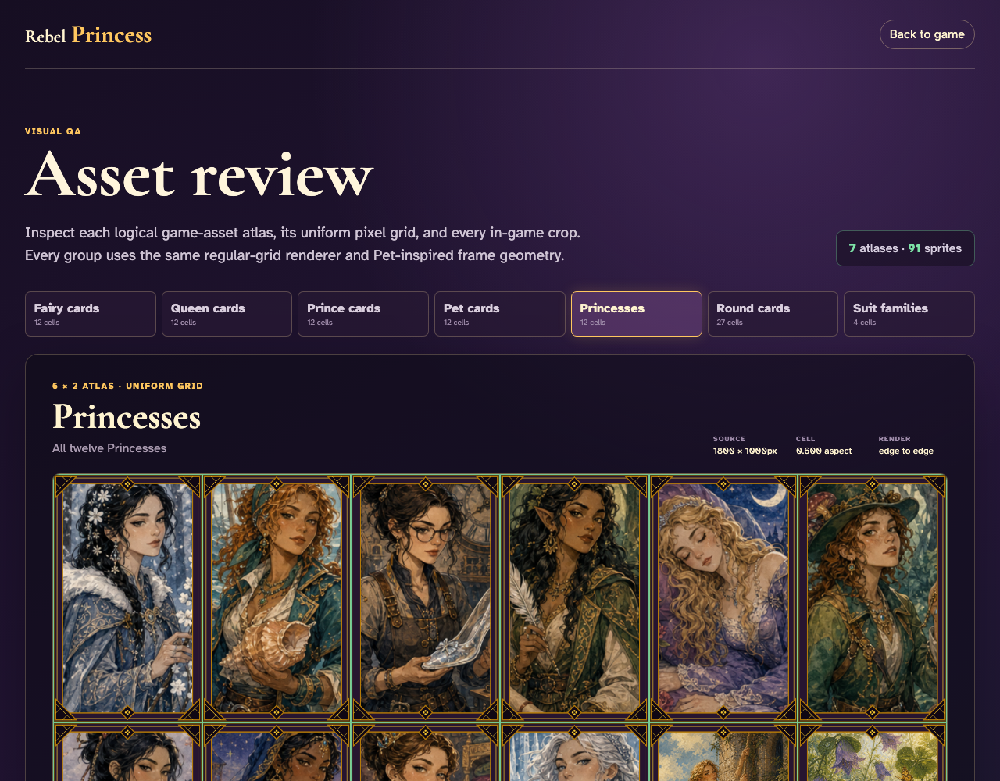

# Asset review

Review all seven logical atlases and verify that every sprite uses the same Pet-inspired frame and exact regular-grid crop path.

## Fairy cards uses a complete edge-to-edge 6 × 2 uniform grid

**Verifications:**
- [x] All 12 sprites are rendered
- [x] Every sprite uses the shared 6x2 grid renderer
- [x] The first crop starts at the source origin
- [x] The final crop reaches the source bottom-right edge
- [x] Every card has the same 20px frame on all four edges

---

## Queen cards uses a complete edge-to-edge 6 × 2 uniform grid

**Verifications:**
- [x] All 12 sprites are rendered
- [x] Every sprite uses the shared 6x2 grid renderer
- [x] The first crop starts at the source origin
- [x] The final crop reaches the source bottom-right edge
- [x] Every card has the same 20px frame on all four edges

---

## Prince cards uses a complete edge-to-edge 6 × 2 uniform grid

**Verifications:**
- [x] All 12 sprites are rendered
- [x] Every sprite uses the shared 6x2 grid renderer
- [x] The first crop starts at the source origin
- [x] The final crop reaches the source bottom-right edge
- [x] Every card has the same 20px frame on all four edges

---

## Pet cards uses a complete edge-to-edge 6 × 2 uniform grid

**Verifications:**
- [x] All 12 sprites are rendered
- [x] Every sprite uses the shared 6x2 grid renderer
- [x] The first crop starts at the source origin
- [x] The final crop reaches the source bottom-right edge
- [x] Every card has the same 20px frame on all four edges

---

## Princesses uses a complete edge-to-edge 6 × 2 uniform grid

**Verifications:**
- [x] All 12 sprites are rendered
- [x] Every sprite uses the shared 6x2 grid renderer
- [x] The first crop starts at the source origin
- [x] The final crop reaches the source bottom-right edge
- [x] Every card has the same 20px frame on all four edges

---

## Round cards uses a complete edge-to-edge 9 × 3 uniform grid

**Verifications:**
- [x] All 27 sprites are rendered
- [x] Every sprite uses the shared 9x3 grid renderer
- [x] The first crop starts at the source origin
- [x] The final crop reaches the source bottom-right edge
- [x] Every card has the same 20px frame on all four edges

---

## Suit families uses a complete edge-to-edge 4 × 1 uniform grid

**Verifications:**
- [x] All 4 sprites are rendered
- [x] Every sprite uses the shared 4x1 grid renderer
- [x] The first crop starts at the source origin
- [x] The final crop reaches the source bottom-right edge
- [x] Every card has the same 20px frame on all four edges

---
