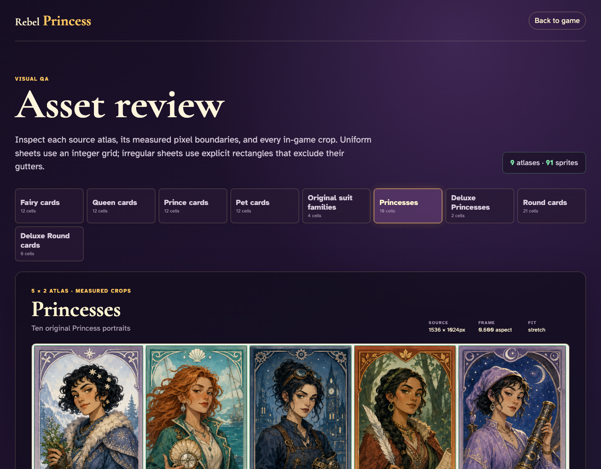
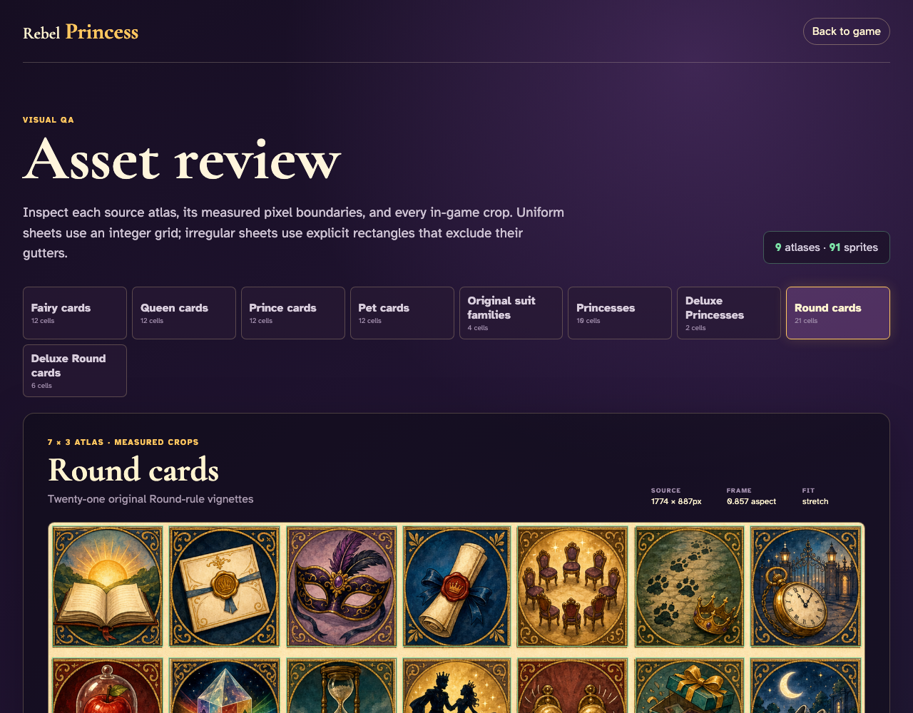

# Asset review

Review raw sprite sheets, source-specific cell boundaries, and every in-game crop without entering a game.

## The review route opens the irregular Fairy atlas with all twelve complete frames and their source coordinates

**Verifications:**
- [x] The route keeps its GitHub Pages-compatible trailing slash
- [x] All nine source atlases are available
- [x] The route reports all ninety-one sprites
- [x] Every Fairy rank has one computed crop
- [x] Generated gameplay cards fill their canonical frame
- [x] The indivisible sheet ends exactly at pixel 1651

---

## The four original suit-family panels use their native source widths instead of a shared gameplay-card ratio

**Verifications:**
- [x] All four original suit families are rendered
- [x] The first panel reports its native frame aspect

---

## Measured Princess rectangles exclude every unequal white gutter in the original portrait sheet

**Verifications:**
- [x] All ten original Princess portraits are rendered
- [x] The first portrait starts after the outer gutter
- [x] The final portrait stops before the bottom and right gutters

---

## Measured Round-card rectangles exclude the unequal cream gutters around all twenty-one vignettes

**Verifications:**
- [x] All twenty-one Round crops are rendered
- [x] The first crop excludes its top and left gutters
- [x] The final crop excludes its bottom and right gutters

---
