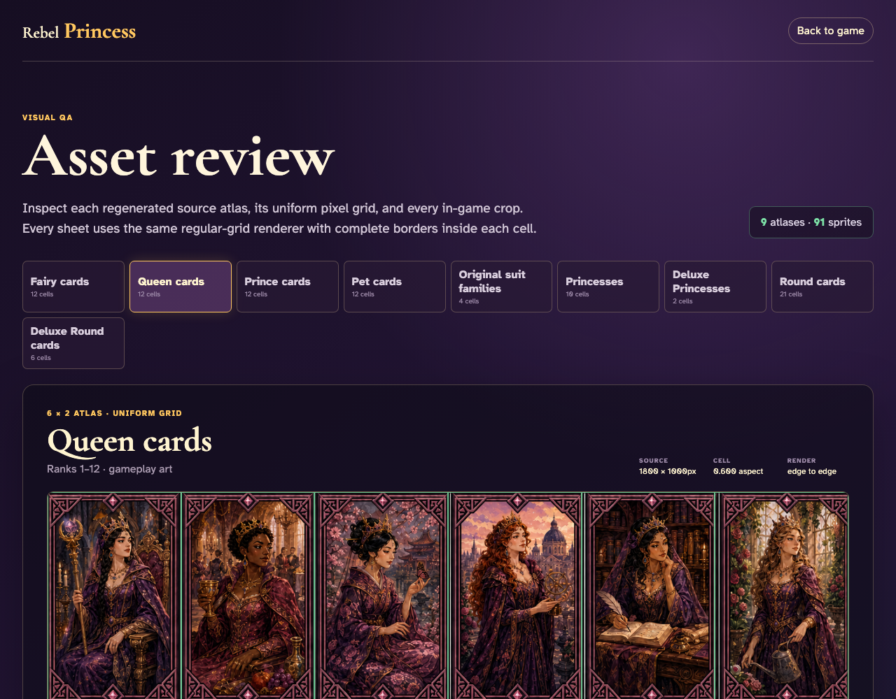
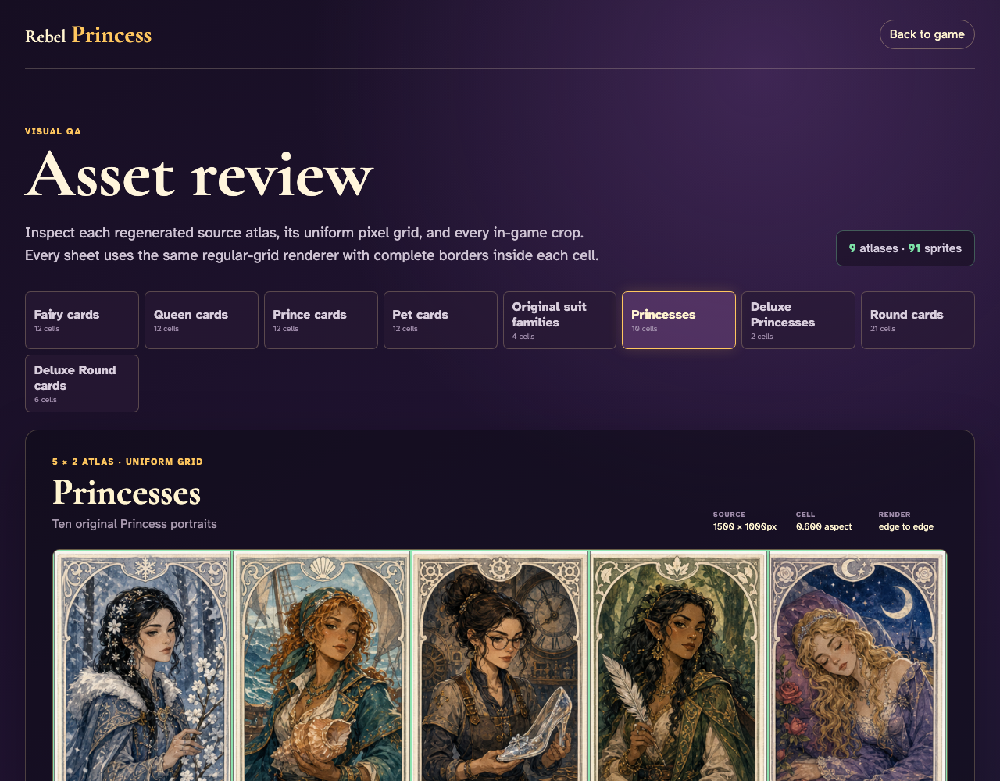

# Asset review

Review all nine regenerated atlases and verify that every sprite uses the same exact regular-grid crop path.

## Fairy cards uses a complete edge-to-edge 6 × 2 uniform grid

**Verifications:**
- [x] All 12 sprites are rendered
- [x] Every sprite uses the shared 6x2 grid renderer
- [x] The first crop starts at the source origin
- [x] The final crop reaches the source bottom-right edge

---

## Queen cards uses a complete edge-to-edge 6 × 2 uniform grid

**Verifications:**
- [x] All 12 sprites are rendered
- [x] Every sprite uses the shared 6x2 grid renderer
- [x] The first crop starts at the source origin
- [x] The final crop reaches the source bottom-right edge

---

## Prince cards uses a complete edge-to-edge 6 × 2 uniform grid

**Verifications:**
- [x] All 12 sprites are rendered
- [x] Every sprite uses the shared 6x2 grid renderer
- [x] The first crop starts at the source origin
- [x] The final crop reaches the source bottom-right edge

---

## Pet cards uses a complete edge-to-edge 6 × 2 uniform grid

**Verifications:**
- [x] All 12 sprites are rendered
- [x] Every sprite uses the shared 6x2 grid renderer
- [x] The first crop starts at the source origin
- [x] The final crop reaches the source bottom-right edge

---

## Original suit families uses a complete edge-to-edge 4 × 1 uniform grid

**Verifications:**
- [x] All 4 sprites are rendered
- [x] Every sprite uses the shared 4x1 grid renderer
- [x] The first crop starts at the source origin
- [x] The final crop reaches the source bottom-right edge

---

## Princesses uses a complete edge-to-edge 5 × 2 uniform grid

**Verifications:**
- [x] All 10 sprites are rendered
- [x] Every sprite uses the shared 5x2 grid renderer
- [x] The first crop starts at the source origin
- [x] The final crop reaches the source bottom-right edge

---

## Deluxe Princesses uses a complete edge-to-edge 2 × 1 uniform grid

**Verifications:**
- [x] All 2 sprites are rendered
- [x] Every sprite uses the shared 2x1 grid renderer
- [x] The first crop starts at the source origin
- [x] The final crop reaches the source bottom-right edge

---

## Round cards uses a complete edge-to-edge 7 × 3 uniform grid

**Verifications:**
- [x] All 21 sprites are rendered
- [x] Every sprite uses the shared 7x3 grid renderer
- [x] The first crop starts at the source origin
- [x] The final crop reaches the source bottom-right edge

---

## Deluxe Round cards uses a complete edge-to-edge 3 × 2 uniform grid

**Verifications:**
- [x] All 6 sprites are rendered
- [x] Every sprite uses the shared 3x2 grid renderer
- [x] The first crop starts at the source origin
- [x] The final crop reaches the source bottom-right edge

---
