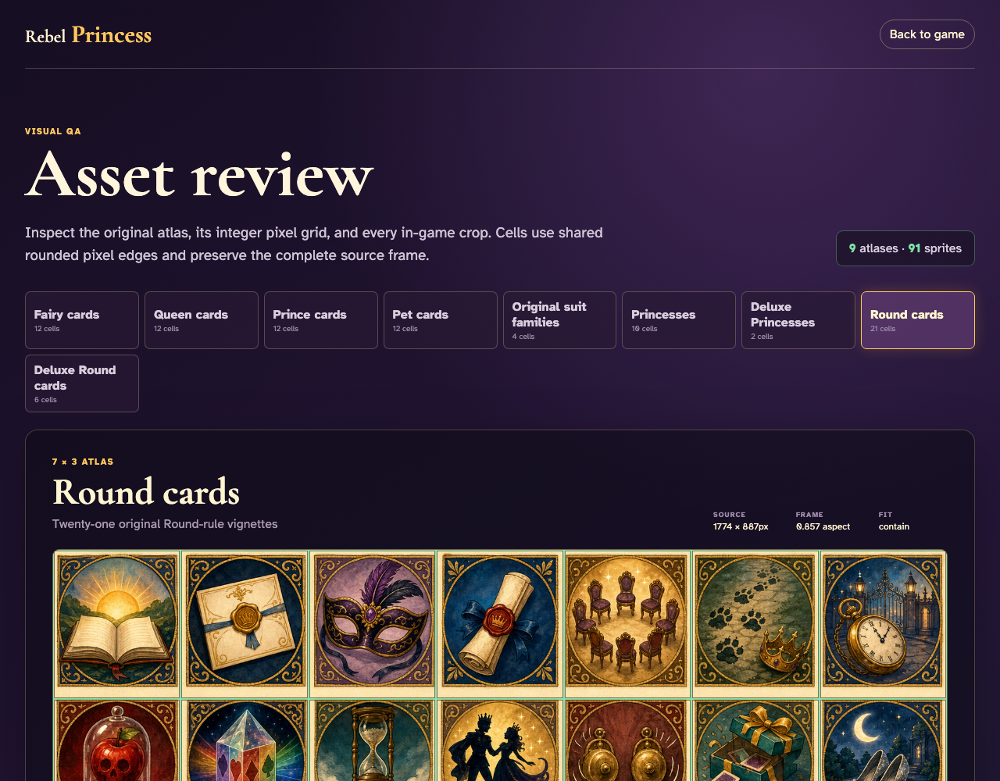

# Asset review

Review raw sprite sheets, integer cell boundaries, and every contained in-game crop without entering a game.

## The review route opens the irregular Fairy atlas with all twelve complete frames and their source coordinates

**Verifications:**
- [x] The route keeps its GitHub Pages-compatible trailing slash
- [x] All nine source atlases are available
- [x] The route reports all ninety-one sprites
- [x] Every Fairy rank has one computed crop
- [x] The indivisible sheet ends exactly at pixel 1651

---

## Switching atlases reveals all twenty-one Round cards with visible raw grid lines and no neighbouring-cell bleed

**Verifications:**
- [x] All twenty-one Round crops are rendered
- [x] The first crop starts at the source origin
- [x] The final crop reaches the bottom-right source pixel

---
