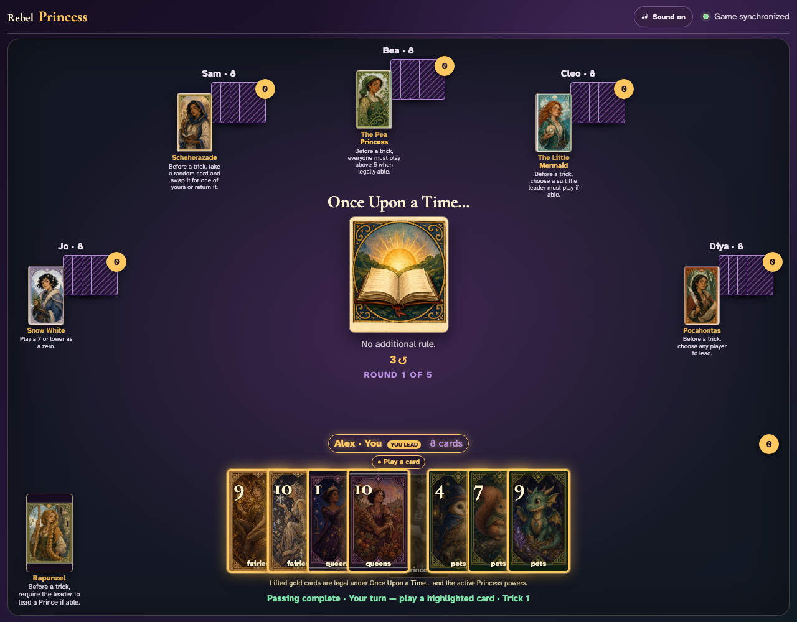

# Responsive six-player table

Deal the densest supported table at phone and desktop sizes and verify that primary game assets grow into available space without leaving the viewport.

## All six seats use the desktop viewport while the active hand, Round card, Princesses, and text remain readable

**Verifications:**
- [x] All five opponent seats remain visible
- [x] The local hand contains all eight cards
- [x] Hand cards are at least 70px wide
- [x] The Round art is at least 140px wide
- [x] Opponent Princesses are at least 44px wide
- [x] Every opponent Princess still exposes readable power copy

---
